Pandas is a python tool for data manipulation. It was created by Wes McKinney in 2008. Pandas is built on two important python packages, NumPy and Matplotlib. NumPy s for accessing and analyzing data and Matplotlib for visualization data.

In this tutorial, I will be explaining five simple techniques that are essential in handling data in python.

1. Exploratory Data Analysis
2. Sorting dataframe
3. Subsetting data
4. Adding new columns to existing data
5. Grouped summary statistics

I will be using the dataset **Students Performance in Exams** which was downloaded from Kaggle [here](https://www.kaggle.com/spscientist/students-performance-in-exams). The dataset which is a CSV file will be used as an example to explain the above techniques in this blog.

The first thing to do here is to import the various packages that will be needed to work on the dataset provided. The packages such as NumPy and Pandas are imported under their usual alias as **np** and **pd** respectively.

```python
import pandas as pd
import numpy as np
```

The CSV file is converted into a DataFrame using the pandas pd.read_csv() method and assigning it to the variable "**performance**".  The variable performance is called to see the nature of the DataFrame to be worked on.

```python
performance = pd.read_csv('StudentsPerformance.csv')
performance
```

This displays all the rows and columns in the file as below

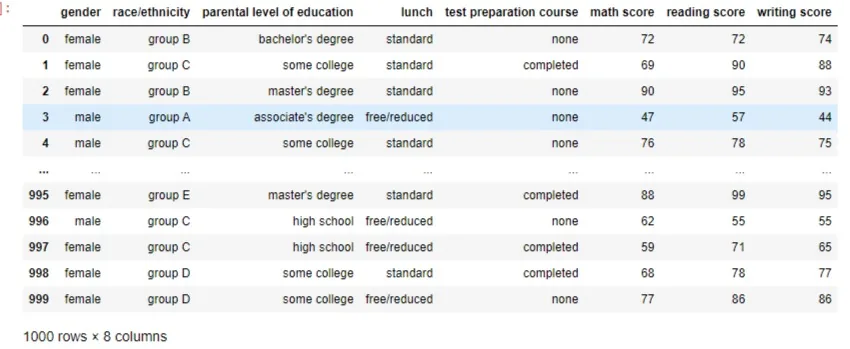

**Exploratory Data Analysis(EDA)**

Exploratory data analysis (EDA) is examining data to check for patterns, missing data and test hypotheses. The purpose is to give a snippet of the data before making any assumptions and hypotheses.

Pandas has several attributes and methods for exploring data. We will be using three of them in this blog.

1. The pandas **shape attribute** returns a tuple that shows the number of rows followed by the number of columns in the dataset. Using the shape attribute on the performance DataFrame, we can see that the data sets contain 1000 rows and 8 columns

```python
performance.shape
```

output:


2. Pandas **columns attribute** displays a tuple of the column names in the dataset. We get to see the names of all the 8 columns in the DataFrame.

```python
performance.columns
```

output:

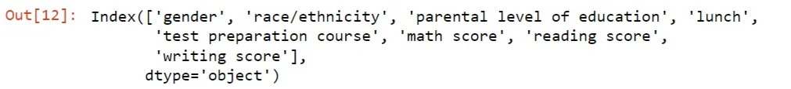

3. Pandas **info() method** returns the names of columns, the data types they contain and if they contain any missing values. The output shows the data contains zero missing values( which is not always the case) and the data types of the first 5 columns are the object type and the remaining are integer types.

```python
performance.info()
```

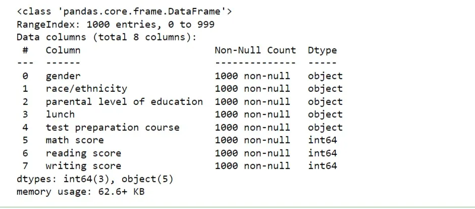

**Sorting Dataframes**

The rows of a DataFrame can be sorted using the **sort_values** method. This is done by passing in the column name that you want to sort. By default, the sort_values method sorts in ascending order. That is from smallest to largest or from first place to last place For example when we apply the **sort_values** method on the **'parental level of education'** column of the **performance DataFrame**. We get the rows of the DataFrame sorted in ascending order according to the **'parental level of education'**  column. The row indexes is a good indicator to know whether the DataFrame has truly been sorted. From the output below, the row index of the first row is now **669**, then it jumps to **457** etc.

```python
# using the pandas dataframe method: pd.sort_values()
performance.sort_values('parental level of education')
```

Output:

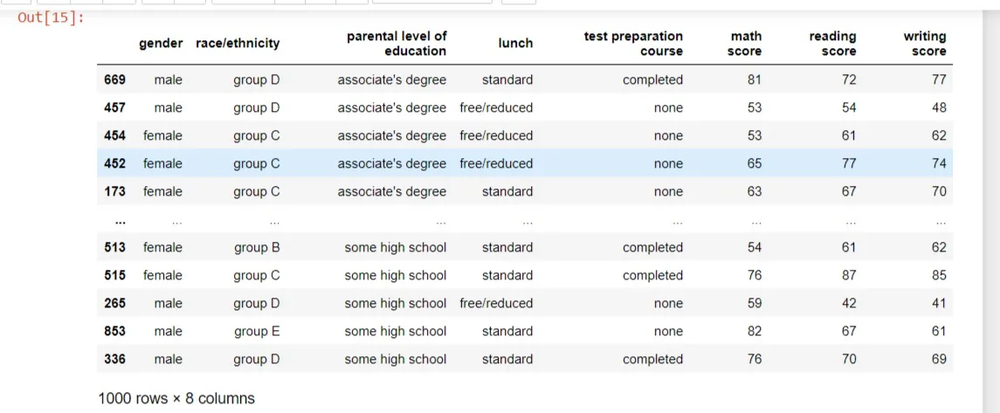

Setting the ascending parameter of the **sort_values** method to the boolean value False will sort the data in descending order. Using the same column we assign the ascending parameter to False. Now instead of having **''associate's degree"** as the first value of the **'parental level of education'** column, it is now **"senior high school"**.

```python
performance.sort_values('parental level of education', ascending= False)
```

output:

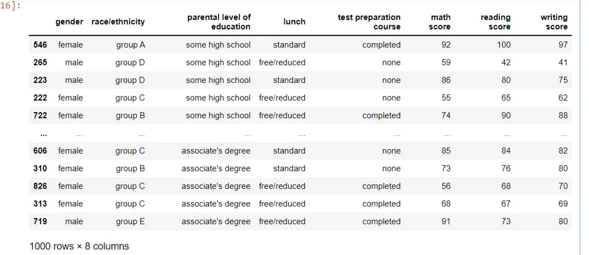

***Sorting by multiple variables:***

Sorting can be done on multiple variables by passing a list of the column names to the sort_values methods. We pass the column names **'race/ethnicity'**, **'parental level of education'** and **'test preparation course'** to the sort_values() method to sort multiple variables.

```python
performance.sort_values(['race/ethnicity','parental level of education','test preparation course'])
```

output:

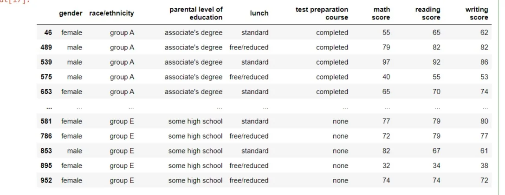

Setting the ascending parameter to a list of Boolean values will sort the data in whatever direction you want. In this case, we pass a list of False, False and True to the above columns.

```python
performance.sort_values(['race/ethnicity','parental level of education','test preparation course'], ascending=[False,False,True])
```

Output:

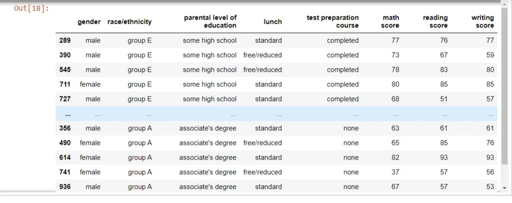

**Subsetting DataFrames**

There are many ways to subset a DataFrame in pandas. In this tutorial, we will be looking at subsetting using column names.

***Subsetting a single column:***

This is done by using the name of the DataFrame followed by square brackets then the column name inside. For example, we can select only the "gender" column of the performance DataFrame.

```python
performance['gender']
```

Output:

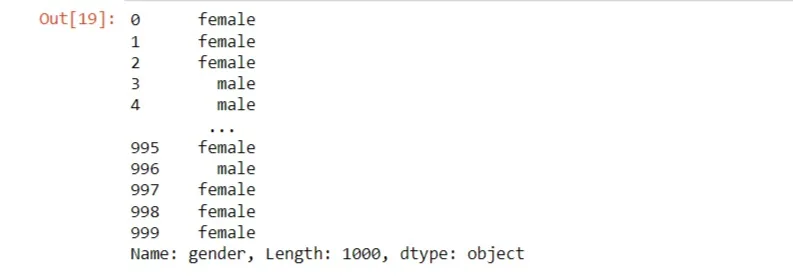

***Subsetting multiple columns:***

We can subset multiple columns by passing a list of column names into double square brackets. We will need two pairs of square brackets. Both the inner and outer square brackets are performing different functions. The outer bracket is responsible for sub-setting the DataFrame and the inner is creating a list of column names to subset over. Using the '**performance**' DataFrame, we subset '**gender**', '**lunch**' and '**math score**' columns.

```python
performance[['gender','lunch','math score']]
```

output:

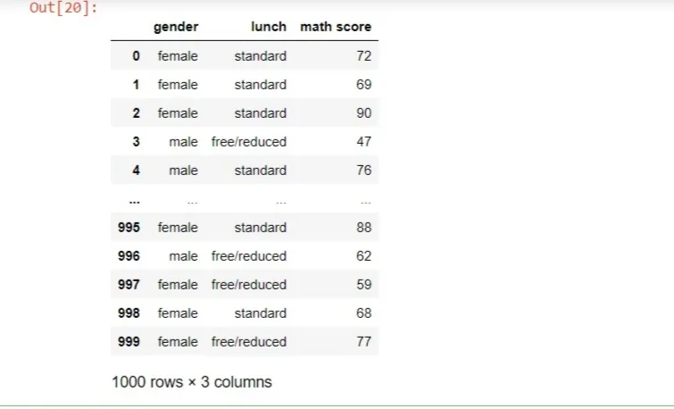

***Subsetting rows using logical conditions:***

There are many different ways to subset rows in a DataFrame. One way is filtering against a logical condition. We can use logical conditions inside of square brackets to subset rows we are interested in. For example, we can subset the rows of the performance data of students who had a standard lunch by using the double equal to sign("**==**") in the logical condition to filter for it.

```python
performance[performance['lunch'] == 'standard']
```

Output:

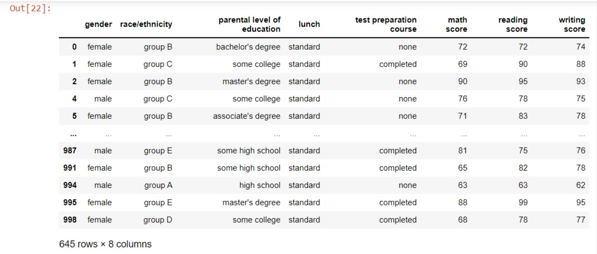

***Subsetting rows with multiple conditions:***

Multiple conditions can be used to subset rows by using logical operators such as "and'' or "or" to combine multiple conditions. In pandas, the bitwise operators such as bitwise AND (**&**) is ideal for subsetting with multiple conditions. This can be done by adding parenthesis around each condition. For example, in order to ascertain the students who had above 80 scores in maths and also completed the test preparation course, we use the following code.

```python
performance[(performance['math score'] > 80) & (performance['test preparation course'] == 'completed')]
```

output:

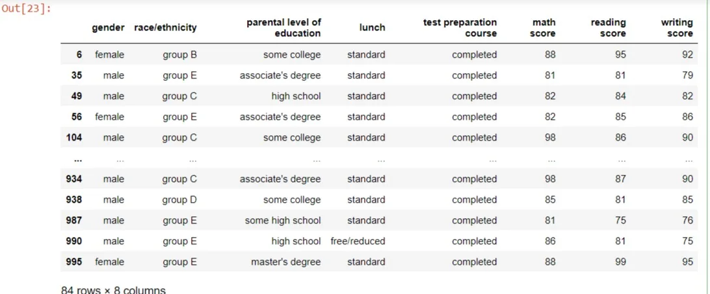

**Adding New Columns to a DataFrame**

We can add new columns using existing columns of a DataFrame. For example, if we want to add a new column that sums the scores of maths, reading and writing scores. We do this by using square brackets with the name of the new column on the performance DataFrame on the left side of the equals sign(=). On the right side, we have a calculation of the total sum of the values in each of the three existing columns. We add the values of the three columns by subsetting the individual columns of math scores, reading scores and writing scores and adding them together using the addition operator.

```python
performance['total scores'] = performance['math score'] + performance['reading score'] + performance['writing score']
```

When the performance DataFrame is recalled, it adds the new column total scores

```python
performance
```

Output:

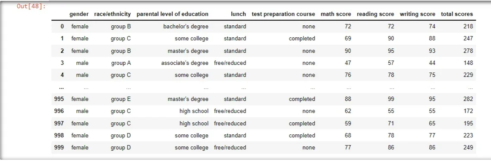

**Grouped Summary Statistics**

Summary statistics are useful to compare different groups of data. Pandas makes this easy for us with the groupby() method. It allows us to group the data by one or multiple columns while performing summary statistics such as mean, median, standard deviation on the other columns. For example, to determine the level of education of parents of children who took the test in terms of their gender, we need to group the DataFrame by the parental level of education and perform a value count on the gender of each student. The code for this is written below as:

```python
performance.groupby('parental level of education')['gender'].value_counts()
```

Output:


We can also groupby multiple columns by passing a list of columns into the groupby() and perform summary statistics on multiple columns. For example, if we wanted to know the average math and reading score in students who took a test preparation course with respect to their gender.

```python
performance.groupby(['test preparation course','gender'])[['math score','reading score']].mean()
```

output:

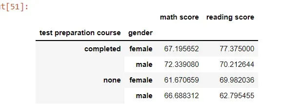

We can use the aggregate or **agg()** method together with the groupby method to perform custom summary statistics. The **agg()** method allows us to subset any column by passing in the name of the function we want to see. It could take one or more functions depending on what summary you want from your data. A list of functions can be passed in the **agg()** method for more summary statistics. For example, we group students according to their gender and ethnicity or race and then aggregate the minimum, maximum, mean and median scores of their math, reading and writing scores.

```python
performance.groupby(['gender','race/ethnicity'])[['math score','reading score', 'writing score']].agg([np.min,np.max,np.mean,np.median])
```

output:

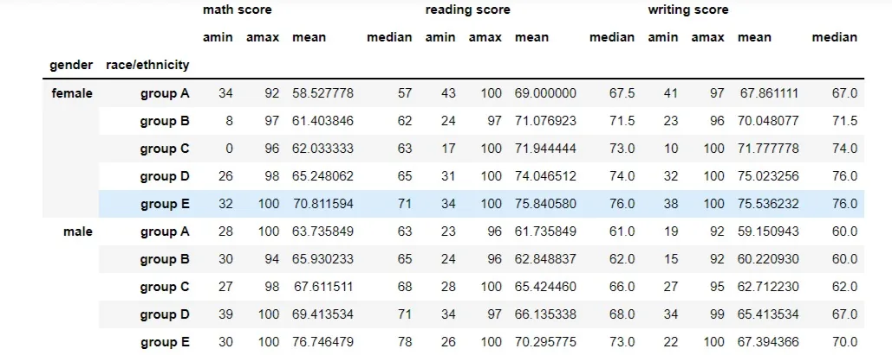

**Conclusion**

These are just a few ways to manipulate data using pandas. Pandas allows you to use multiple ways to analyze and solve a problem. It provides you with a variety of tools to work with to ascertain your desired output from any dataset. I hope this beginners tutorial will be helpful to anyone reading this blog.

This blog is a Data Insight assignment project.

The link to the code written in this blog can be found [here](https://github.com/Storerun/Pandas_data_manipulation_techniques).

This is the link to the cover [photo](https://pythondiario.com/2018/06/manipulacion-y-redaccion-de-datos-con.html) of this blog.
