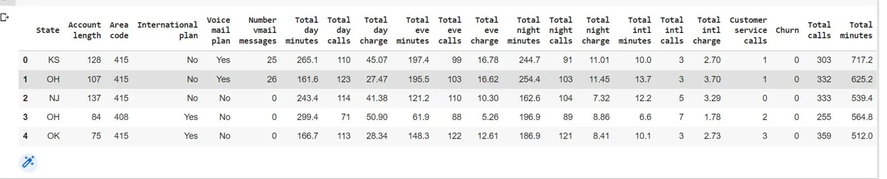
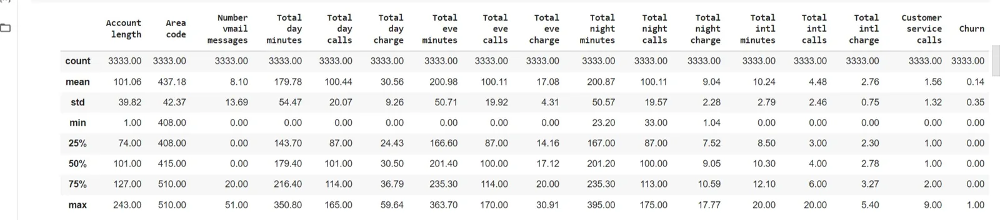
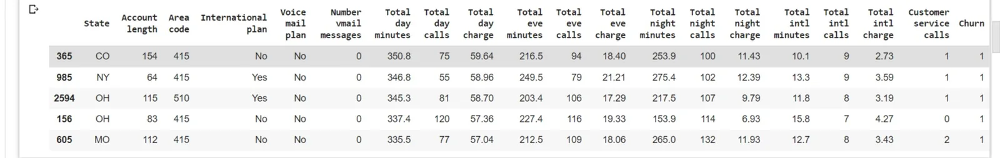
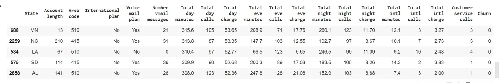

Pandas is a python library used for data analysis, it is built on top of **matplotlib** and **numpy** for data visualization and mathematical operations respectively.

In this blog we would like to explore some features of pandas library, so we will use telecom churn data set as data source, and apply some of the desired techniques.

1. we import the required libraries, **numpy** and pandas.

```python
import numpy as np
import pandas as pd
```

2. we read the data using read_csv from pandas library:

```python
data = pd.read_csv("telecom_churn.csv", on_bad_lines='skip')
```

This is loading, it works as if we are converting csv data into pandas **dataframe** for pandas to be able to deal with it.

while a **dataframe** is like a spreadsheet or a table.

3. Lets take a quick into data using **head()**:

```python
data.head()
```



4. we can look into data shape using: **data.shape** which results in: 3333 rows X 20 columns, this is the shape of the entire data set.

5. The same way we can print out the names of all columns using :

```python
 data.columns

 Index(['State', 'Account length', 'Area code', 'International plan',        'Voice mail plan', 'Number vmail messages', 'Total day minutes',        'Total day calls', 'Total day charge', 'Total eve minutes',        'Total eve calls', 'Total eve charge', 'Total night minutes',        'Total night calls', 'Total night charge', 'Total intl minutes',        'Total intl calls', 'Total intl charge', 'Customer service calls',        'Churn'],       dtype='object')
```

6. we still also can take a look into the data using **data.info()** to list the types of each column:

```python
data.info()
<class 'pandas.core.frame.DataFrame'>
RangeIndex: 3333 entries, 0 to 3332
Data columns (total 20 columns):
#   Column                  Non-Null Count  Dtype
---  ------                  --------------  -----
0   State                   3333 non-null   object
1   Account length          3333 non-null   int64
2   Area code               3333 non-null   int64
3   International plan      3333 non-null   object
4   Voice mail plan         3333 non-null   object
5   Number vmail messages   3333 non-null   int64
6   Total day minutes       3333 non-null   float64
7   Total day calls         3333 non-null   int64
8   Total day charge        3333 non-null   float64
9   Total eve minutes       3333 non-null   float64
10  Total eve calls         3333 non-null   int64
11  Total eve charge        3333 non-null   float64
12  Total night minutes     3333 non-null   float64
13  Total night calls       3333 non-null   int64
14  Total night charge      3333 non-null   float64
15  Total intl minutes      3333 non-null   float64
16  Total intl calls        3333 non-null   int64
17  Total intl charge       3333 non-null   float64
18  Customer service calls  3333 non-null   int64
19  Churn                   3333 non-null   bool
dtypes: bool(1), float64(8), int64(8), object(3) memory usage: 498.1+ KB
```

7. Another technique is converting columns type from one to another, such as converting **churn** from boolean to int64:

```python
data["Churn"] = data["Churn"].astype("int64")
```

8. beside converting types, another primary technique is using describe() to apply primary statistical computations on the columns of the numerical types, such as displaying mean, standard deviation, counts, quartiles, and maximum and minimum.

```python
data.describe()
```



9. In this data set, we are mainly exploring users churns who are loyal to the company or not (Yes or NO) and the factors impacting their decision. One of the useful techniques is exploring the distribution of the Yes, No users of this telecommunication company , using **value_counts** method:

```python
data["Churn"].value_counts()
0    2850
1     483
Name: Churn, dtype: int64
```

we can normalized these values to display fractions:

```python
data["Churn"].value_counts(normalize=True)
```

10. sorting the dataframe according to one value: column is usually a an important feature in pandas, it an be done as the following:

```python
data.sort_values(by="Total day minutes", ascending=False).head()
```



or sorting according to multiple columns:

```python
data.sort_values(by=["Churn", "Total day charge"], ascending=[True, False]).head()
```



11 To inspect more we can add a column to this data set, which represents the total value of all telephone usage daily by adding four columns together as the following:

```python
data['Total calls'] = data['Total day calls'] + data['Total eve calls'] + data['Total night calls'] + data['Total intl calls']
```

12. Another technique we might use for aggregating values into one table is pivot table, pivot tables make it easy to apply one statistical computation on multiple columns and view it according to one another column, as the following:

```python
data.pivot_table(
    ["Total day calls", "Total eve calls", "Total night calls"],
    ["Area code"],
    aggfunc="mean",
)
-------------------------------------------------------------
           Total day calls Total eve calls  Total night calls
Area code
    408    100.50                99.79             99.04
    415    100.58                100.50            100.40
    510    100.10                99.67             100.60
```

The last technique we want to discuss here is **time series using pandas:**

we can use pandas for time series analysis as the following:

```python
import pandas as pd
from datetime import datetime
import numpy as np

range_date = pd.date_range(start ='1/1/2020', end ='1/05/2020', freq ='Min')
print(range_date)
```

here we created a timestamp by minutes (freq='Min') starting from 01/01/2020 until 01/05/2020, and this was the result:

```python
DatetimeIndex(['2020-01-01 00:00:00', '2020-01-01 00:01:00',                '2020-01-01 00:02:00', '2020-01-01 00:03:00',                '2020-01-01 00:04:00', '2020-01-01 00:05:00',                '2020-01-01 00:06:00', '2020-01-01 00:07:00',                '2020-01-01 00:08:00', '2020-01-01 00:09:00',                ...                '2020-01-04 23:51:00', '2020-01-04 23:52:00',                '2020-01-04 23:53:00', '2020-01-04 23:54:00',                '2020-01-04 23:55:00', '2020-01-04 23:56:00',                '2020-01-04 23:57:00', '2020-01-04 23:58:00',                '2020-01-04 23:59:00', '2020-01-05 00:00:00'],               dtype='datetime64[ns]', length=5761, freq='T')
```

The length of the datetime stamp is 5761.the data type as **datetime64[ns]**. Pandas uses this type.

```python
df = pd.DataFrame(range_date, columns =['date'])
df['data'] = np.random.randint(0, 100, size =(len(range_date)))

print(df.head(10))
```

Now, we are converting this time series into dataframe using the random function to generate random data.

```python
                 date  data
0 2020-01-01 00:00:00    86
1 2020-01-01 00:01:00    65
2 2020-01-01 00:02:00    15
3 2020-01-01 00:03:00    17
4 2020-01-01 00:04:00    12
5 2020-01-01 00:05:00    10
6 2020-01-01 00:06:00    16
7 2020-01-01 00:07:00    22
8 2020-01-01 00:08:00    54
9 2020-01-01 00:09:00    40
```

This was a quick look at some of pandas techniques in manipulating different types of data: category, integers, time series.

Thanks for reading so far, if you like this article please follow me on twitter on: @sanaomaro.

Resources:

Kashnitsky. (2021, May 7). *Topic 1. exploratory data analysis with Pandas*. Kaggle. Retrieved February 28, 2022, from https://www.kaggle.com/kashnitsky/topic-1-exploratory-data-analysis-with-pandas/notebook

*Pandas: Python library - mode*. Mode Resources. (2016, May 23). Retrieved February 28, 2022, from https://mode.com/python-tutorial/libraries/pandas/

*Pandas: Basic of time series manipulation*. GeeksforGeeks. (2021, August 31). Retrieved February 28, 2022, from https://www.geeksforgeeks.org/pandas-basic-of-time-series-manipulation/
