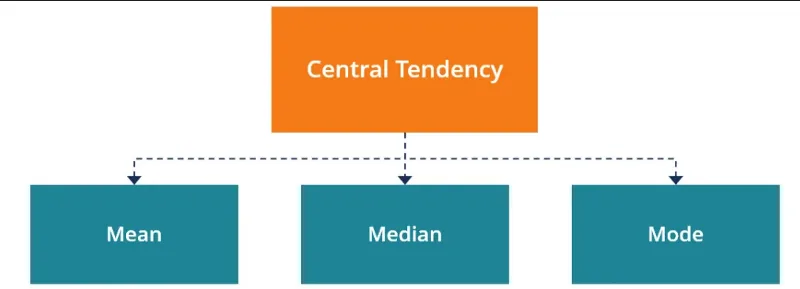
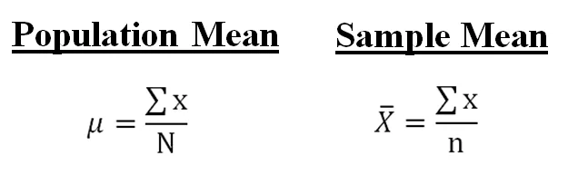
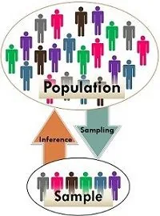
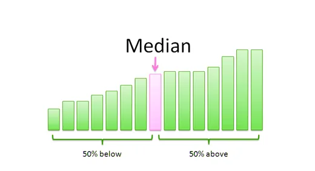
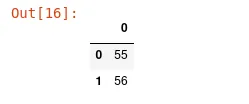
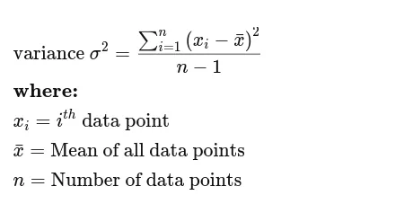
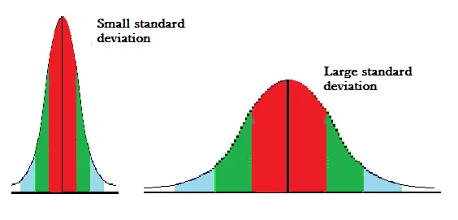
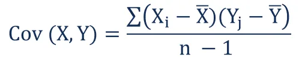

Statistique is one of the key parts of data science. In this blog post, we’ll present some important statistics concepts for data science such as mean, median, mode, variance, and so on.

### Measures of Central Tendency

They are a single number that tries to define a data set by revealing the central position in that data set. Also, known as a central location, they are **mean, median and mode** and each of them is suitable for a specific use case.



### a. Mean

The mean is a fundamental concept in mathematics and statistics. It’s the most popular and well-known measure of central tendency. It can be used for discrete and continuous data. The mean is the sum of all the values ​​in the data set divided by the number of values ​​in the data set. There are two types of arithmetic means: population means and sample mean. They are calculated in the same way, but written differently:



where N is the size of the population and n is the size of the sample.

**What’s the difference between population and sample?**

To be short and brief, **a population** is an entire group that you want to draw conclusions about while **a sample** is just the specific group that you will collect data.



In python, we don’t care about those formulas. Everything is done under the hood for us to easily calculate the mean. Either you use NumPy or pandas, they remain too simple.

```python
### USING NUMPY
import numpy as np

data = np.array([65, 55, 89, 56, 35, 14, 56, 55, 87,45,92])
np.mean(data)

Output: 59.0

### USING PANDAS
import pandas as pd
pd.DataFrame(data).mean()

Output:
0    59.0
dtype: float64
```

#### b. Median

The median is a type of average used to find the middle value of a given list of data when arranging them in order. More formally, the median is the modality of the cumulative frequency at the position n/2 where n is the size of the sample. If n is an even number, then the median is the sum of the modality of cumulative frequency at the position n/2 and (n/2)+1 divided by 2.



One more time, python simplifies the work for us. using NumPy, we can calculate the median like:

```python
## Numpy
np.median(data)

Output: 56.0

## Pandas
pd.DataFrame(data).mean()

Output:
0    56.0
dtype: float64
```

#### c. Mode

The mode is the value that has the most frequent apparition in the dataset. Unlike mean and median they can be multiple modes in the data set for any type of data.

As the mode can be found for any type of data type, NumPy doesn’t provide a direct method to find the mode. It’s because NumPy is designed to word with a number. To find the mode, we’ll do a little gymnastics.

```python
values, counts = np.unique(data, return_counts=True)
index = np.argmax(counts)
values[index]

Output: 55
```

Here, we use NumPy the count the number of occurrences of each value in the dataset, then we use **np.argmax** to determine the index of maximum values in the array of counts, and finally, we return the mode.

This operation is pretty easy with pandas and it gives us two modes we have in our data.

```python
pd.DataFrame(data).mode()
```



### Variance

The variance is the measure of the distance of each variable from the mean in the data set. Otherwise, it’s the statistical measurement of the spread between values in the dataset. It’s measures variability from the mean and is calculated by taking the differences between each number in the data set and the mean, then squaring the differences to make them positive, and finally dividing the sum of the squares by the number of values in the data set. The formula is:



We can easily calculate variance using NumPy and pandas:

```python
## Numpy
np.var(data)
```

```python
Output: 514.1818181818181
```

```python
## Pandas
pd.DataFrame(data).var()
```

```python
Output:
0    565.6
dtype: float64
```

### Standard deviation

The standard deviation is the measure of how data are spread out. It’s calculated as the square root of variance. A low standard deviation indicates that data in a group around the mean and a high standard deviation show that data are more spread out.



We python, we calculate this as follow:

```python
## Numpy
np.std(data)
```

```python
Output: 22.675577571074527
```

```python
## Pandas
pd.DataFrame(data).std()
```

```python
Output:
0    23.782346
dtype: float64
```

### Covariance

It’s the measure of the relationship between two random variables and helps to know if the two variables vary together. The covariance can be positive or negative where **positive covariance** indicates that the two variables tend to move in the same direction while **negative covariance** reveals that they tend to move in inverse directions. We calculate the covariance of a population using this formula:


To calculate the covariance of a sample, we use:



where:

- **Xi**— the values of the X-variable
- **Yj** — the values of the Y-variable
- **X̄**— the mean (average) of the X-variable
- **Ȳ** — the mean (average) of the Y-variable
- **n** — the number of data points

To calculate covariance with numpy, we use:

```python
np.cov(data)
```

```python
Output:
```

```python
array(565.6)
```

### Conclusion
During this story, we present some important statistics concept used in data science. You can found the source code [here](https://github.com/tderick/datainsightonelineprogram/blob/main/Untitled.ipynb).
