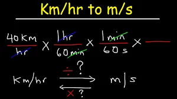

For people who are not arithmetically savvy, it is hard to convert speed from km/hr to miles/hr and vice versa. Furthermore, to convert meters/second to km/hr and vice versa.



The following python code is an attempt to assist this dilemma:

The first part is to define a function that takes either values of km/hr or miles/hr. The arithmetic function will convert using the formula. Later the user is then asked to input a value and the code outputs the desired figure.

```python
#Kilometers Function
def kmh_to_mph(x):
    return round(x * 0.621371, 2)

# Miles Function
def mph_to_kmh(x):
    return round(1/ 0.621371 * x, 2)

speed_km = float(input("What is the speed in km/hr?:"))
g = kmh_to_mph(speed_km)
print("The speed in miles/hr is {}".format(g))

speed_m = float(input("What is the speed in miles/hr?:"))
g = mph_to_kmh(speed_m)
print("The speed in km/hr is {}".format(g))
```

To address the second part of meters/sec to km/hr and vice versa. Again an arithmetic equation using 3.6 is used. To validate the outputs, the inverse function of the arithmetic operations are used. ***That is, if 3.6\*x was used, to validate, 1/3.6 \*x was used to return to the previous value.***

```python
def kmh_to_ms(x):
	return round(1/ 3.6 * x, 2)

def ms_to_kmh(x):
	return round(3.6 * x, 2)

speed_ms = float(input("What is the speed in metres/s?:"))
g = ms_to_kmh(speed_ms)
print("The speed in km/hr is {}".format(g))
speed_kmh = float(input("What is the speed in km/hr?:"))
g = kmh_to_ms(speed_kmh)
print("The speed in metres/sec is {}".format(g))
```

The Github repository can be found [here](https://github.com/Matshisela/Speed-Converter)
