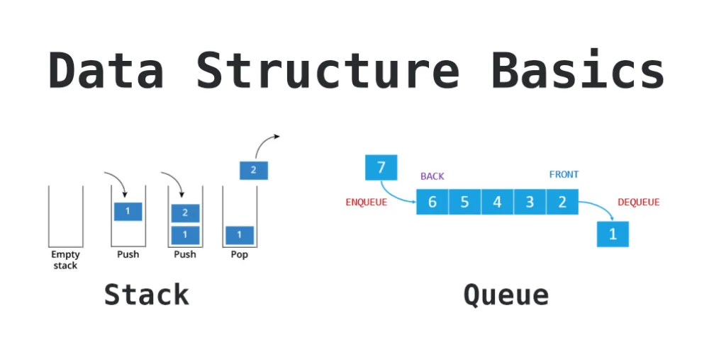
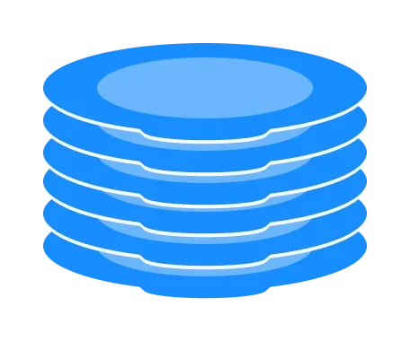
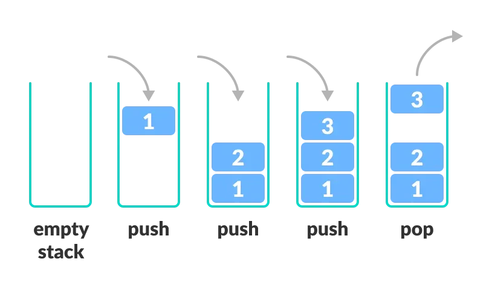
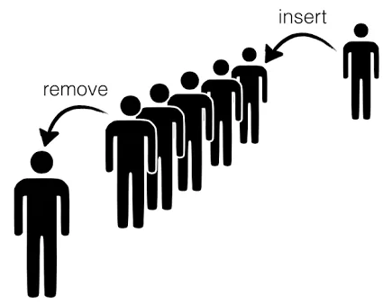
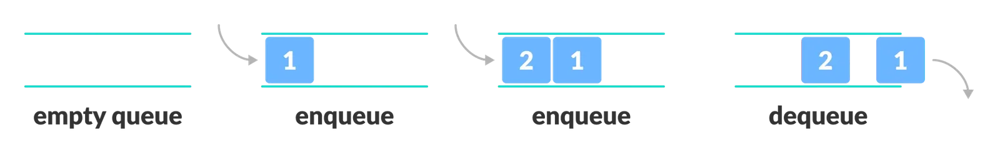

In this tutorial, we will discuss together the definition of stack and queue and discover their different uses.



## Stack

In computer science, a stack is an abstract data type that serves as a collection of elements, with two main principal operations:

- Push: which adds an element to the collection
- Pop: which removes the most recently added element that was not yet removed

It is a data structure based on the LIFO "Last In, First Out" principle, which means that the last elements added to the stack will be the first to be retrieved.

You can think of the stack data structure as the pile of plates on top of another.



Here, you can:

- Put a new plate on top
- Remove the top plate

And, if you want the plate at the bottom, you must first remove all the plates on top. This is exactly how the stack data structure works.

### Implementation

In programming terms, putting an item on top of the stack is called push and removing an item is called pop.



In the above image, although item 2 was kept last, it was removed first. This is exactly how the LIFO (Last In First Out) Principle works.

We can implement a stack in any programming language like Python. There are some basic operations that allow us to perform different actions on a stack.

- **Push:** Add an element to the top of a stack
- **Pop:** Remove an element from the top of a stack
- **IsEmpty:** Check if the stack is empty
- **IsFull:** Check if the stack is full
- **Peek:** Get the value of the top element without removing it

```python
# Creating a stack
def create_stack():
    stack = []
    return stack

# Checking if stack is empty
def check_empty(stack):
    return len(stack) == 0

# Adding items into the stack
def push(stack, item):
    stack.append(item)
    print("pushed item: " + item)

# Removing an element from the stack
def pop(stack):
    if (check_empty(stack)):
        return "stack is empty"
    return stack.pop()

stack = create_stack()
push(stack, "1")
push(stack, "2")
push(stack, "3")
push(stack, "4")
print("popped item: " + pop(stack))
print("stack after popping an element: " + str(stack))
```

```python
pushed item: 1
pushed item: 2
pushed item: 3
pushed item: 4
popped item: 4
stack after popping an element: ['1', '2', '3']
```

### Applications of Stack Data Structure

Stacks have various applications:

- In browsers: he back button in a browser saves all the URLs you have visited previously in a stack. Each time you visit a new page, it is added on top of the stack. When you press the back button, the current URL is removed from the stack, and the previous URL is accessed.
- The evaluation of mathematical expressions in postfixed (or reverse Polish) notation uses a stack.
- The Undo function of a word processor stores changes made to text in a stack

## Queue

In computer science, a queue is a collection of entities that are maintained in a sequence and can be modified by the addition of entities at one end of the sequence and the removal of entities from the other end of the sequence. By convention, the end of the sequence at which elements are added is called the back, tail, or rear of the queue, and the end at which elements are removed is called the head or front of the queue, analogously to the words used when people line up to wait for goods or services.



In the above image, since the first person was kept in the queue before the second one, it is the first to be removed from the queue as well. It follows the FIFO rule.

### Implementation

In programming terms, putting items in the queue is called enqueue, and removing items from the queue is called dequeue.



We can implement the queue using python following basics operations.

- **Enqueue:** Add an element to the end of the queue
- **Dequeue:** Remove an element from the front of the queue
- **IsEmpty:** Check if the queue is empty
- **IsFull:** Check if the queue is full
- **Peek:** Get the value of the front of the queue without removing it

```python
class Queue:

    def __init__(self):
        self.queue = []

    # Add an element
    def enqueue(self, item):
        self.queue.append(item)

    # Remove an element
    def dequeue(self):
        if len(self.queue) < 1:
            return None
        return self.queue.pop(0)

    # Display  the queue
    def display(self):
        print(self.queue)

    def size(self):
        return len(self.queue)

q = Queue()
q.enqueue(1)
q.enqueue(2)
q.enqueue(3)
q.enqueue(4)
q.enqueue(5)

q.display()

q.dequeue()

print("After removing an element")
q.display()
```

```python
[1, 2, 3, 4, 5]
After removing an element
[2, 3, 4, 5]
```

### Applications of Queue
- CPU scheduling, Disk Scheduling
- When data is transferred asynchronously between two processes.The queue is used for synchronization. For example: IO Buffers, pipes, file IO, etc
- Call Center phone systems use Queues to hold people calling them in order.

Link to [GitHub repo](https://github.com/Jihed503/data_insight_python_concepts_for_data_science).

Reference:

[programiz.com](https://programiz.com)
