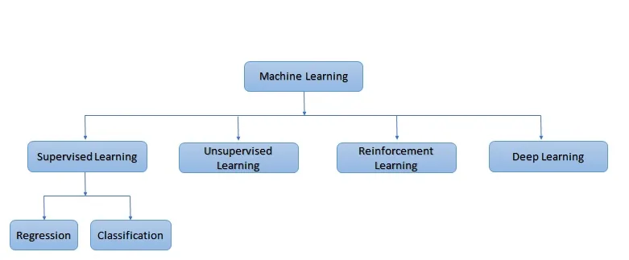

"Google's self-driving cars and robots get a lot of press, but the company's real future is in machine learning the technology that enables computers to get smarter and more personal" - Eric Sehmidt (Google Chairman)

With growing digital and technological world, Artificial Intelligence has the excel boost of blockchain and quantum computing. It is being advantage for developers to create new machine learning models and make more efficient the existing models by performance and results.

Machine learning has several applications on finance services, virtual personal assistants, marketing and sales, prediction while travelling, healthcare, social media services and many more.

*Types of Machine Learning*

Supervised machine learning algorithm contains a target or outcome variable that is to be predicted from a given set of independent variables.

Regression is the case where you give concrete known examples to the system. you let the system figure out an empirical relationship between input and output.

In classification problems, you classify objects of similar nature into a single group when the machine learns how the groups are formed, it will be able to classify any unknown object.

Support Vector Machine is one of the classification method and it can be apply for both data as linear and non-linear.

In case of linearly separable data in two dimensions, a typical machine learning algorithm tries to find a boundary that divides the data in a way that the misclassification error can be minimized.

The most optimal decision boundary is the one which has maximum margin from the nearest points of all the classes. The nearest points from the decision boundary that maximum the distance between the decision boundary and the points are called support vectors. The decision boundary in case of support vector machines is called the maximum margin classifier, or the maximum margin hyper plane.

SVM differs from the other classification algorithms in the way that it chooses the decision boundary that maximizes the distance from the nearest data points of all the classes.

SVM(Python)

from sklearn import svm l

model = svm.svc()

model.fit(x,y)

model.score(x,y)

predicted = model.predicted(x_test)

SVM finds the most optimal decision boundary.
