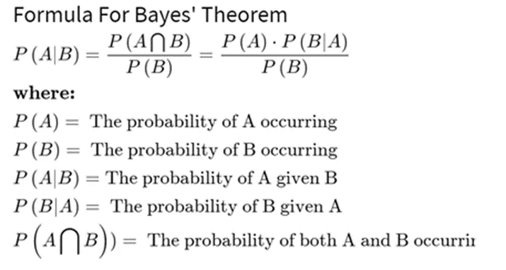

In order to become a great data scientist, there is a base of statistical knowledge that one has to gain. Here are some of the most used concepts.

1- Bayes theorem:

Bayes theory is a mathematical formula formula for determining conditional probability. Conditional probability is the likelihood of an outcome occurring, based on a previous outcome occurring in similar circumstances.



Let us solve an example with code:

suppose we have 2 buckets A and B. In bucket A we have 30 blue balls and 10 yellow balls, while in bucket B we have 20 blue and 20 yellow balls. We are required to choose one ball. What is the chance that we choose bucket A?

```python
import numpy as np
import pandas as pd
```

According to the question, the hypotheses and prior are:

```python
hypos = 'bucket a', 'bucket b'
probs= 1/2,1/2
```

We can use the pandas series for computation as:

```python
prior = pd.Series(probs, hypos)
print(prior)
```

Output:

```python
bucket a    0.5
bucket b    0.5
dtype: float64
```

According to the question, we know that the chances of choosing a blue ball from bucket A is ¾ and from bucket B the chances of choosing any ball or blue ball are ½. This chance or probabilities are our likelihood.

So from the above statement, we can say that,

```python
likelihood = 3/4, 1/2
```

Using the likelihood and prior we can calculate the unnormalized posterior as:

```python
unnorm = prior * likelihood
print(unnorm)
```

output:

```python
bucket a    0.375
bucket b    0.250
dtype: float64
```

To make the unnormalized posterior normalized posterior we have to divide the unnormalized posterior with the sum of the unnormalized posterior.

```python
prob_data = unnorm.sum()
prob_data
```

Output:

0.625

```python
posterior = unnorm / prob_data
posterior
```

```python
bucket a    0.6
bucket b    0.4
dtype: float64
```

Here from the results, we can say the posterior probability of choosing bucket A with a blue ball is 0.6. Which is an implementation of the Bayes theorem which we had read above.

2- Measures of central tendency:

There are 3 of them:

Mean : or the average and is calculated by sum of values over their count

```python
import numpy

height = [99,86,87,88,111,86,103,87,94,78,77,85,86]

x = numpy.mean(height)

print(x)
```

Median : The value that divides the values to half and another name is the 50th percentile and it is not affected by outliers unlike mean.

```python
x = numpy.median(height)
print(x)
```

Mode: which is the most common value

```python
from scipy import stats
x = stats.mode(height)

print(x)
```

3- Measures of dispersion:

- Interquartile range: Interquartile range is defined as the difference between the 25th and 75th percentile (also called the first and third quartile). Hence the interquartile range describes the middle 50% of observations. If the interquartile range is large it means that the middle 50% of observations are spaced wide apart. The important advantage of interquartile range is that it can be used as a measure of variability if the extreme values are not being recorded exactly (as in case of open-ended class intervals in the frequency distribution). Other advantageous feature is that it is not affected by extreme values. The main disadvantage in using interquartile range as a measure of dispersion is that it is not amenable to mathematical manipulation.

- Standard deviation: Standard deviation (SD) is the most commonly used measure of dispersion. It is a measure of spread of data about the mean. SD is the square root of sum of squared deviation from the mean divided by the number of observations.

```python
import numpy as np

#define array of data
data = np.array([14, 19, 20, 22, 24, 26, 27, 30, 30, 31, 36, 38, 44, 47])

#calculate interquartile range
q3, q1 = np.percentile(data, [75 ,25])
iqr = q3 - q1

#display interquartile range
iqr
```

output: 12.25

Standard deviation

```python
import statistics
data = [7,5,4,9,12,45]
print("Standard Deviation of the sample is % s "%(statistics.stdev(data)))
```

Standard Deviation of the sample is 15.61623087261029

or

```python
def stdev(data):
  import math
  var = variance(data)
  std_dev = math.sqrt(var)
  return std_dev
```

4- Covariance and correlation:

Put simply, both covariance and correlation measure the relationship and the dependency between two variables. Covariance indicates the direction of the linear relationship between variables while correlation measures both the strength and direction of the linear relationship between two variables. Correlation is a function of the covariance.

```python
def correlation(x, y):
    # Finding the mean of the series x and y
    mean_x = sum(x)/float(len(x))
    mean_y = sum(y)/float(len(y))
    # Subtracting mean from the individual elements
    sub_x = [i-mean_x for i in x]
    sub_y = [i-mean_y for i in y]
    # covariance for x and y
    numerator = sum([sub_x[i]*sub_y[i] for i in range(len(sub_x))])
    # Standard Deviation of x and y
    std_deviation_x = sum([sub_x[i]**2.0 for i in range(len(sub_x))])
    std_deviation_y = sum([sub_y[i]**2.0 for i in range(len(sub_y))])
    # squaring by 0.5 to find the square root
    denominator = (std_deviation_x*std_deviation_y)**0.5 # short but equivalent to (std_deviation_x**0.5) * (std_deviation_y**0.5)
    cor = numerator/denominator
    return cor
```

```python
def covariance(x, y):
    # Finding the mean of the series x and y
    mean_x = sum(x)/float(len(x))
    mean_y = sum(y)/float(len(y))
    # Subtracting mean from the individual elements
    sub_x = [i - mean_x for i in x]
    sub_y = [i - mean_y for i in y]
    numerator = sum([sub_x[i]*sub_y[i] for i in range(len(sub_x))])
    denominator = len(x)-1
    cov = numerator/denominator
    return cov
```

5- P-value:

In statistics, the p-value is the probability of obtaining results at least as extreme as the observed results of a statistical hypothesis test, assuming that the null hypothesis is correct. The p-value is used as an alternative to rejection points to provide the smallest level of significance at which the null hypothesis would be rejected. A smaller p-value means that there is stronger evidence in favour of the alternative hypothesis.

- A p-value is a measure of the probability that an observed difference could have occurred just by random chance.
- The lower the p-value, the greater the statistical significance of the observed difference.
- P-value can be used as an alternative to or in addition to preselected confidence levels for hypothesis testing.

```python
from scipy import stats
rvs = stats.norm.rvs(loc = 5, scale = 10, size = (50,2))
print(stats.ttest_1samp(rvs,5.0))
```

Ttest_1sampResult(statistic=array([0.41009454, 0.00505827]), pvalue=array([0.68352415, 0.99598464]))
