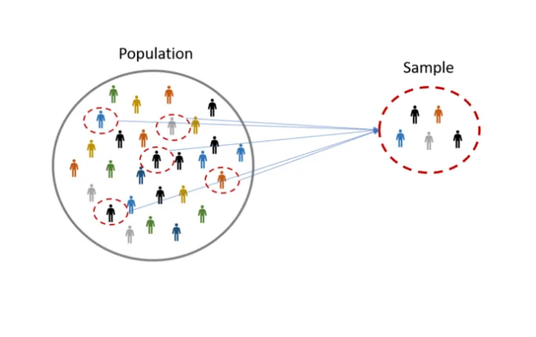
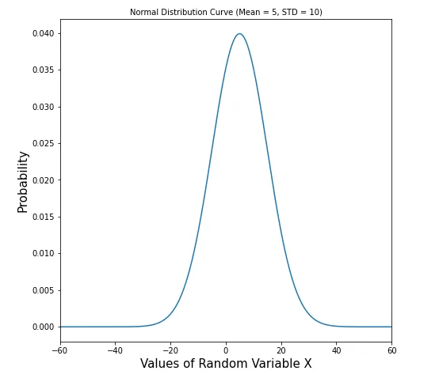
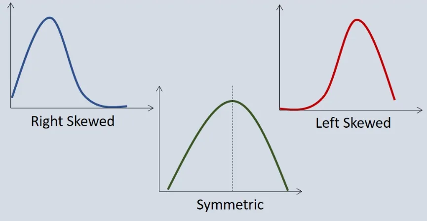
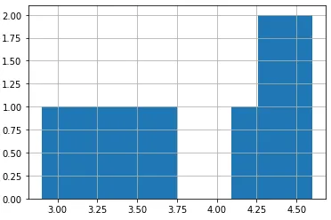
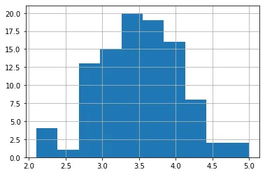
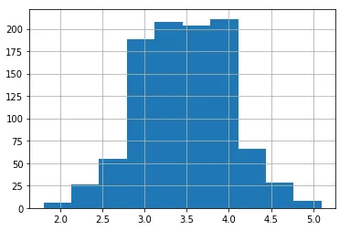
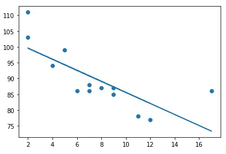
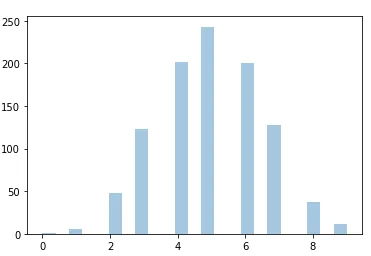
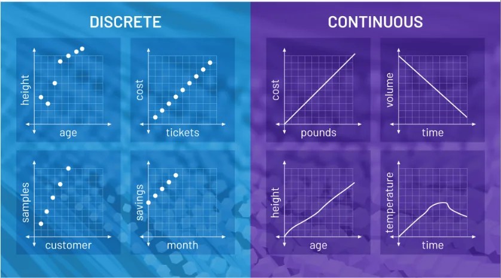

Statistics is a form of mathematical analysis which uses models and representations for a particular sets of data which makes our understandings easier. Statistics is mainly focused on data collection, data organisation, data analysis, data interpretation, and data visualisation.

Let us look into 10 important Statistical Concepts used in Data Science with examples.

For that first we will import all the important libraries that we will use.

```python
import statistics
import pandas as pd
import numpy as np
import matplotlib.pyplot as plt
from scipy.stats import norm
from scipy import stats
import seaborn as sns
```

## 1. Measures of Central Tendency
Measure of central tendency shows a single value that gives the central value of the data sets. It points the central location of the datas.

Mean: The mean is equal to the sum of all the values in the data set divided by the number of values in the data set. We can calculate the mean using statistics.mean() method.

```python
statistics.mean([1,3,3,5,7,8])
output:
4.5
```

Median:The median is the middle value for a set of data that has been arranged in order of magnitude. Similarly we calculate the median with statistics.median() method.

```python
statistics.median([1,3,5,7,9])
output:
5
```

Mode: Mode is the most frequently occurring data in the data set.

```python
statistics.mode([1,3,3,5,7,8])
output:
3
```

## 2**. **Population and Sample


In statistics population refers to the entire set of data for the statistical study. It can be a group of individuals, objects, events, organisation, etc. An Example of Population could be all the students in a school. It is not always feasible to do analysis on population because we cannot collect all the data of a population. Therefore, we use samples.

A sample represents a group of data selected from the population. Samples should be randomly selected and should represent the entire population within it.

## 3.Variance and Standard Deviation
Standard Deviation is a measure of spread in Statistics. A low standard deviation means that most of the numbers are close to the mean value. A high standard deviation means that the values are spread out over a wider range.

```python
speed = [32,111,138,28,59,77,97]
x = np.std(speed)
print(x)
output:
37.84501153334721
```

Variance is another number that indicates how spread out the values are. Variance is the square of Standard deviation.

```python
speed = [32,111,138,28,59,77,97]
x = np.var(speed)
print(x)
output:
1432.2448979591834
```

## 4. Normal Distribution
Normal distribution can be thought like a bell curve with most of its values scattered around it's central peak called the mean of the distribution. Here the probability of getting values near the mean is higher than the values away from the mean. The points in normal distribution are symmetrical.

*We will create a normal distribution with mean 5 and standard deviation 10.*

```python
m = 5
std = 10
snd = norm(m, std)
```

*To generate 1000 random values between -100, 100*

```python
x = np.linspace(-100, 100, 1000)
```

*Plot the normal distribution curve for different values of random variable falling in the range -100 to 100*

```python
plt.figure(figsize=(7.5,7.5))
plt.plot(x, snd.pdf(x))
plt.xlim(-60, 60)
plt.title('Normal Distribution Curve (Mean = 5, STD = 10)', fontsize='10')
plt.xlabel('Values of Random Variable X', fontsize='15')
plt.ylabel('Probability', fontsize='15')
plt.show()
```



## 5. Skewness


Skewness is asymmetry that deviates from the symmetrical bell curve, or normal distribution curve in a set of data, it measures the level of how much a given distribution is different from a normal distribution.

If the curve is shifted to the left or to the right, it is said to be skewed. Positive skew : when the distribution has a thicker right tail and mode<median<mean.

Negative skew : when the distribution has a thicker left tail and mode>median>mean.

Zero : when the distribution is symmetric about its mean and approximately mode=median=mean.

## 6. Central Limit Theorem
The Central Limit Theorem states that the sampling distribution of the sample means approaches a normal distribution as the sample size gets larger, no matter what the shape of the population distribution is.

```python
#lets roll a die 10 times
die = pd.Series([1, 2, 3, 4, 5, 6])
roll_die = die.sample(10, replace=True)
print(roll_die)
output:
0    1
1    2
4    5
5    6
1    2
3    4
5    6
2    3
0    1
0    1
dtype: int64
```

```python
# Rolling the dice 10 times 10 times
sample_means = []
for i in range(10):
    roll_die = die.sample(10, replace=True)
    sample_means.append(np.mean(roll_die))
 print(sample_means)
 # Convert to Series and plot histogram
 sample_means_series = pd.Series(sample_means)
 sample_means_series.hist()
 # Show plot
 plt.show()
 output:
 [3.7, 3.1, 4.3, 4.5, 3.5, 2.9, 3.3, 4.4, 4.1, 4.6]
```



```python
# 100 sample means
sample_means = []
for i in range(100):
    sample_means.append(np.mean(die.sample(10, replace=True)))
# Convert to Series and plot histogram
sample_means_series = pd.Series(sample_means)
sample_means_series.hist()
# Show plot
plt.show()
```



```python
# 1000 sample means
sample_means = []
for i in range(1000):
    sample_means.append(np.mean(die.sample(10, replace=True)))

# Convert to Series and plot histogram
sample_means_series = pd.Series(sample_means)
sample_means_series.hist()
# Show plot
plt.show()
```

- 

From above we came to know that as we keep on increasing the sample size our sample mean tends to show normal distribution curve.

## 7. Percentiles
Percentiles are used in statistics to give a number that describes the value that a given percent of the values are lower than.

```python
#To find which age are falling below 75%
ages = [5,31,43,48,50,41,7,11,15,39,80,82,32,2,8,6,25,36,27,61,31]
x = np.percentile(ages, 75)
print(x)
output:
43.0
```

The above example illustrates that 75% of the people are 43 or younger.

```python
#create array of 100 random integers distributed between 0 and 500
data = np.random.randint(0, 500, 100)
#find the 37th percentile of the array
np.percentile(data, 37)
output:
155.63
```

```python
#Find the quartiles (25th, 50th, and 75th percentiles) of the array
np.percentile(data, [25, 50, 75])
output:
array([ 92.25, 223.5 , 398.25])
```

## 8. Linear Regression
Linear regression in statistics is used to draw a straight line between different data points that passes through them all. With the help of this line we can also predict the future values.

We have two sets of data x and y as follows

```python
x = [5,7,8,7,2,17,2,9,4,11,12,9,6]
y = [99,86,87,88,111,86,103,87,94,78,77,85,86]
```

We use *some important key values of Linear Regression.*

```python
slope, intercept, r, p, std_err = stats.linregress(x, y)
```

*Next we create a function that uses the slope and intercept values to return a new value.The new value represents where on the y-axis the corresponding x value will be placed.*

```python
def reg(x):
    return slope * x + intercept
```

*Run each value of the x array through the function*

```python
plot = list(map(reg, x))
```

```python
#create scater plot
plt.scatter(x, y)
#Draw the line of linear regression
plt.plot(x, plot)
plt.show()
```



## 9. Binomial Distribution
Binomial distribution is the type of distribution that has two possible outcomes. It can be thought as a probability of predicting success or failure like in case of tossing a fair coin.

It takes three parameters, n is number of trials, p is probability of occurrence of each trial (e.g. for toss of a coin 0.5 each) and size is the shape of the array.

```python
x = np.random.binomial(n=10, p=0.5, size=20)
print(x)
output:
[6 2 4 5 4 5 3 1 5 3 4 4 6 6 3 8 4 2 8 4]
```

*For visualising binomial distribution*

```python
sns.distplot(np.random.binomial(n=10, p=0.5, size=1000), hist=True, kde= False)
```

- 

*binom.pmf() calculates the probability of having exactly k heads out of n coin flips.*

*Lets look into it with an example*

*Dorji makes 70% of his free-throw attempts. If he shoots 15 free throws, what is the probability that he makes exactly 10?*

```python
stats.binom.pmf(k=10, n=15, p=0.7)
output:
0.20613038097752118
```

*binom.cdf() calculates the probability of having k heads or less out of n coin flips.*
*Sonam flips a fair coin 10 times. What is the probability she gets heads 5 times or fewer?*

```python
stats.binom.cdf(k=5, n=10, p=0.5)
output:
0.6230468749999999
```

*binom.sf() calculates the probability of having more than k heads out of n coin flips.*
*Sonam flips a fair coin 10 times. What is the probability she gets heads more than 5 times?*

```python
stats.binom.sf(k=5, n=10, p=0.5)
output:
0.3769531250000001
```

## 10. Continuous vs Discrete Data
- 

Discrete data is a count that involves integers. It can only have limited number of values. The discrete values cannot be subdivided into parts. Example: number of students in a class, number of test questions answered correctly.

Continuous data is a type of numerical data that refers to the unspecified number of possible measurements between two realistic points. In continuous data we can get any value between any two points and the data are infinite unlike in case of discrete data. Example: Temperature measurement over a day, speed of a car.
