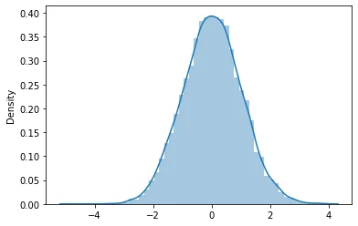
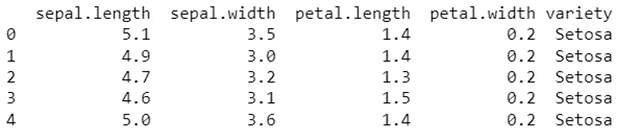
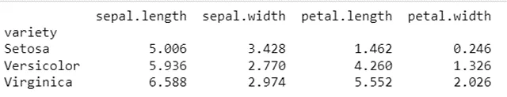
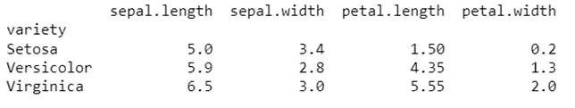

Understanding fundamental statistical concepts is essential for doing data science. In this blog post, we will explain in detail some statistical concepts such as **population and sample**, **normal distribution, mode, median, mean, range, interquartile range, standard deviation**.

A **population** is an entire group that you want to draw conclusions about.
A **sample** is a specific group that you will collect data from. The size of the sample is always less than the total size of the population.
In research, a population doesn’t always refer to people. It can mean a group containing elements of anything you want to study, such as objects, events, organizations, countries, species, organisms, etc.

*sample()* is an inbuilt function of random module in Python that returns a particular length list of items chosen from the sequence i.e. list, tuple, string, or set. It is used for random sampling without replacement.

Reasons for sampling

Necessity: Sometimes it’s simply not possible to study the whole population due to its size or inaccessibility.

Practicality: It’s easier and more efficient to collect data from a sample. Cost-effectiveness: There are a fewer participant, laboratory, equipment, and researcher costs involved.

Manageability: Storing and running statistical analyses on smaller datasets is easier and more reliable.

Syntax :

```python
random.sample(sequence, k)
```

Parameters: sequence:

Can be a list, tuple, string, or set. k: An Integer value, specifies the length of a sample.
Returns: k length new list of elements chosen from the sequence.

Simple implementation of sample() function.

```python
import pandas as pd
import numpy as np
import seaborn as sns
import matplotlib.pyplot as plt
from random import sample

# Prints list of random items of given length
list1 = [1, 2, 3, 4, 5]

print(sample(list1,3))
```

This results:

```python
[3, 2, 4]
```

Normal distribution, also known as the Gaussian distribution, is a probability distribution that is symmetric about the mean, showing that data near the mean are more frequent in occurrence than data far from the mean. In graph form, the normal distribution will appear as a bell curve.

```python
from scipy.stats import norm
# Create the sample using norm.rvs()
sample = norm.rvs(loc=0, scale=1, size=10000, random_state=13)
# Plot the sample
sns.distplot(sample)
plt.show()
```



Measures of central tendency help you find the middle, or the average, of a data set. The 3 most common measures of central tendency are the mode, median, and mean.

**Mode**: the most frequent value.

**Median**: the middle number in an ordered data set.

**Mean**: the sum of all values divided by the total number of values.

```python
df= pd.read_csv('iris.csv')
print(df.head())
```



The mean is the same as the average value of a data set and is found using a calculation. Add up all of the numbers and divide by the number of numbers in the data set.

```python
print(df.groupby('variety').agg(np.mean))
```



The median is the central number of a data set. Arrange data points from smallest to largest and locate the central number. This is the median. If there are 2 numbers in the middle, the median is the average of those 2 numbers.

```python
print(df.groupby('variety').agg(np.median))
```



The mode is the number in a data set that occurs most frequently. Count how many times each number occurs in the data set. The mode is the number with the highest tally. It's ok if there is more than one mode. And if all numbers occur the same number of times there is no mode.

```python
import statistics
df_setosa=df[df['variety']=='Setosa']
statistics.mode(df_setosa['sepal.length'])
```

This results:

```python
5.1
```

The measures of central tendency are not adequate to describe data. Two data sets can have the same mean but they can be entirely different. Thus to describe data, one needs to know the extent of variability. This is given by the measures of dispersion. Range, interquartile range, and standard deviation are the three commonly used measures of dispersion.

The range is the difference between the largest and the smallest observation in the data. The prime advantage of this measure of dispersion is that it is easy to calculate. On the other hand, it has lot of disadvantages. It is very sensitive to outliers and does not use all the observations in a data set.[1] It is more informative to provide the minimum and the maximum values rather than providing the range.

The interquartile range is defined as the difference between the 25th and 75th percentile (also called the first and third quartile). Hence the interquartile range describes the middle 50% of observations. If the interquartile range is large it means that the middle 50% of observations are spaced wide apart.

```python
np.quantile(df_setosa['sepal.length'],0.75)-np.quantile(df_setosa['sepal.length'],0.25)
```

This results:

```python
0.40000000000000036
```

This code also has the same output.

```python
from scipy.stats import iqr
iqr(df_setosa['sepal.length'])
```

```python
0.40000000000000036
```

Standard deviation (SD) is the most commonly used measure of dispersion. It is a measure of the spread of data about the mean. SD is the square root of the sum of squared deviation from the mean divided by the number of observations.

```python
np.std(df_setosa['sepal.length'])
```

This results:

```python
0.3489469873777391
```

```python
np.sqrt(np.var(df_setosa['sepal.length']))
```

This code also has the same output.

```python
0.3489469873777391
```

In conclusion, in data science, statistics is **at the core of sophisticated machine learning algorithms, capturing and translating data patterns into actionable evidence**. Data scientists use statistics to gather, review, analyze, and draw conclusions from data, as well as apply quantified mathematical models to appropriate variables.

You can get the Github repo of these codes as a jupyter notebook [here](https://github.com/iamNargiz/Statistical-Concepts-for-Data-Science).
