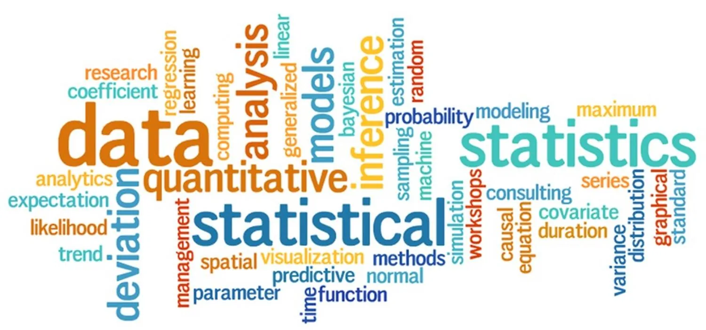
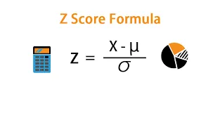
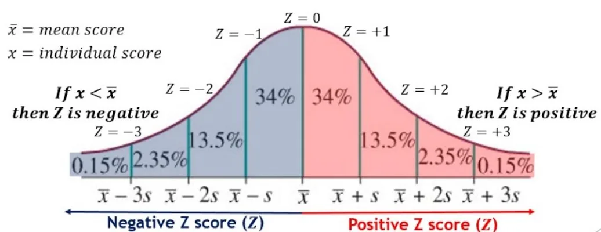
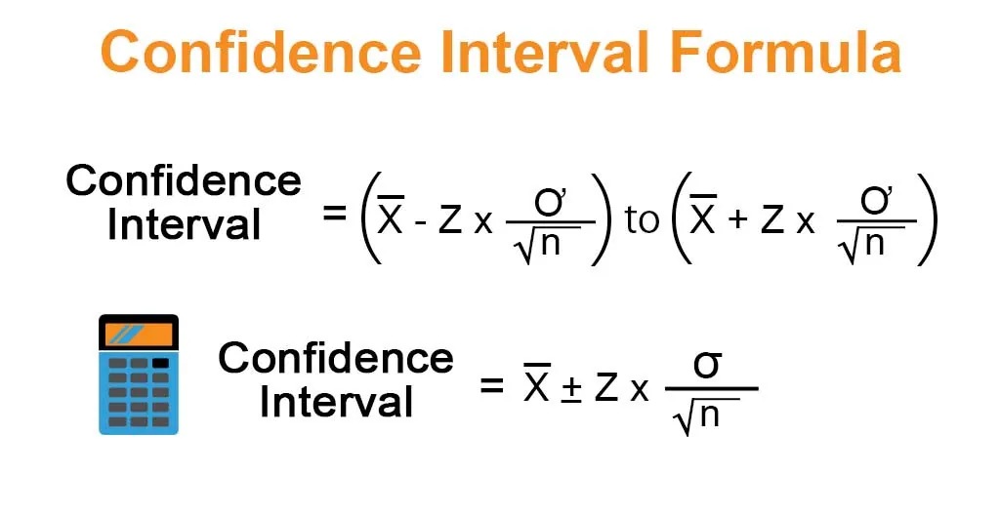
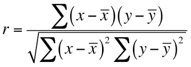

In this blog post, we will cover some essential statistics terms which are very helpful in exploratory data analysis, and feature engineering tasks.

## 1) Z-Score
Z-score is a measure that describes a relationship of a particular value with the mean of a group of values. It is measured in terms of standard deviation from the mean. it is computed using the below formula.



### Applications of using Z-score
1. Z-score will help us to know how much standard deviation far a value is from the mean.
2. Z-score is used in Standardization – we can scale down the values in feature towards mean using z-score.
3. Compare scores between different distributions – we can also use a z-score to compare two distributions and tell which one is better. for example, suppose Indian-England test series data for the past 2 years. we are given an average score, maximum score, and standard deviation, and based on this we want to find in which year India played more powerful. we can use a z-score to solve this type of problem. have a look at the below figure and you will see how we use a z-score to do so.



### calculate Z-score using Python
```python
import numpy as np
import scipy.stats as stat
arr = np.array([6, 7, 7, 12, 13, 13, 15, 16, 19, 22])
print(stat.zscore(arr, axis=0))
```

```python
Out:
[-1.39443338 -1.19522861 -1.19522861 -0.19920477  0.          0.   0.39840954  0.5976143   1.19522861  1.79284291]
```

## 2) Confidence Interval
Confidence Interval is the probability that a population parameter will fall between a certain range for a certain proportion of times. In simple words, a confidence interval tells the percentage confidence of certain events happening in a particular range. It is one of the important measures in data analysis for proving our assumptions true



where the margin of error is basically a standard deviation and the point estimate is the mean. for calculating the confidence interval we calculate the point estimate, for example, we need to find 95% confidence so we will assume the point estimate as 95 and try to find the quantity of data lies between which range.

How to Compute Confidence Interval using Python

```python
import scipy.stats as stat
np.random.seed(10)
data = np.random.randint(10, 30, 50)
#create 95% confidence interval for population mean weight
conf_interval = stat.norm.interval(alpha=0.95, loc=np.mean(data), scale=stat.sem(data))
print(conf_interval)
```

```python
Out:
(18.936862441586825, 22.103137558413174)
```

The 95% Confidence interval for the true population mean is:
**(18.93, 22.10)**

## 3) Hypothesis Testing
A hypothesis in simple words is an assumption or a guess about something in the world around you. So results can be 2 things either your guess is correct or incorrect. In data science terms we refer to hypothesis testing as where We try to evaluate 2 mutually exclusive statements on a population using a sample of data.

### Steps of Hypothesis testing
- make initial assumptions – The initial assumption you make is known as the **Null Hypothesis** with is denoted with H0, which is always assumed as true before the experiment. And in opposite to it, we have an **Alternate Hypothesis** denoted by H1.
- Collect data – To prove your assumptions correct we collect some data related to it or we can say we collect evidence to prove our statement correct. while working with the Machine learning problem statements we are having data, and we try to find some patterns from it as evidence.

### Type-I Error and Type-II Error
When we know the actual outcome that the null hypothesis is true but due to lack of evidence we failed to prove it and we have to reject it and select an Alternate hypothesis is known as Type-1 error. And in the opposite of it, the same applies to Type-II error, when we have can not reject the Null hypothesis, there Type-II error is achieved. You can understand it in a better way in form of Confusion Matrix.

### Different tests to perform Hypothesis testing

#### I) P-Value Test
P-value is the probability of obtaining results at least as extreme as observed results for the Hypothesis test assuming the Null hypothesis as correct and is performed by knowing the distribution of data. The P-value is also known as significance level and also denoted as alpha. the default value assumed is 5% or 0.05. when P-value is less than 5%, it means we do not have enough evidence to prove the NULL hypothesis as correct and have to reject it. P-value is usually found using a P-value table also known as a *z-table*.

If we have 2 categorical variables then we use the chi-square test.

#### II) Chi-Square Test
Chi-square is a very good way to show a relationship between 2 categorical features. Chi-square is a measure that basically tells a difference that exists between your observed counts and the count you would expect if there would no relationship between 2 variables in the population.

Compute P-value for Chi-Square test using Python

```python
stat.chi2.pdf(3.84, 1)
```

```python
Out: 0.029846887483060566
```

we apply the chi-square transformation and calculated the probability density function which in turn gives P-value.

#### III) T-test
When we assume continuous features for Hypothesis testing then the type of test we use is a T-test. T-test tells the significant difference between the mean of two groups which may or may not be related to a label. In simple words, the t-test helps us in comparing an average of 2 groups and determining if they came from the same population or not.

For calculating T-value we require 3 data values. It includes differences between mean values, standard deviation, and several observations.

If we want to perform a test on a more continuous feature then we go with Correlation which we will study in the further part of the article.

## 4) Covariance
Covariance is one of the very important topics when we consider data preprocessing in order. Quantifying the relationship between two random variables is known as Covariance. It is similar to variance, where variance tells how a single variable varies from the mean, covariance helps to know how two variables vary together. Covariance does not represent strength between two variable and only indicate the direction of the linear relationship between them.

**Cov(x,y) = SUM [(xi – xm) \* (yi – ym)] / (n – 1)**

- xi is a given x value in the data set
- xm is the mean, or average, of the x values
- Yi is the y value in the data set that corresponds with xi
- ym is the mean, or average, of the y values
- n is the number of data points

Covariance is an important term that will help you in the data analysis step and also it is used by many machine learning algorithms like Linear Regression.

Compute covariance using Python.

```python
arr = np.array([[2,6,8],[1,5,7],[3,6,9]])
print("covariance: ", np.cov(arr))
```

```python
covariance:  [[9.33333333 9.33333333 9.        ]  [9.33333333 9.33333333 9.        ]  [9.         9.         9.        ]]
```

## 5) Correlation
Correlation is a measure used to represent how strongly 2 variables relate to each other. Correlation is the scaled form of covariance. correlation ranges between -1 to +1. If the value of correlation is near +1, it means two variables are highly positively correlated. And in the opposite, its value is near -1 which means the two variables are negatively correlated. It basically measures the strength and direction of a linear relationship between two variables.

- Strength – if I have 2 variables as X and Y, then if X increases then Y increases or decreases, this is only a strength that correlation tells us.
- The direction of the relationship – It means whether the relationship is in a positive or negative direction.

We also use correlation in ***feature selection*** to avoid ***multicollinearity*** in data. There are different ways to calculate the correlation coefficient between two variables.

### I) Pearson Correlation Coefficient
It is the most used technique to find correlation coefficients. Pearson Correlation coefficient is the covariance of two variables divided by-product of their standard deviation. Its range is between -1 to +1 and It is represented by *ρ* (rho).



- When there is a perfect linear relationship then the value of the Pearson correlation coefficient will be +1(When x increases, Y also increases).
- When X(independent variable) is increasing, Y(dependent variable) is decreasing then the value will be -1.
- When there is a non-linear relationship or a constant line at 0 then the value is 0.

we can directly use the corr method of the panda's data frame to find the Pearson correlation coefficient.

### II) Spearman rank Correlation Coefficient
It is a little bit different in both methods. In Spearman rank correlation we trying to find the Pearson correlation of rank of x and rank of y. now, what is the rank of X and Y?


Steps to compute the Spearman Correlation coefficient are,

1. Sort the data by the first column(Xi), create a new column, and assign it ranked values from 1,2,3,…n.
2. Now sort the data by second column(Yi). Create another column and rank it.
3. Create a new column difference(Di) that holds a difference between two rank columns.
4. Finally, create a new column that holds a squared value of the difference column.

Now you have all the values, substitute values to the equation and you will get the correlation coefficient.

That's it, I hope this article was worth reading and helped you acquire new knowledge no matter how small.

Feel free to check up on the [notebook](https://github.com/MariamAlsaedy/Data-Insight-Scholarship-Article-Statistical-concepts). You can find the results of code samples in this post.
