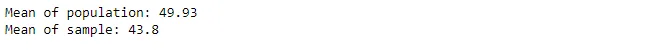
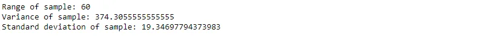
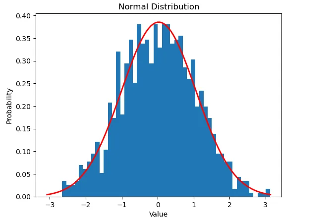
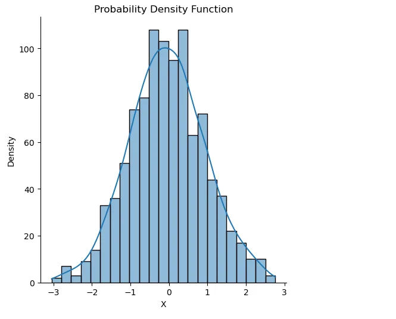
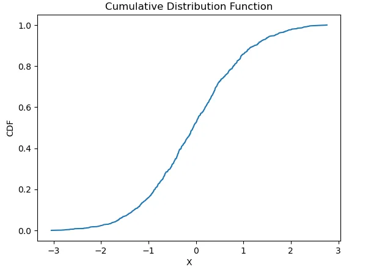
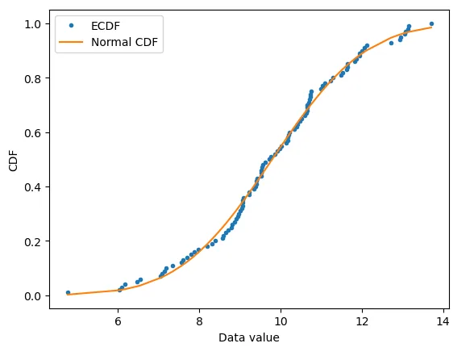

Fundamental statistical concepts play a crucial role in data science because they provide the mathematical framework and tools necessary to extract insights and make informed decisions from data. It is these statistical concepts that will be used to understand the data and model relationships in data. Designing experiments and analyzing the results of the experiments requires an understanding of the fundamental statistical concepts.

In this post, we will discuss a number of key statistical concepts that are critical for a data science process.

## Table of Contents

1. Population and Sample

2. Measure of central Tendency

3. Measure of Dispersion

4. Probability Distributions

5. Normal Distribution

6. Standard Normal Distribution

7. Probability Density Function

8. Cumulative Distribution Function

9. Empirical Cumulative Distribution function

10. Hypothesis Testing

Conclusion

GitHub Link

## 1. Population and Sample

A population is a complete set of all elements or objects of interest in a study. It is the entire group that we want to draw inferences about or make statements about. In contrast, a sample is a portion of the population selected for study. The sample is used to estimate characteristics of the population, make inferences about the population, and to understand the relationship between variables in the population. The sample should be representative of the population, meaning it should accurately reflect the characteristics of the population. Proper sampling techniques are critical to ensure accurate inferences about the population can be made from the sample.

Let us say we have a population of 100 individuals with different ages and we want to make inferences about their ages. We may draw a sample of say 10 individuals from this population and study their ages. In the example below we use the random module to generate a population of 100 individual ages between 20 and 80 and draw a random sample of 10 individual ages. We calculate the mean of the population and the sample. Without the population mean, the sample mean is used to represent the population mean in data analysis.

## 2. Measure of central Tendency

Measures of central tendency are statistical tools used to describe the central or typical value of a set of data. There are three common measures: mean (arithmetic average), median (middle value), and mode (most frequent value). The choice of measure depends on the data and the purpose of the analysis. The mean is sensitive to outliers, the median is not sensitive to outliers, and the mode may not always be a good representation of the central tendency. It's important to consider the properties of each measure when choosing the appropriate one for the data.

### 2.1 Mean
The mean is calculated by summing all the values in a dataset and then dividing the number of values in the dataset. Given 𝑛 values in a dataset of values 𝑥1,𝑥2,𝑥3...𝑥𝑛 the mean is given by:

𝑀𝑒𝑎𝑛=(∑𝑥)/n

### 2.2 Mode

The mode is the value that occurs most frequently in a set of data. To calculate the mode, you need to count the frequency of each value in the data and identify the value(s) with the highest frequency. If the data has multiple values with the same highest frequency, then the data has multiple modes. If there is no value that occurs more frequently than any other value, then the data has no mode.

### 2.3 Median

The median is the middle value of a set of data when the data is arranged in order from smallest to largest. To calculate the median of a set of n values, x, you first need to arrange the values in order and then follow these steps:

1. If n is odd, the median is the middle value, 𝑥[(𝑛+1)/2]
   .
2. If n is even, the median is the average of the two middle values,(𝑥[𝑛/2]+𝑥[𝑛/2+1])/2

## 3. Measure of Dispersion

## 4. Probability Distributions

Probability distributions are mathematical functions that describe the likelihood of observing certain values in a population. They provide a way to describe and model the distribution of data by specifying the probability of observing each possible value or range of values. Different types of probability distributions can be used to model different types of data, such as discrete or continuous variables, and different types of distributions are suitable for different types of data. Some common types of probability distributions include normal, binomial, Poisson, exponential, and uniform distributions. Understanding probability distributions is important for data scientists as it allows them to model and make predictions about real-world data, to compare different distributions and to make inferences about populations based on samples.

## 5. Normal Distribution

The normal distribution, also known as the Gaussian distribution or the bell curve, is a continuous probability distribution that is widely used in statistics. The normal distribution is defined by its mean and standard deviation, and it describes the distribution of a large number of independent, identically distributed random variables. The normal distribution is symmetrical and has a peak at the mean, with values becoming increasingly rare as they move away from the mean. This shape is why the normal distribution is often depicted as a bell-shaped curve. The normal distribution is widely used to model real-world phenomena and to make predictions and inferences about a population based on a sample of data. It is also the basis for many statistical tests, such as hypothesis testing, and is widely used in fields such as economics, engineering, and the natural sciences.

In the example below we demonstrate how we can generate a normal distribution with mean of zero and standard deviation of 1.

## 6. Standard Normal Distribution

The normal distribution plotted in 5 above with a mean of zero and standard deviation of one is known as a standard Normal Distribution. It is a special case of the normal distribution that has been standardized to make comparison between different normal distributions easier. Standardizing a normal distribution transforms its mean and standard deviation into the standardized values of 0 and 1, respectively. The standard normal distribution is important because it allows for the use of standard normal tables and z-scores, which can be used to make inferences about a population based on a sample. For example, a z-score can be used to determine the probability of observing a particular value in a standard normal distribution, which can then be used to make inferences about values in a non-standard normal distribution.

## 7. Probability Density Function

A probability density function (PDF) is a mathematical representation of the probability distribution of a continuous random variable. It describes the likelihood of a variable taking on a particular value by giving its instantaneous rate of change of probability. The PDF is a non-negative function that integrates to 1 over all possible values and provides information about the central tendency, spread, and skewness of the data. PDFs are used in data science to visualize the distribution of variables and make inferences about populations based on sample data.

The example below shows a visualization of a PDF for a normal distribution.

## 8. Cumulative Distribution Function

A cumulative distribution function (CDF) is a function that describes the probability that a random variable will take on a value less than or equal to a specified value. It is the accumulation of the probability density function (PDF) over an interval. The CDF is a non-decreasing function that ranges from 0 to 1 and represents the accumulated probability of all the values less than or equal to the specified value. It can be used to calculate probabilities of intervals and to find percentiles and quantiles of a distribution. CDFs are useful for comparing different distributions and for visualizing the distribution of a variable by plotting its CDF. In data science, CDFs are often used to visualize the distribution of variables and to make inferences about the population based on sample data.

The example below shows a visualization of a CDF for a normal distribution.

## 9. Empirical Cumulative Distribution function

An empirical cumulative distribution function (ECDF) is a non-parametric estimator of a cumulative distribution function (CDF) that provides information about the distribution of a set of data. The ECDF is calculated by counting the number of data points that are less than or equal to a given value, and dividing by the total number of data points. The result is a step function that approaches the true CDF as the number of data points increases. ECDFs are useful for visualizing the distribution of a sample of data and making inferences about the population. They are particularly useful when the data is not normally distributed or when the underlying distribution is unknown. ECDFs are widely used in data science, especially in exploratory data analysis and hypothesis testing.

The example below shows how you can plot an ECDF and compare it with the normal CDF to see if the data follows a normal distribution.

## 10. Hypothesis Testing

Hypothesis testing is a statistical method used to test the validity of a claim or hypothesis about a population based on a sample of data. It involves formulating a null hypothesis and an alternate hypothesis, and using statistical tests to determine the likelihood of the observed sample data under the null hypothesis. The result of the hypothesis test is used to make a decision about whether to accept or reject the null hypothesis in favor of the alternate hypothesis. The goal of hypothesis testing is to make inferences about the population based on the sample data, and to assess the uncertainty of these inferences.

## Conclusion

In conclusion, fundamental statistical concepts play a crucial role in data science. They provide the foundation for understanding the behavior of data and making informed decisions based on that data. Understanding and being able to apply concepts such as measures of central tendency, dispersion, probability distributions, hypothesis testing, and sampling is essential for data scientists to effectively analyze and interpret data. The ability to generate, visualize and analyze statistical distributions, perform hypothesis tests, and make inferences about populations from samples, enables data scientists to extract meaningful insights from data and support decision making. The application of these concepts allows data scientists to effectively extract insights and make accurate predictions based on data, and as such, are an indispensable tool in the data science toolkit.

## GitHub Link

Notebook for the full code can be found from this [GitHub link](https://github.com/Musonda2day/Data-Scientist-Program---Data-Insight/tree/main/Assignments/Statistical%20Concepts%20for%20Data%20Science).
