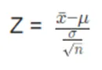
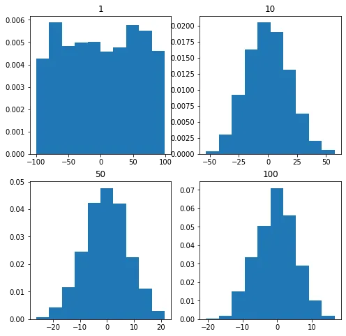
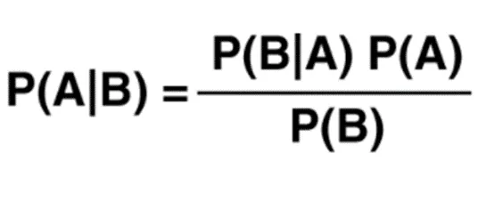
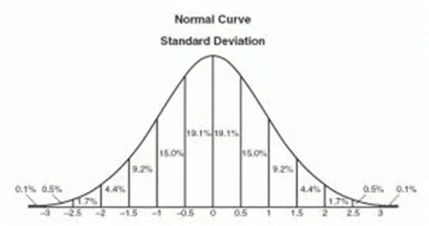
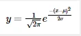
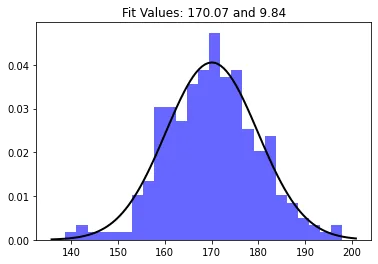
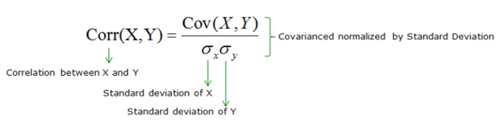
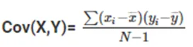
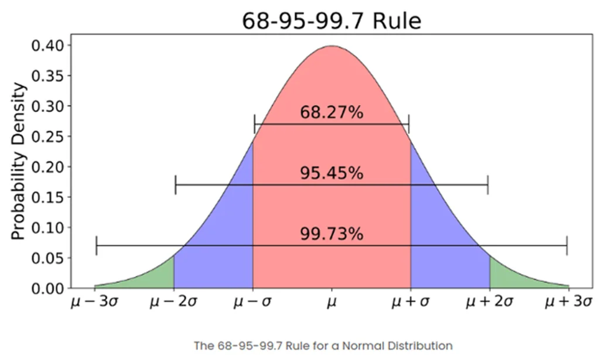
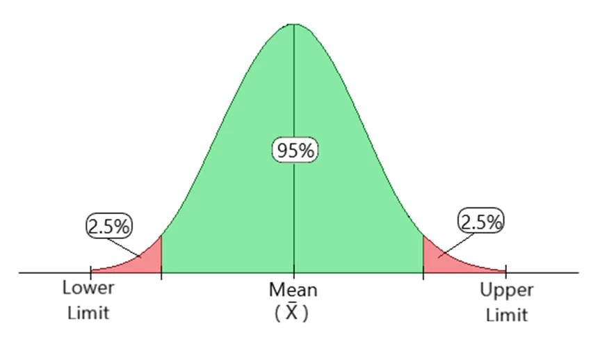

In this blog, some important statistical concepts for Data Science are discussed.

## 1. Measures of Central Tendency

There are two main branches in the field of statistics: Descriptive and Inferential Statistics. Descriptive statistics aims to describe the data as the name suggests. The raw data are described using summary statistics, graphs and table. Whereas, inferential statistics uses a small sample to draw inferences about the larger population that the sample came from. While descriptive statistics describe data, inferential statistics make predictions in data.

We will now take a look how to describe data using one of the summary statistics which is measuring central tendency. Measures of central tendency provide a single value that describes the center of the data set, which tends to help us understand the dataset much more quickly compared to simply looking at all of the individual values in the dataset.

The central tendency of the dataset can be found out using three important measures namely mean, median and mode.

**Mean**

The most commonly used measure of central tendency which finds the average value of the dataset. We can calculate by simply add up all of the individual values and divide by the total number of values. It is best to use the mean when the distribution of the data is fairly symmetrical and there are no outliers.

Mean = (sum of all values) / (total number of values)

**Median**

The median is the middle value in a dataset. You can find the median by arranging all the individual values in a dataset from smallest to largest and finding the middle value. If there are an odd number of values, the median is the middle value. If there are an even number of values, the median is the average of the two middle values. It is best to use the median when the distribution of the data is either skewed or there are outliers present.

**Mode**

The mode is the value that occurs most often in a dataset. A dataset can have no mode (if no value repeats), one mode, or multiple modes. It is best to use the mode when you are working with categorical data and you want to know which category occurs most frequently.

We can use 'statistics' library in python to illustrate this.

```python
import statistics
nums = [9, 4, 6, 6, 5, 2, 10, 12, 1]
mean = statistics.mean(nums)mean = statistics.mean(nums)
median = statistics.median(nums)
mode=statistics.mode(nums)
print("Mean:",mean)
print("Median:",median)
print("Mode:",mode)
```

Output:

```python
Mean: 6.111111111111111
Median: 6
Mode: 6
```

## 2. Central Limit Theorem

In probability, the central limit theorem (CLT) states that the distribution of a sample variable approximates a normal distribution as the sample size becomes larger, assuming that all samples are identical in size, and regardless of the population’s actual distribution shape. In other words, if a sufficiently large sample size from a population with a finite level of variance, the mean of all sampled variables from the same population will be approximately equal to the mean of the whole population.

**Assumptions of Central Limit Theorem**

- The sample should be drawn randomly following the condition of randomization.
- The samples drawn should be independent of each other. They should not influence the other samples.
- When the sampling is done without replacement, the sample size shouldn’t exceed 10% of the total population.
- The sample size should be sufficiently large

**Formula**

Central Limit Theorem for Sample Means,



**Applications of Central Limit Theorem**

The sample distribution is assumed to be normal when the distribution is unknown or not normally distributed according to Central Limit Theorem. This method assumes that the given population is distributed normally. It helps in data analysis.

The sample mean deviation decreases as we increase the samples taken from the population, which helps in estimating the mean of the population more accurately.

**Illustration of CLT**

```python
#import libraries
import numpy as np
import matplotlib.pyplot as plt
#number of sample
s_size=[1,10,50,100]
#list of sample means
means=[]
#Generating random numbers from -50 to 50 of different sample sizes
#take each mean and appending to list means
for i in s_size:
  #Generate seed to get same result
  np.random.seed(1)
  x=[np.mean(np.random.randint(-100,100,i)) for j in range(1000)]
  means.append(x)
  k=0
#plot all the means in one figure
fig,ax=plt.subplots(2,2,figsize=(8,8))
for i in range(0,2):
  for j in range(0,2):
    ax[i, j].hist(means[k], 10, density = True)
    ax[i, j].set_title(label = s_size[k])
    k = k + 1
plt.show()
```

Result:



We can see that the distribution of a sample variable approximates a normal distribution as the sample size becomes larger.

## 3. Bayes Theorem

Bayes’ Theorem or Bayes’ Rule is named after Reverend Thomas Bayes. It describes the probability of an event, based on prior knowledge of conditions that might be related to that event. It can also be considered for conditional probability examples. For example: if we have to calculate the probability of taking a blue ball from the second bag out of three different bags of balls, where each bag contains three different color balls viz. red, blue, black. In this case, the probability of occurrence of an event is calculated depending on other conditions is known as conditional probability.

**Formula**



**Applications of Bayes Theorem**

One of the many applications of Bayes’ theorem is Bayesian inference, a particular approach to statistical inference. Bayesian inference has found application in various activities, including medicine, science, philosophy, engineering, sports, law, etc. For example, we can use Bayes’ theorem to define the accuracy of medical test results by considering how likely any given person is to have a disease and the test’s overall accuracy. Bayes’ theorem relies on consolidating prior probability distributions to generate posterior probabilities. In Bayesian statistical inference, prior probability is the probability of an event before new data is collected.

## 4. Normal Distribution

A normal distribution is an arrangement of a data set in which most values cluster in the middle of the range and the rest taper off symmetrically toward either extreme. Height is one simple example of something that follows a normal distribution pattern. Most people are of average height the numbers of people that are taller and shorter than average are fairly equal and a very small (and still roughly equivalent) number of people are either extremely tall or extremely short. Here's an example of a normal distribution curve: (ref: www.tutorialspoint.com)



A graphical representation of a normal distribution is sometimes called a bell curve because of its flared shape. The precise shape can vary according to the distribution of the population but the peak is always in the middle and the curve is always symmetrical. In a normal distribution the mean mode and median are all the same.

Formula



Illustration of Normal Distribution

```python
import numpy as np
from scipy.stats import norm
import matplotlib.pyplot as plt
#Generate some data for this demo
data = np.random.normal(170, 10, 250)

# Fit a normal distribution to the data, mean and standard deviation
mu, std = norm.fit(data)

# Plot the histogram.
plt.hist(data, bins=25, density=True, alpha=0.6, color='b')

# Plot the PDF.
xmin, xmax = plt.xlim()
x = np.linspace(xmin, xmax, 100)
p = norm.pdf(x, mu, std)

plt.plot(x, p, 'k', linewidth=2)
title = "Fit Values: {:.2f} and {:.2f}".format(mu, std)
plt.title(title)

plt.show()
```

Result:



## 5. Covariance and Correlation

The terms covariance and correlation are very similar to each other in probability theory and statistics. Both the terms describe the extent to which a random variable or a set of random variables can deviate from the expected value.

In statistics, it is frequent that we come across these two terms known as covariance and correlation. The two terms are often used interchangeably. These two ideas are similar, but not the same. Both are used to determine the linear relationship and measure the dependency between two random variables.

Covariance is when two variables vary with each other, whereas Correlation is when the change in one variable results in the change in another variable.

In simple terms, correlation is a function of the covariance. The fact that differentiates the two is that covariance values are not standardized while correlation values are. The correlation coefficient of two variables can be obtained by dividing the covariance values of these variables by the multiplication of the standard deviations of the given values.

Correlation and covariance are calculated on samples and not populations termed as sample covariance and correlation. Both terms define the relationship and dependency between the variables.

Correlation measures the association between the variables.





## 6. Correlation Vs Causation

It is a statistical term which depicts the degree of association between two random variables. In data analysis it is often used to determine the amount to which they relate to one another.

Three types of correlation are:

**Positive correlation** –If with increase in random variable A, random variable B increases too, or vice versa.

**Negative correlation** –If increase in random variable A leads to a decrease in B, or vice versa.

**No correlation** –When both the variables are completely unrelated and change in one leads to no change in other.

**Causation :**

Causation between random variables A and B implies that A and B have a cause-and-effect relationship with one another. Or we can say existence of one gives birth to other, and we say A causes B or vice versa. Causation is also termed as causality.

***Correlation does not imply Causation.***

Correlation and Causation can exist at the same time also, so definitely correlation doesn’t imply causation.

## 7. Bias/Variance Tradeoff

In statistics and machine learning, it is vital to understand prediction errors: bias and variance when we consider the accuracy of the models. There is a tradeoff between the ability of thee model to minimize bias and variance. Proper understanding of these errors would help to avoid overfitting and underfitting of data set while training the mode.

**Bias**

The bias is the difference between the predicted values and the correct values. High bias can give a large error in training as well as testing data which can lead to underfitting. Underfitting means that the predicted data is in a straight line format, thus not fitting accurately in the data set. Being low bias is recommended to avoid underfitting. Underfitting can happen when the hypothesis is too simple or linear in nature.

**Variance**

Variance shows the variability of model prediction. High variance has a very complex fit to the training data whereby it cannot make the data which it has not seen before to fit accurately. As a result of it, such models perform very well on training data but has high error rates on test data. High variance model can lead to overfitting of data. Overfitting is fitting the training data set accurately but high error on testing data. Low variance is recommended to avoid overfitting.

**Trade-off**

If the model is too simple and has very few parameters, then it may be on high bias and low variance condition and thus is error-prone. On the other hand, if the model fit too complex and has large number of parameters, then it may be on high variance and low bias. There is something between both of these conditions, known as Trade-off or Bias Variance Trade-off. We need to balance the trade-off to avoid both overfitting and underfitting the data. An algorithm cannot be more complex and less complex at the same time.

An optimal balance of bias and variance can overcome overfit and underfit problems. Therefore, understanding bias and variance is important for understanding the behavior of prediction models.

## 8. Sampling errors

Sampling errors are statistical errors that arise when a sample does not represent the whole population. They are the difference between the real values of the population and the values derived by using samples from the population. It is the difference between a population parameter and a sample statistic used to estimate it. For example, the difference between a population mean and a sample mean. Since there is a fault in the data collection, the results obtained from sampling become invalid. Furthermore, when a sample is selected randomly, or the selection is based on bias, it fails to denote the whole population, and sampling errors will certainly occur.

Causing sampling error can be prevented by selecting samples of data to represent the whole population effectively. Sampling errors are affected by factors such as the size and design of the sample, population variability. The population variability can cause variations in the estimates derived from different samples which can further lead to large errors. The effect of population variability can be reduced by increasing the size of the samples to represent the population more effectively. In general, increasing the size of samples can eliminate sampling errors.

**Different types of sampling errors**

Population Specification Error: Can happen when we do not understand who to survey.

**Selection Error**: Can occur when the respondents’ survey participation is self-selected which implies that only those who are interested respond. This type of error can be reduced by encouraging participation.

**Sample Frame Error**: Can occur when a sample is selected from the wrong population data.

**Non-Response Error:** Can occur when a useful response is not obtained from the surveys. It may happen due to the inability to contact potential respondents or their refusal to respond.

## 9. Z-score

Z-score is also known as standard score which tells us how far a data point is from the mean. It indicates how many standard deviations an element is from the mean. Hence, Z-Score is measured in terms of standard deviation from the mean. For example, a standard deviation of 2 indicates the value is 2 standard deviations away from the mean. In order to use a z-score, we need to know the population mean (μ) and also the population standard deviation (σ).

A z-score can be calculated using the following formula.

z = (X – μ) / σ

where,

z = Z-Score,

X = The value of the element,

μ = The population mean, and

σ = The population standard deviation

**Interpretation of Z-score**

- An element having a z-score less than 0 represents that the element is less than the mean.
- An element having a z-score greater than 0 represents that the element is greater than the mean.
- An element having a z-score equal to 0 represents that the element is equal to the mean.
- An element having a z-score equal to 1 represents that the element is 1 standard deviation greater than the mean; a z-score equal to 2, 2 standard deviations greater than the mean, and so on.
- An element having a z-score equal to -1 represents that the element is 1 standard deviation less than the mean; a z-score equal to -2, 2 standard deviations less than the mean, and so on.
- If the number of elements in a given set is large, then about 68% of the elements have a z-score between -1 and 1; about 95% have a z-score between -2 and 2; about 99% have a z-score between -3 and 3. This is known as the Empirical Rule or the 68-95-99.7 Rule and can be demonstrated in the image below:



## 10. Confidence Interval

In simple terms, Confidence Interval is a range where we are certain that true value exists. The selection of a confidence level for an interval determines the probability that the confidence interval will contain the true parameter value. This range of values is generally used to deal with population-based data, extracting specific, valuable information with a certain amount of confidence, hence the term ‘Confidence Interval’.



Fig 1: Confidence Interval Illustration

**Confidence Level**:

The confidence level describes the uncertainty associated with a sampling method.

Suppose we used the same sampling method (say sample mean) to compute a different interval estimate for each sample. Some interval estimates would include the true population parameter and some would not.

A 90% confidence level means that we would expect 90% of the interval estimates to include the population parameter. A 95% confidence level means that 95% of the intervals would include the population parameter.
