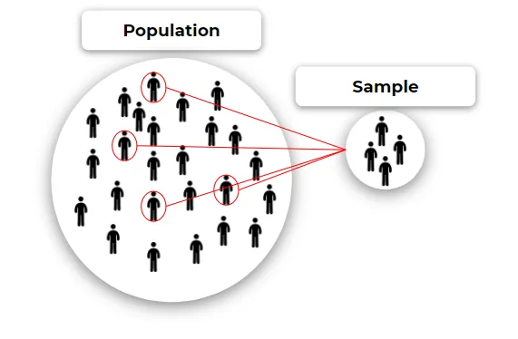
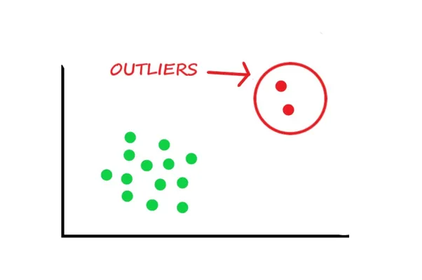

INTRODUCTION:

Statistics is used in almost all aspects of data science. It is used to analyze, transform and clean data. Evaluate and optimize machine learning algorithms. It is also used in the presentation of insights and findings. In this article, we learned some concepts of Statistics which help us in our analysis.

**1) Population and Sample:**

A **population** is an entire group that you want to conclude about.

A **sample** is a specific group that you will collect data from. The size of the sample is always less than the total size of the population.

Examples:

Overall advertised jobs in World is population. From the population, data scientists advertised jobs are a sample.



**2) Descriptive Statistics:**

Descriptive statistics are useful because they allow you to understand a group of data much more quickly and easily compared to just staring at rows and rows of raw data values.

For example, suppose we have a set of raw data that shows the test scores of 1,000 students at a particular school. We might be interested in the average test score along with the distribution of test scores.

Using descriptive statistics, we could find the average score and create a graph that helps us visualize the distribution of scores.

This allows us to understand the test scores of the students much more easily compared to just staring at the raw data.

In Descriptive Statistics, we used the measures of central tendency and dispersion to analyze raw data more frequently.

**3) The measure of Central Tendency**

The mean, median and mode are all valid measures of central tendency, but under different conditions, some measures of central tendency become more appropriate to use than others. In the following sections, we will look at the mean, mode and median, and learn how to calculate them.

**Mean:**

The mean is equal to the sum of all the values in the data set divided by the number of values in the data set.

```python
data = [12, 15, 36, 41, 18, 27, 41, 37, 41, 25, 95, 10, 25, 124]
np_data = np.array(data)
np.mean(np_data)
```

```python
39.07142857142857
```

**Median:**

The median is the middle score for a set of data that has been arranged in order of magnitude. The median is less affected by outliers.

```python
np.median(np_data)
```

```python
31.5
```

**Mode:**

The mode is the most frequent score in our data set.

```python
statistics.mode(np_data)
```

```python
41
```

**4) Percentiles**

A percentile (or a centile) is a measure used in statistics indicating the value *below which* a given percentage of observations in a group of observations fall.

For example, the 20th percentile is the value (or score) below which 20% of the observations may be found.

To calculate percentile, we used np.percentile() function

from the Numpy library.

```python
np.percentile(np_data, 25)
```

```python
19.75
```

To calculate multiple percentiles in one line of code.

```python
np.percentile(np_data, [25, 50, 75])
```

```python
array([19.75, 31.5 , 41.  ])
```

**5) Discrete and Continuous Data:**

Discrete data is information that can only take certain values and can't be made more precise. This might only be whole numbers, like the numbers on a die (any number from 1 to 6) or could be other types of fixed number schemes, such as shoe sizes (2, 2.5, 3, 3.5, etc.). They are called discrete data because they have fixed points and measures in between do not exist (you can't get 2.5 on a die, nor can you have a shoe size of 3.49).

Counted data are also discrete data, so numbers of students in a class, the number of patients in the hospital and the number of marbles in a bag are all examples of discrete data.

On the other hand, continuous data is data that can take any value, usually within certain limits, and could be divided into finer and finer parts. A person's height is continuous data as it can be measured in meters and fractions of meters like (centimeters, millimeters, nanometers).

The time of an event is also continuous data and can be measured in years and divided into smaller fractions, depending on how accurately you wish to record it (months, days, hours, minutes, seconds, etc.).

**6) Inferential Statistics:**

Inferential statisticsuses a small sample of data to draw *inferences* about the larger population that the sample came from.

For example, we might be interested in understanding the political preferences of millions of people in a country.

However, it would take too long and be too expensive to actually survey every individual in the country. Thus, we would instead take a smaller survey of say, 1,000 Americans, and use the results of the survey to draw inferences about the population as a whole.

This is the whole premise behind inferential statistics . We want to answer some questions about a population, so we obtain data for a small sample of that population and use the data from the sample to draw inferences about the population.

**7) Measures of Dispersion:**

The measures of central tendency are not adequate to describe data. Two data sets can have the same mean but they can be entirely different. Thus to describe data, one needs to know the extent of variability. This is given by the measures of dispersion. Range, interquartile range, variance and standard deviation are the three commonly used measures of dispersion.

**Range:**

The range is the difference between the largest and the smallest observation in the data.

**Interquartile Range:**

The interquartile range is defined as the difference between the 25th and 75th percentile (also called the first and third quartile).

```python
# Inter quartile range
# IQR = Q3 - Q1
IQR = np.percentile(np_data, 75) - np.percentile(np_data, 25)
print(IQR)
```

```python
21.25
```

**Standard Deviation and Variance:**

Standard deviation is the most commonly used measure of dispersion. It is a measure of the spread of data about the mean. Standard deviation is the square root of the sum of squared deviation from the mean divided by the number of observations. Variance is the squared value of Standard Deviation.

```python
np.var(np_data)
```

```python
964.9234693877552
```

```python
np.std(np_data)
```

```python
31.06321730580648
```

**8) Outliers:**

An outlier is an unusually large or small observation. Outliers can have a disproportionate effect on statistical results, such as the mean, which can result in misleading interpretations. An *outlier* is an observation that lies an abnormal distance from other values in a random sample from a population. In a sense, this definition leaves it up to the analyst (or a consensus process) to decide what will be considered abnormal. Before abnormal observations can be singled out, it is necessary to characterize normal observations.

For example, a data set includes the values: 1, 2, 3, and 34. The mean value, 10, which is higher than the majority of the data (1, 2, 3), is greatly affected by the extreme data point, 34. In this case, the mean value makes it seem that the data values are higher than they really are. You should investigate outliers because they can provide useful information about your data or process. Often, it is easiest to identify outliers by graphing the data.



**9) Skewness:**

If one tail is longer than another, the distribution is skewed. These distributions are sometimes called asymmetric or asymmetrical distributions as they don’t show any kind of symmetry. Symmetry means that one half of the distribution is a mirror image of the other half. For example, the normal distribution is a symmetric distribution with no skew. The tails are exactly the same.

A left-skewed distribution has a long left tail. Left-skewed distributions are also called *negatively-skewed* distributions. That’s because there is a long tail in the negative direction on the number line. The mean is also to the left of the peak.

A right-skewed distribution has a long right tail. Right-skewed distributions are also called positive-skew distributions. That’s because there is a long tail in the positive direction on the number line. The mean is also to the right of the peak.

A left-skewed distribution has a long left tail. Left-skewed distributions are also called *negatively-skewed* distributions. That’s because there is a long tail in the negative direction on the number line. The mean is also to the left of the peak.


**10) Correlation:**

Correlation is a statistical term describing the degree to which two variables move in coordination with one another. If the two variables move in the same direction, then those variables are said to have a positive correlation. If they move in opposite directions, then they have a negative correlation.

```python
np_data_1 = np.array([15, 25, 36, 21, 65, 74, 98, 88, 10, 54])
np_data_2 = np.array([45, 75, 46, 24, 19, 88, 110, 74, 94, 16])
np.corrcoef(np_data_1, np_data_2)
```

```python
array([[1.        , 0.29507011],
       [0.29507011, 1.        ]])
```

I hope, this article is helpful for you to learn some statistical concepts for data analysis.
