**1. Probability Distributions**

**A. Geometric Distribution**

[Geometric distribution is a type of discrete probability distribution that represents the probability of the number of successive failures before a success is obtained in a Bernoulli trial.](https://www.cuemath.com/geometric-distribution-formula/) The geometric distribution is an appropriate model if the following assumptions are true.

- The phenomenon being modeled is a sequence of independent trials.
- There are only two possible outcomes for each trial, often designated success or failure.
- The probability of success, p, is the same for every trial.

To see how this model works we will use the scipy.stats python library and address the below problem. PMF stands for the probability mass function,hence we can execute P(X=4). To address P(X>4) we ise geom.sf(x, p) in pretty much all distributions.

```python
# Geometric Question
from scipy.stats import geom
a = geom.pmf(4, 0.25)
print(a)
b = geom.sf(4, 0.25)
print(b)
```

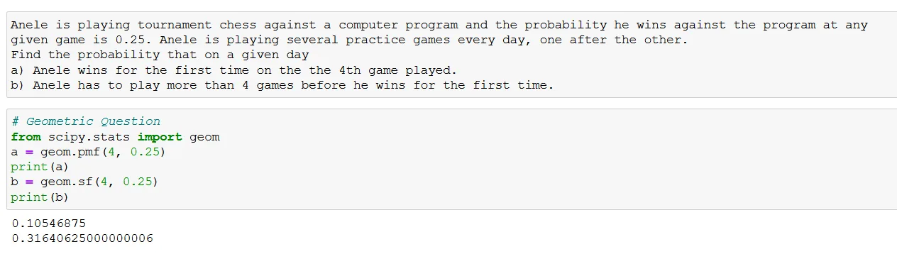

**B. Binomial Distribution**

In probability theory and statistics, the binomial distribution with parameters n and p is the discrete probability distribution of the number of successes in a sequence of n independent experiments, each asking a yes–no question, and each with its own Boolean-valued outcome: success or failure. Binomial distribution function, binom, is imported from the scipy.stats library also. We solve the problem below using the pmf, sf and the cdf functions. CDF stands for the cummulative distribution function which is P(X<=5).

```python
from scipy.stats import binom
a = binom.pmf(k=11, n=30, p=0.3)
print(a)
b = binom.cdf(k=14, n=30, p=0.3)
print(b)
c = binom.sf(k=10, n=30, p=0.3)
print(c)
d = binom.cdf(k=13, n=30, p=0.3) - binom.cdf(k=8, n=30, p=0.3)
print(d)
```

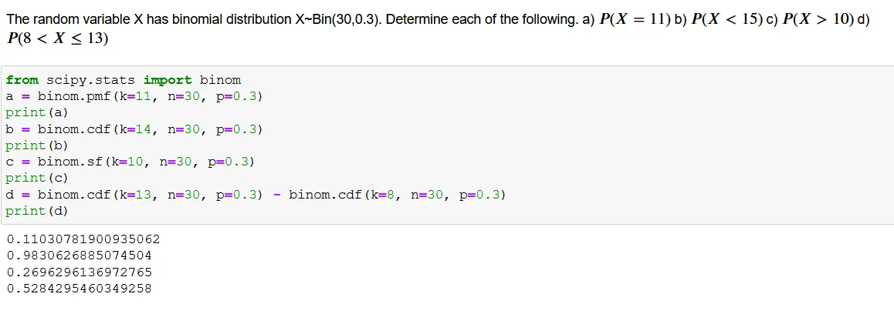

**C. Poisson Distribution**

The Poisson distribution is used to model the number of events occurring within a given time interval. Where lambda is shape parameter which indicates the average number of events in the given time interval.

```python
from scipy.stats import poisson
a = poisson.pmf(k=3, mu=2.25)
print(a)
b = poisson.sf(k=5, mu=4.5)
print(b)
```

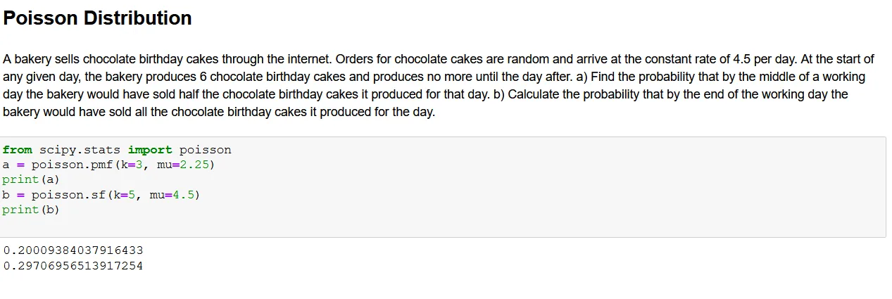

The poisson has the time component. Its functions in calculating are similar to the other discrete functions

**2. Normal Distribution**

normal distribution, also called Gaussian distribution, A normal distribution is a [probability distribution](https://en.wikipedia.org/wiki/Probability_distribution) used to model phenomena that have a default behaviour and cumulative possible deviations from that behaviour.

```python
from scipy.stats import norm
a = norm.cdf(x=4200, loc=4300, scale=750)-norm.cdf(x=2500, loc=4300, scale=750)
print(a)
```

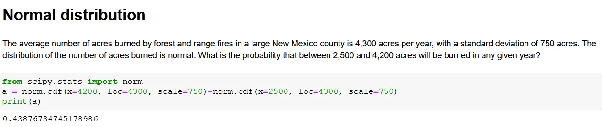

The normal distribution, incoporates the mean and standard deviation. One of its assumptions is that the distribution is bell shaped. In the model, loc is the mean and scale is the standard deviation, both parameters are needed in the calculation

**3. Measures of central tendencies**

A measure of central tendency is a single value that attempts to describe a set of data by identifying the central position within that set of data.

```python
import numpy as np
from scipy import stats

x = [2,3,4,5,3,2,3,4,5,3,2,4,5,3,2,4,5,2,2,4,5,2,3,3,3,4,3,3,3,3,4,3,2]
a=average = np.mean(x)
b= stats.mode(x)
b = b[0]
c = np.median(x)
print("The mean, mode and median for the array is {}, {} and {} respectively".format(a,b,c))
```

To get the mean, mode and median, we employ numpy and scipy functions which can be done as follows:

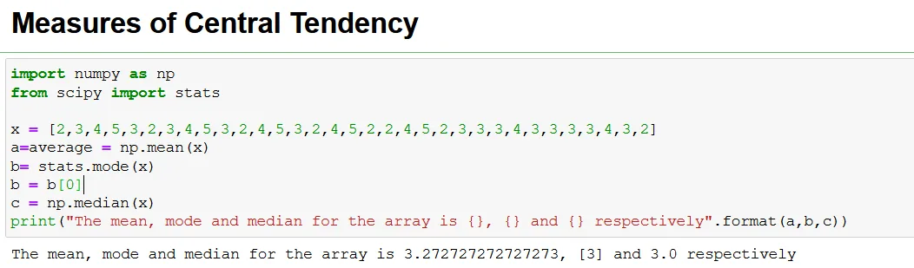

**4. Measures of Dispersion**

Measures of dispersion describe the spread of the data. They include the range, interquartile range, standard deviation and variance.

```python
x = [2,3,4,5,3,2,3,4,5,3,2,4,5,3,2,4,5,2,2,4,5,2,3,3,3,4,3,3,3,3,4,3,2]
a = np.std(x)
print("The standard deviation is {}".format(a))
b = np.var(x)
print("The variance is {}".format(b))
c = max(x)-min(x)
print("The range is {}".format(c))
```

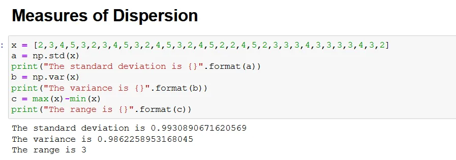

The most common measures of dispersion that of the range, standard deviation and variance are calculated as above using the numpy package.

**5. Covariance and Correlation**

Covariance is a statistical tool that is used to determine the relationship between the movements of two random variables. When two stocks tend to move together, they are seen as having a positive covariance; when they move inversely, the covariance is negative. Positive covariance: Indicates that two variables tend to move in the same direction. Negative covariance: Reveals that two variables tend to move in inverse directions.

```python
x=[2,3,4,5,3,2,3,4,5,3,2,4,5,3,2,4,5,2,2,4,5,2,3,3,3,4,3,3,3,3,4,3,2]
z=[22,23,24,25,23,22,23,42,25,23,22,24,52,32,22,42,52,22,22,42,52,22,23,23,23,24,23,23,23,23,24,23,22]
np.cov(x,z)
```

Correlation means association - more precisely it is a measure of the extent to which two variables are related. Correlation is a bivariate analysis that measures the strength of association between two variables and the direction of the relationship.

```python
from stats.py import stats
stats.pearsonr(x, z)
```

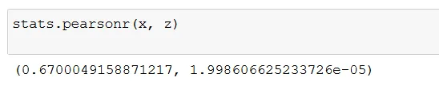

The information shows that there is a moderate correlation between x and z which is also significant since p<0.05.

**6. Linear Regression**

Linear regression attempts to model the relationship between two variables by fitting a linear equation to observed data.

```python
x=[22,23,24,25,23,22,23,42,25,23,22,24,52,32,22,42,52,22,22,42,52,22,23,23,23,24,23,23,23,23,24,23,22]
y=[12,13,14,15,13,12,13,14,15,13,12,14,15,13,12,14,15,12,12,14,15,12,13,13,13,14,13,13,13,13,14,13,12]

slope, intercept, r, p, se = stats.linregress(x, y)
print(slope)
print(intercept)
print(r)
print(p)
print(se)
```

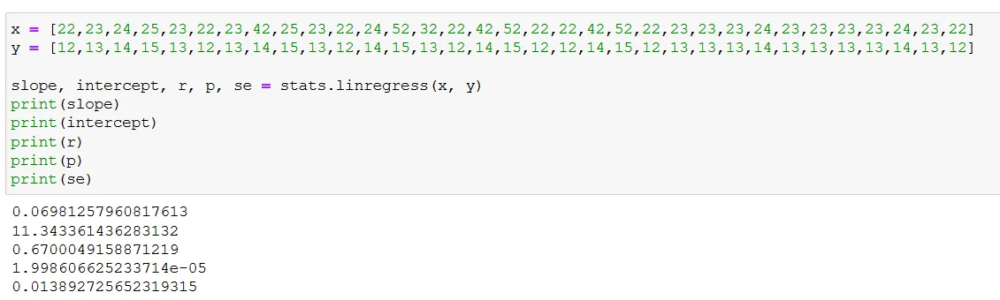

The r value retained is the pearson product moment correlation which was found in part 6 of the article. The intercept and slope are both positive. Since the slope is positive it means 1 unit increase in x, there is 0.0698 increase in y. The relationship is significant.

**7. Linear Algebra**

Linear algebra is the study of vectors and linear transformations. These vectors and transformations are used in pretty much everything. From the Ordinary Least Squares (OLS) method to the Principal Component Analysis (PCA)

```python
# Import the required libraries
from scipy import linalg
import numpy as np

# Initializing the matrix
x = np.array([[7, 2, 5, 6, 8], [5, 4, 4, 5, 6], [5, 4, 4, 5, 7], [4, 7, 9, 8, 6], [7, 8, 9, 5, 6]])

# Finding the inverse of
# matrix x
y = linalg.inv(x)
print(y)
```

If we consider a 5x5 Matrix and determine the inverse, we obtain:

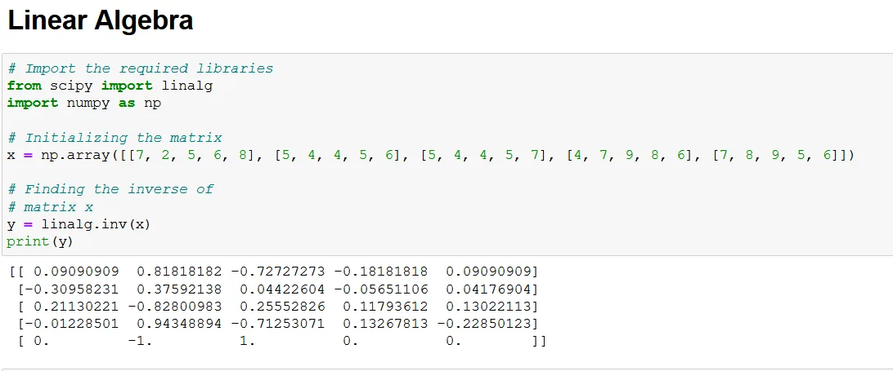

**8. Percintiles**

Percintile a measure used in statistics indicating the value below which a given percentage of observations in a group of observations fall. It is used in statistics to express how a score compares to other scores in the same set.

```python
from scipy import stats
x = [22,23,24,25,23,22,23,42,25,23,22,24,52,32,22,42,52,22,22,42,52,22,23,23,23,24,23,23,23,23,24,23,22]
stats.scoreatpercentile(x, 50)
```

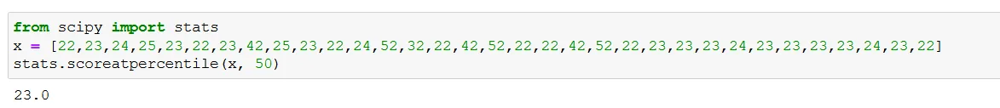

**9. Confidence Interval**

The confidence interval (CI) is a range of values that's likely to include a population value with a certain degree of confidence.

The confidence interval can be change from 85%, 95%, to any figure between 0 and 1.

```python
mean, sigma = np.mean(x), np.std(x)
#85% CI
stats.norm.interval(0.85, loc=mean, scale=sigma)
```

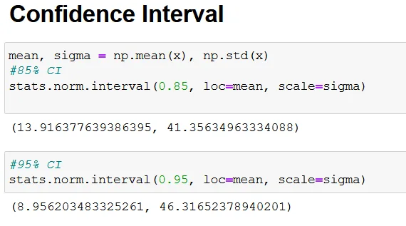

**10. Skewness and Kurtosis**

Skewness refers to a distortion or asymmetry that deviates from the symmetrical bell curve, or normal distribution, in a set of data.

```python
from scipy.stats import stats
stats.skew(x)
stats.kurtosis(x)
```

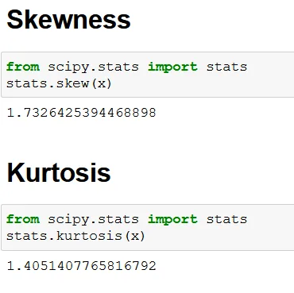

The skewness and kurtosis show the distribution of the data, as seen the data is positively skewed.

The Github code for this article is found [here](https://github.com/Matshisela/Statistical-Concepts-for-Data-Science)
