Statistics is "a branch of mathematics dealing with the collection, analysis, interpretation and presentation of masses of numerical data." Throw programming and machine learning into the mix and you have a pretty good description of the basic skills for data science.

in this tutorial we will apply 10 fundamentals of **Statistical Concepts for Data Science**

1. Bayes’ theorem
2. Normal distribution
3. Measures of central tendency
4. Correlation
5. Central limit theorem
6. Linear Regression
7. Cumulative Distribution Function
8. Binomial Distribution
9. Measuring variance
10. Chi-square test

1. **Bayes’ theorem**

Bayes' theorem provides a logical way to calculate the conditional probability.

The simple form of the Bayes theorem calculation is as follows:

- P(A|B) = P(B|A) \* P(A) / P(B)

Where:

- P(A|B) is the probability of event A occurring, given event B has occurred
- P(B|A) is the probability of event B occurring, given event A has occurred
- P(A) is the probability of event A
- P(B) is the probability of event B

To make this example practical, we can do the calculation in Python to calculate the probability of cancer patient and diagnostic test

```python
# calculate P(A|B) given P(A), P(B|A), P(B|not A)
def bayes_theorem(p_a, p_b_given_a, p_b_given_not_a):
    # calculate P(not A)
    not_a = 1 - p_a
    # calculate P(B)
    p_b = p_b_given_a * p_a + p_b_given_not_a * not_a
    # calculate P(A|B)
    p_a_given_b = (p_b_given_a * p_a) / p_b
    return p_a_given_b

# P(A)
p_a = 0.0002
# P(B|A)
p_b_given_a = 0.85
# P(B|not A)
p_b_given_not_a = 0.05
# calculate P(A|B)
result = bayes_theorem(p_a, p_b_given_a, p_b_given_not_a)
# summarize
print('P(A|B) = %.3f%%' % (result * 100))
```

**Result :**

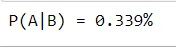

**2. Normal distribution**

A normal distribution is also known as a Gaussian distribution or the famous Bell curve. People use the two words interchangeably, but it means the same thing. It is a continuous probability distribution.

The probability density function (pdf) for Normal Distribution:

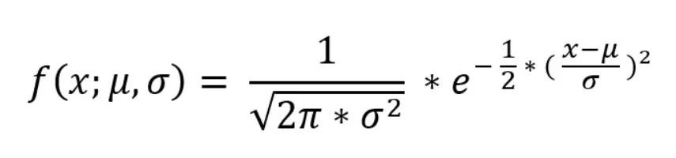

where, μ = Mean , σ = Standard deviation , x = input value.

**Let’s have a look at the code below**

```python
# Importing required libraries

import numpy as np
import matplotlib.pyplot as plt

# Creating a series of data of in range of 1-50.
x = np.linspace(1,50,200)

#Creating a Function.
def normal_dist(x , mean , sd):
    prob_density = (np.pi*sd) * np.exp(-0.5*((x-mean)/sd)**2)
    return prob_density

#Calculate mean and Standard deviation.
mean = np.mean(x)
sd = np.std(x)

#Apply function to the data.
pdf = normal_dist(x,mean,sd)

#Plotting the Results
plt.plot(x,pdf , color = 'red')
plt.xlabel('Data points')
plt.ylabel('Probability Density')
```

**Result of code:**

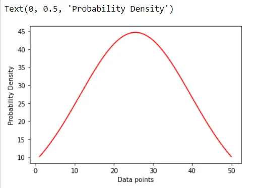

**3. Measures of central tendency**

The mathematically central tendency means to measure the center or distribution of the location of the values in a data set. It gives an idea of the average value of the data in the data set and also an indication of the extent of the distribution of values in the data set.

There are three main measures of central tendency that can be calculated using the methods in the python pandas library.

- **Mean :** This is the average value of the data which is a division of the sum of the values with the number of values.
- **Median :** This is the median value of the distribution when the values are sorted in ascending or descending order.
- **Mode :** This is the most common value in a distribution

Let't try with an example :

**- Calculating Mean and Median**

```python
import pandas as pd
#Calculating Mean and Median
#Create a Dictionary of series
d = {'Name':pd.Series(['Tom','James','Ricky','Vin','Steve','Smith','Jack',
   'Lee','Chanchal','Gasper','Naviya','Andres']),
   'Age':pd.Series([25,26,25,23,30,29,23,34,40,30,51,46]),
   'Rating':pd.Series([4.23,3.24,3.98,2.56,3.20,4.6,3.8,3.78,2.98,4.80,4.10,3.65])}

#Create a DataFrame
df = pd.DataFrame(d)
print ('Mean Values in the Distribution')
print (df.mean())
print ("*******************************")
print ("Median Values in the Distribution")
print (df.median())
```

**Result of code:**

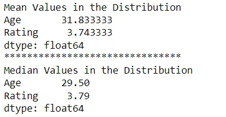

**- Calculating Mode**

```python
#Calculating Mode
import pandas as pd

#Create a Dictionary of series
d = {'Name':pd.Series(['Tom','James','Ricky','Vin','Steve','Smith','Jack',
   'Lee','Chanchal','Gasper','Naviya','Andres']),
   'Age':pd.Series([25,26,25,23,30,25,23,34,40,30,25,46])}
#Create a DataFrame
df = pd.DataFrame(d)

print (df.mode())
```

**The result :**

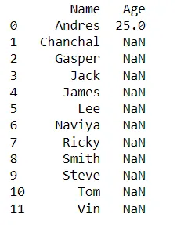

**4. Correlation**

Correlation is a statistical technique that can show whether and to what extent pairs of variables are related/interdependent. When we look at two variables over time, if one variable changes, how does it affect the change in another variable.

We have :

Positive correlation: the two variables move in the same direction.

Neutral correlation: No relationship in the change of the variables.

Negative correlation: the variables change in opposite directions.

Let's do an example with **Correlation calculation in Pandas**

Pandas provides the **.corr()** function that we can use to calculate the correlation coefficient.

Pandas d**ataframe.corr()** is used to find the pairwise correlation of all columns in the dataframe.

All NA values are automatically excluded.

For all non-numeric data type columns in the dataframe, it is ignored.

```python
#creating a datasets to illustrate positive correlation.

# importing libraries
import numpy as np
import pandas as pd

from numpy import mean
from numpy import std
from numpy.random import randn
from numpy.random import seed
from matplotlib import pyplot

# seed random number generator
seed(1)

# creating data for columns
d1 = 30 * randn(1500) + 100
d2 = d1 + (20 * randn(1500) + 50)

# let's convert to a dataframe
df = pd.DataFrame({'Column1': d1, 'Column2': d2})

# summarize
print('d1: mean=%.3f stdv=%.3f' % (mean(d1), std(d1)))
print('d2: mean=%.3f stdv=%.3f' % (mean(d2), std(d2)))

# plot
pyplot.scatter(d1, d2)
pyplot.show()
```

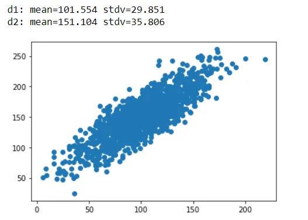

```python
df.head()
```

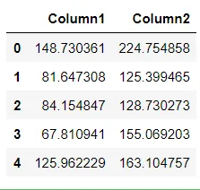

```python
df.corr(method ='pearson')
```

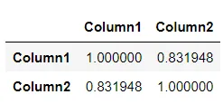

```python
df.corr(method ='kendall')
```

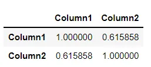

**5. Central limit theorem**

```python
#implementation of the Central Limit Theorem
import numpy
import matplotlib.pyplot as plt

# number of sample
num = [1, 10, 50, 100]
# list of sample means
means = []

# Generating 1, 10, 30, 100 random numbers from -40 to 40
# taking their mean and appending it to list means.
for j in num:
    # Generating seed so that we can get same result
    # every time the loop is run...
    numpy.random.seed(1)
    x = [numpy.mean(
    numpy.random.randint(
    -40, 40, j)) for _i in range(1000)]
    means.append(x)
k = 0

# plotting all the means in one figure
fig, ax = plt.subplots(2, 2, figsize =(8, 8))
for i in range(0, 2):
    for j in range(0, 2):
        # Histogram for each x stored in means
        ax[i, j].hist(means[k], 10, density = True)
        ax[i, j].set_title(label = num[k])
        k = k + 1
plt.show()
```

Result:

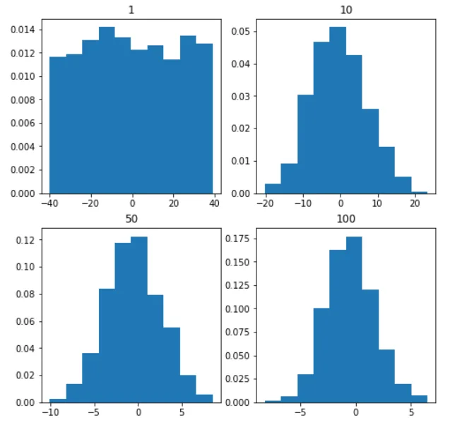

**6. Linear Regression**

In linear regression, these two variables are related by an equation, where the exponent (power) of these two variables is 1. Mathematically, a linear relationship represents a straight line when plotted as a graph. A nonlinear relationship where the exponent of one variable is not equal to 1 creates a curve.

Seaborn's functions for finding the linear regression relationship are regplot. The example below shows its use.

```python
#linear regression
import seaborn as sb
from matplotlib import pyplot as plt
df = sb.load_dataset('tips')
sb.regplot(x = "total_bill", y = "tip", data = df)
plt.show()
```

**Result :**

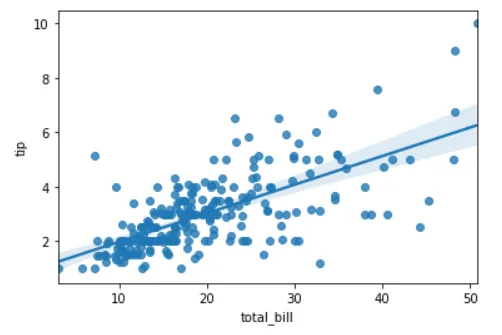

**7. cumulative distribution function**

The term cumulative distribution function or CDF is a function y=f(x), where y represents the probability that the integer x or any number less than x is selected at random from a distribution

It is computed in Python using the following functions of the NumPy library.

- **Function numpy.arange()** which returns a ndarray of regularly spaced values.
- **Function numpy.linspace()** which returns a ndarray of regularly spaced values in a given interval

Below is an example that illustrates the implementation of the CDF function using the **numpy.arange()** function in Python.

```python
#cumulative distribution function
import matplotlib.pyplot as plt
import numpy

data = numpy.random.randn(5)
print("The data is-",data)
sorted_random_data = numpy.sort(data)
p = 1. * numpy.arange(len(sorted_random_data)) / float(len(sorted_random_data) - 1)
print("The CDF result is-",p)

fig = plt.figure()
fig.suptitle('CDF of data points')
ax2 = fig.add_subplot(111)
ax2.plot(sorted_random_data, p)
ax2.set_xlabel('sorted_random_data')
ax2.set_ylabel('p')
```

**Result:**

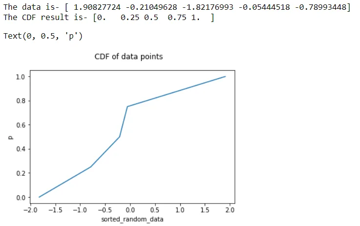

Here is an other example that illustrates the implementation of the CDF function using **numpy.linspace()** in Python.

```python
import matplotlib.pyplot as plt
import numpy as np

data = np.random.randn(5)
print("The data is-",data)
sorted_random_data = np.sort(data)
np.linspace(0, 1, len(data), endpoint=False)

print("The CDF result using linspace =\n",p)

fig = plt.figure()
fig.suptitle('CDF of data points')
ax2 = fig.add_subplot(111)
ax2.plot(sorted_random_data, p)
ax2.set_xlabel('sorted_random_data')
ax2.set_ylabel('p')
```

**Result :**

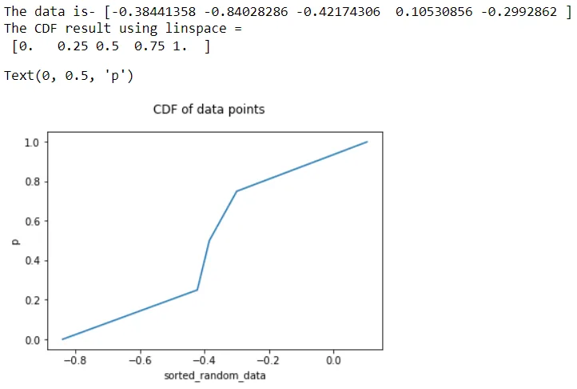

**8. Binomial Distribution**

The binomial distribution model consists of finding the probability of success of an event that has only two possible outcomes in a series of experiments. For example, tossing a coin always results in heads or tails. The probability of finding exactly 3 heads by tossing a coin repeatedly for 10 times is estimated using the binomialet distribution.

```python
#binomial distribution
from scipy.stats import binom
import seaborn as sb

binom.rvs(size=10,n=20,p=0.8)

data_binom = binom.rvs(n=20,p=0.8,loc=0,size=1000)
ax = sb.distplot(data_binom,
                  kde=True,
                  color='blue',
                  hist_kws={"linewidth": 25,'alpha':1})
ax.set(xlabel='Binomial', ylabel='Frequency')
```

**Result :**

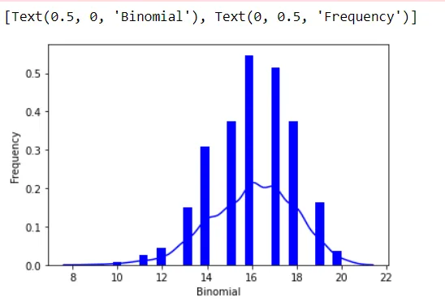

**9. Measuring Variance**

In statistics, variance is a measure of the distance between a value in a data set and the mean value. In other words, it indicates how widely dispersed the values are. It is measured using the standard deviation. The other commonly used method is skewness.

Both are calculated using functions available in the pandas library.

In python we calculate this value by using the function std() from pandas library.

```python
#Measuring Variance
import pandas as pd

#Create a Dictionary of series
d = {'Name':pd.Series(['Tom','James','Ricky','Vin','Steve','Smith','Jack',
   'Lee','Chanchal','Gasper','Naviya','Andres']),
   'Age':pd.Series([25,26,25,23,30,25,23,34,40,30,25,46]),
   'Rating':pd.Series([4.23,3.24,3.98,2.56,3.20,4.6,3.8,3.78,2.98,4.80,4.10,3.65])}

#Create a DataFrame
df = pd.DataFrame(d)

# Calculate the standard deviation
print (df.std())
```

**Result :**

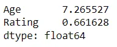

**10. Chi-Square Test**

The Chi-Square test is a statistical method for determining whether two categorical variables are significantly correlated with each other. These two variables must come from the same population and must be categorical such as - Yes/No, Male/Female, Red/Green, etc.

For example, we can create a dataset with observations on people's ice cream buying pattern and try to correlate a person's gender with the flavor of ice cream they prefer. If a correlation is found, we can plan an appropriate stock of flavors by knowing the number of genders of people visiting.

We will use here various functions in numpy library to carry out the chi-square test.

```python
#Chi-Square
from scipy import stats
import numpy as np
import matplotlib.pyplot as plt

x = np.linspace(0, 10, 100)
fig,ax = plt.subplots(1,1)

linestyles = [':', '--', '-.', '-']
deg_of_freedom = [1, 4, 7, 6]
for df, ls in zip(deg_of_freedom, linestyles):
  ax.plot(x, stats.chi2.pdf(x, df), linestyle=ls)

plt.xlim(0, 10)
plt.ylim(0, 0.4)

plt.xlabel('Value')
plt.ylabel('Frequency')
plt.title('Chi-Square Distribution')

plt.legend()
plt.show()
```

**Result :**

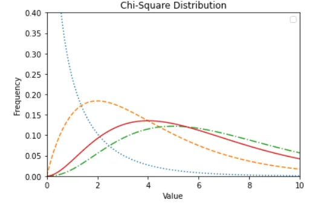

Thank you!

I hope you like this tutorialto see the complete code you can download it from this [github link](https://github.com/rabebbenothmen/Data-Insight2021/blob/main/Assignments/7-%20Statistical%20Concepts%20for%20Data%20Science.ipynb)
