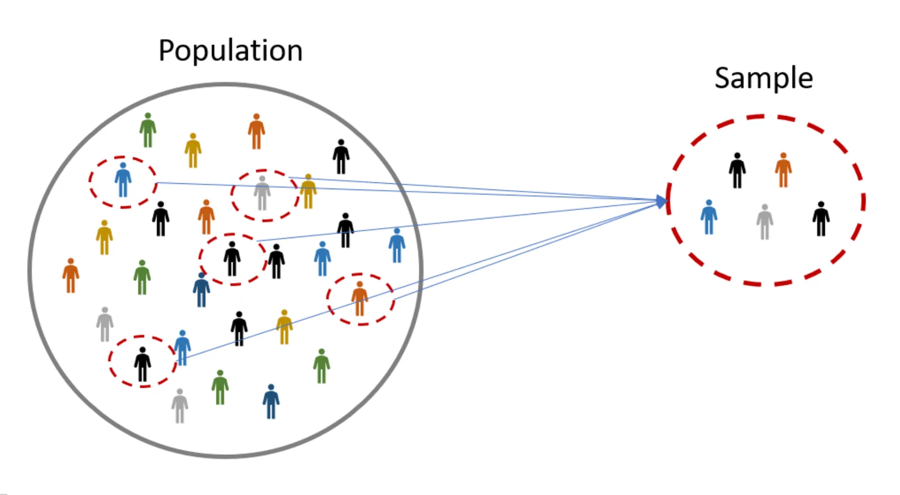
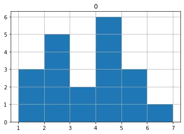
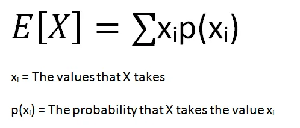
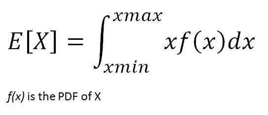
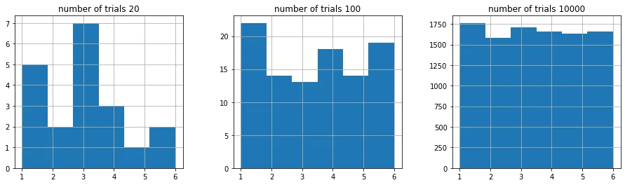
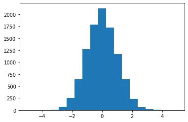

Data Scientist is one of the most attractive career options that offers immense job satisfaction, insanely high salary, global recognition, and amazing growth opportunities. As per the Harvard Business Review, Data Scientist is defined as the most desirable profession of the 21st century. Machine Learning and Statistics are the two core skills required to become a data scientist.

Statistics is like the heart of Data Science that helps to analyze, transform and predict data. In the following article, I am going to introduce ten fundamental statistical concepts you need to be able to grasp when learning data science. These are not particularly advanced techniques but they are a selection of the basic requirements you need to know before moving onto learning more complex methods.

### Population and Sample

In statistic, the entire set of raw data that you may have available for a test or experiment is known as the Population.For example, college students in US is a population that includes all of the college students in US. 25-year-old people in Europe is a population that includes all of the people that fits the description.

It is not always feasible or possible to do analysis on population because we cannot collect all the data of a population. For that reason statistics allows us to take a sample, perform some computations on that set of data, and using probability and some assumptions we can with a certain degree of certainty understand trends for the entire population or predict future events. For example, 1000 college students in US is a subset of “college students in US” population.



Let's take example in Python using Pandas Library and Numpy Library
 We'll take 6 sides dice and take one sample at a time

Probability

 Probability is the measure of the likelihood that an event will occur in a Random Experiment.In statistics, an event is the outcome of an experiment which could be something like the rolling of a dice or the results of an AB test. Probability for a single event is calculated by dividing the number of events by the number of total possible outcomes. In the case of, say, rolling a six on a dice there are 6 possible outcomes. So the chance of rolling a six is 1/6 = 0.167, sometimes this is also expressed as a percentage so 16.7%.

 It specifies the likelihood of all possible events. In simple terms, an event refers to the result of an experiment like tossing a coin. Events are of two types dependent and independent.
**Independent event**: The event is said to be an Independent event when it is not affected by the earlier events. For example, tossing a coin, let us consider a coin is tossed the first outcome is head when the coin is tossed again the outcome may be head or tail. But this is entirely independent of the first trial.
**Dependent event**: The event is said to be dependent when the occurrence of the event is dependent on the earlier events. For example when a ball is drawn from a bag that contains red and blue balls. If the first ball drawn is red, then the second ball may be red or blue; this depends on the first trial.

### Probability Distribution

A probability distribution is a statistical function that describes all the possible values and likelihoods that a random variable can take within a given range. This range will be bounded between the minimum and maximum possible values, but precisely where the possible value is likely to be plotted on the probability distribution depends on a number of factors. These factors include the distribution's **mean (average), standard deviation, skewness, and kurtosis.** Probability distribution functions are quite useful in predictive analytics or machine learning. We can make predictions about a population based on the probability distribution function of a sample from that population.

except value of a fair dice roll = (1/6 \* 1) + (1/6 \* 2) + (1/6 \* 3)+ …. + (1/6 \* 6) = 3.5

Let's take example of probability distribution of one dice in Python taking 20 time rolls



### Expected value of random variables

The expected value of a random variable is the weighted average of all possible values of the variable. The weight here means the probability of the random variable taking a specific value.
 The expected value is calculated differently for discrete and continuous random variables.
 • Discrete random variables take finitely many or countably infinitely many values. The number of rainy days in a year is a discrete random variable.
 • Continuous random variables take uncountably infinitely many values. For instance, the time it takes from your home to the office is a continuous random variable. Depending on how you measure it (minutes, seconds, nanoseconds, and so on), it takes uncountably infinitely many values.
 The formula for the expected value of a discrete random variable is:



The expected value of a continuous random variable is calculated with the same logic but using different methods. Since continuous random variables can take uncountably infinitely many values, we cannot talk about a variable taking a specific value. We rather focus on value ranges.

In order to calculate the probability of value ranges, probability density functions (PDF) are used. PDF is a function that specifies the probability of a random variable taking value within a particular range.



**Probability Mass Function(PMF):** A function that gives the probability that a discrete random variable is exactly equal to some value.

**Probability Density Function(PDF):** A function for continuous data where the value at any given sample can be interpreted as providing a relative likelihood that the value of the random variable would equal that sample.

**Cumulative Density Function(CDF):**  A function that gives the probability that a random variable is less than or equal to a certain value.

### Law of Large Number

The law of large numbers, in probability and statistics, states that as a sample size grows, its mean gets closer to the average of the whole population. The large numbers theorem states that if the same experiment or study is repeated independently a large number of times, the average of the results of the trials must be close to the expected value. The result becomes closer to the expected value as the number of trials is increased.
 The law of large numbers is an important concept in statistics because it states that even random events with a large number of trials may return stable long-term results. Note that the theorem deals only with a large number of trials while the average of the results of the experiment repeated a small number of times might be substantially different from the expected value. However, each additional trial increases the precision of the average result.
 The simplest example of the law of large numbers is rolling the dice. The dice involves six different events with equal probabilities. The expected value of the dice events is:
 If we roll the dice only three times, the average of the obtained results may be far from the expected value. Let’s say you rolled the dice three times and the outcomes were 6, 6, 3. The average of the results is 5. According to the law of the large numbers, if we roll the dice a large number of times, the average result will be closer to the expected value of 3.5.



### Measure of Central Tendency

Central tendency is the central (or typical) value of a probability distribution. The most common measures of central tendency are mean, median, and mode.

- **Mean** is the average of the values in series.
- **Median** is the value in the middle when values are sorted in ascending or descending order.
- **Mode** is the value that appears most often.

Skewness: A measure of symmetry.

Kurtosis: A measure of whether the data are heavy-tailed or light-tailed relative to a normal distribution

In Python,

### Measure of Dispersion

The types of absolute measures of dispersion are:
 1. **Range:** It is simply the difference between the maximum value and the minimum value given in a data set. Example: 1, 3,5, 6, 7 => Range = 7 -1= 6
 2. **Variance:** Deduct the mean from each data in the set then squaring each of them and adding each square and finally dividing them by the total no of values in the data set is the variance. Variance (σ2)=∑(X−μ)2/N
 3. **Standard Deviation**: The square root of the variance is known as the standard deviation i.e. S.D. = √σ.
 4. **Quartiles and Quartile Deviation:** The quartiles are values that divide a list of numbers into quarters. The quartile deviation is half of the distance between the third and the first quartile.
 5. **Mean and Mean Deviation:** The average of numbers is known as the mean and the arithmetic mean of the absolute deviations of the observations from a measure of central tendency is known as the mean deviation (also called mean absolute deviation).

### Normal Distribution

Normal/Gaussian Distribution: The curve of the distribution is bell-shaped and symmetrical and is related to the Central Limit Theorem that the sampling distribution of the sample means approaches a normal distribution as the sample size gets larger. The standard normal distribution has two parameters – mean and standard deviation .

[ 6.06791198 7.28756282 4.01450555 10.78446981 8.5592705 11.84208047
 7.92744972 10.87653048 12.06786554 5.7193554 ]

0.2742531177500736

16.407757827723003

- when a normal distribution has mean 0 and a standard deviation of 1, it’s a special deviation called standard normal distribution

- for the normal distribution, 68% of the area is within 1 standard deviation of mean

- 95% of the area falls within 2 standard deviation of the mean

- 99.7% of the area falls within three standard deviation of the mean called 68-95-99.7 rule



### Binomial Distribution

The binomial distribution is a probability distribution that summarizes the likelihood that a value will take one of two independent values under a given set of parameters or assumptions.
 The binomial distribution is a common discrete distribution used in statistics, as opposed to a continuous distribution, such as the normal distribution. This is because the binomial distribution only counts two states, typically represented as 1 (for a success) or 0 (for a failure) given a number of trials in the data. The binomial distribution thus represents the probability for x successes in n trials, given a success probability p for each trial.

```python
[0]
[0 1 0 1 0 0 0 1 0 0]
[1 1 2 1 2]
the probability of 7 head in 10 trial of fair coin  0.11718750000000014
the probability of less than or equal 7 head in 10 trial of fair coin  0.9453125
```

### Poisson Distribution

In statistics, a Poisson distribution is a probability distribution that is used to show how many times an event is likely to occur over a specified period. In other words, it is a count distribution. Poisson distributions are often used to understand independent events that occur at a constant rate within a given interval of time. It was named after French mathematician Siméon Denis Poisson.
 A Poisson distribution can be used to estimate how likely it is that something will happen "X" number of times. For example, if the average number of people who buy cheeseburgers from a fast-food chain on a Friday night at a single restaurant location is 200, a Poisson distribution can answer questions such as, "What is the probability that more than 300 people will buy burgers?" The application of the Poisson distribution thereby enables managers to introduce optimal scheduling systems that would not work with, say, a normal distribution.

0.09160366159257921

0.19123606207962532

We have covered some basic yet fundamental statistical concepts. If you are working or plan to work in the field of data science, you are likely to encounter these concepts.

The Github Code can see in [here.](https://github.com/DoublePK/DataScientistProgramAssignments/blob/master/Statistical%20Concepts%20for%20Data%20Science/Statistical%20Concepts%20for%20Data%20Science%20-%20Ipython%20code.ipynb)
