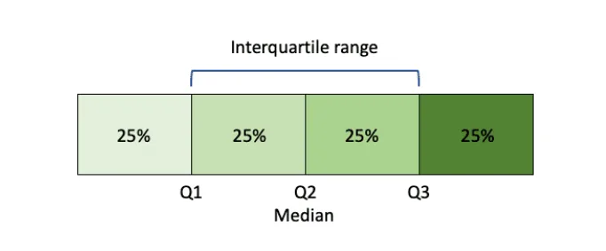
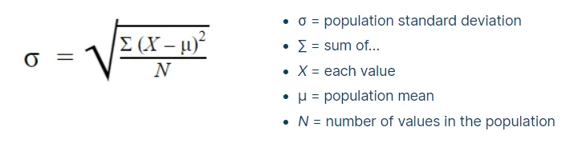
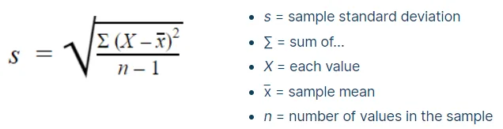
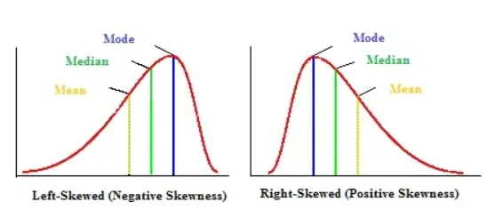
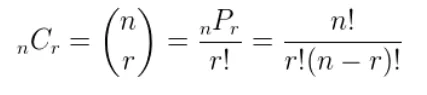
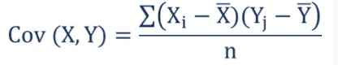
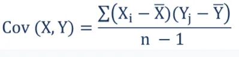
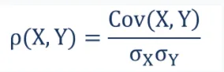

We need to get some statistical concepts to work in the field of data. So today we are looking at some topics of statistics.

**1.** **Population and Sample**

The field of inferential statistics enables you to make educated guesses about the numerical characteristics of large groups. The logic of sampling gives you a way to test conclusions about such groups using only a small portion of its members.

A population is a group of phenomena that have something in common. The term often refers to a group of people. For example, if we want to find the average height of the people of the city with 1 million population. We need to get the height of each people living in the city which is not practical and costly. Instead, we might select a sample of the population.

A sample is a smaller group of members of a population selected to represent the population. To use statistics to learn things about the population, the sample must be random.

|  |  |  |
| --- | --- | --- |
| Parameter | Population notation | Sample notation |
| Population/Total number | N | n |
| Mean | µ | x̄ |
| Standard deviation | *σ* | s |
| Variance | *σ*2 | S2 |

**2.** **Measures of central tendency**

A measure of central tendency is a single value that attempts to describe a set of data by identifying the central position within that set of data. As such, measures of central tendency are sometimes called measures of central location. They are also classed as summary statistics. we will look at the mean, mode, and median, and learn how to calculate them.

For example, we have marks of 10 students.

A = [65+68+70+72+76+76+76+82+85+88]

**Mean**

Mean is the average of the given number. The mean is denoted µ for population and x̄ for sample. Mean is given by the sum of all marks/total number of students.

**Median**

To calculate the median, we have to sort the given data first and then calculate the middle one.

A = [65,68,70,72,76,76,76,82,85,88]

Find the middle number by dividing the total number (10 +1)by 2 is 5.5. So that the median number is an average between the number placed as the fifth position and sixth position i.e. (76+76)/2 = 76.

If the length of A like A = [65,68,70,72,76,76,76,82,85]

then

median = (9+1)/2 = 5 that means median number lies on 5th position. = 76.

**Mode**

The most frequent element in the given dataset is a mode. That means any number which is repeated most of the time is a mode.

In the given dataset 76 is the most repeated number so the mode is 76.

```python
import pandas as pd
A = [65,68,70,72,76,76,76,82,85,88]
A = pd.DataFrame(A)
a_mean = A.mean()
a_median = A.median()
a_mode = A.mode()
print(a_mean)
print(a_median)
print(a_mode)

0    75.8
dtype: float64
0    76.0
dtype: float64
0 0
  76
```

**3.** **Measures of dispersion**

Dispersion is the state of getting dispersed or spread. Statistical dispersion means the extent to which numerical data is likely to vary about an average value. In other words, dispersion helps to understand the distribution of the data.

A = [65,68,70,72,76,76,76,82,85,88]

**Range**

The most elementary measure of variation is range. The range is defined as the difference between the largest and smallest values.

For data A = [65,68,70,72,76,76,76,82,85,88] , range is given by substracting smaller number from the largest number.

```python
rn = A.max() - A.min()
0    23
dtype: int64
```

**Quartiles and Interquartile Range**

The quartiles, namely the lower quartile, the median, and the upper quartile, divide the data into four equal parts; that is there will be approximately equal numbers of observations in the four sections (and exactly equal if the sample size is divisible by four and the measures are all distinct.

```python
A.quantile(q=[0.0,0.25,0.5,0.75,1])
     0
0.00 65.0
0.25 70.5
0.50 76.0
0.75 80.5
1.00 88.0
```

**Interquartile range**

The interquartile range tells you the spread of the middle half of your distribution.

Quartiles segment any distribution that’s ordered from low to high into four equal parts. The interquartile range (IQR) contains the second and third quartiles or the middle half of your data set.



```python
Q3 = np.quantile(A, 0.75)
Q1 = np.quantile(A, 0.25)
IQR = Q3 - Q1
10.0
```

**Standard Deviation**

The standard deviation is the average amount of variability in your dataset. It tells you, on average, how far each value lies from the mean.

A high standard deviation means that values are generally far from the mean, while a low standard deviation indicates that values are clustered close to the mean.

###### The empirical rule
The standard deviation and the mean together can tell you where most of the values in your distribution lie if they follow a normal distribution.

The empirical rule**,** or the 68-95-99.7 rule, tells you where your values lie:

- Around 68% of scores are within 1 standard deviation of the mean,
- Around 95% of scores are within 2 standard deviations of the mean.
- Around 99.7% of scores are within 3 standard deviations of the mean.

Population standard deviation:



Sample standard deviation:



**4.** **Central Limit Theorem**

In probability theory, the central limit theorem (CLT) states that the distribution of a sample variable approximates a normal distribution (i.e., a “bell curve”) as the sample size becomes larger, assuming that all samples are identical in size, and regardless of the population's actual distribution shape.

Sample sizes equal to or greater than 30 are often considered sufficient for the CLT to hold. A key aspect of CLT is that the average of the sample means and standard deviations will equal the population mean and standard deviation.

**5.** **P-value**

A p-value is used in hypothesis testing to help you support or reject the null hypothesis. The p-value is the evidence against a null hypothesis. The smaller the p-value, the stronger the evidence that you should reject the null hypothesis.

P values are expressed as decimals although it may be easier to understand what they are if you convert them to a percentage. For example, a p-value of 0.0254 is 2.54%. This means there is a 2.54% chance your results could be random (i.e. happened by chance). That’s pretty tiny. On the other hand, a large p-value of .9(90%) means your results have a 90% probability of being completely random and *not* due to anything in your experiment. Therefore, the smaller the p-value, the more important (“significant“) your results.

When you run a hypothesis test, you compare the p-value from your test to the alpha level you selected when you ran the test. Alpha levels can also be written as percentages.

Graphically, the p-value is the area in the tail of a probability distribution. It’s calculated when you run a hypothesis test and is the area to the right of the test statistic (if you’re running a two-tailed test, it’s the area to the left *and* to the right).

**6.** **Z-SCORE**

A Z-score is a numerical measurement that describes a value's relationship to the mean of a group of values. Z-score is measured in terms of standard deviations from the mean. If a Z-score is 0, it indicates that the data point's score is identical to the mean score. A Z-score of 1.0 would indicate a value that is one standard deviation from the mean. Z-scores may be positive or negative, with a positive value indicating the score is above the mean and a negative score indicating it is below the mean.

The formula for calculating a z-score is z = (x-μ)/σ, where x is the raw score, μ is the population mean, and σ is the population standard deviation.

**7.** **SKEWED DISTRIBUTION**

If one tail is longer than another, the distribution is skewed. These distributions are sometimes called asymmetric or asymmetrical distributions as they don’t show any kind of symmetry. Symmetry means that one half of the distribution is a mirror image of the other half. For example, the normal distribution is a symmetric distribution with no skew. The tails are exactly the same.

A **left-skewed distribution** has a long left tail. Left-skewed distributions are also called *negatively-skewed* distributions. That’s because there is a long tail in the negative direction on the number line. The mean is also to the left of the peak.

A **right-skewed distribution** has a long right tail. Right-skewed distributions are also called positive-skew distributions. That’s because there is a long tail in the positive direction on the number line. The mean is also to the right of the peak.



**8.** **PERMUTATION AND COMBINATION**

Permutation and combination form the principles of counting and they are applied in various situations. A permutation is a count of the different arrangements which can be made from the given set of things.

Permutation relates to the act of arranging all the members of a set into some sequence or order**.** In other words, if the set is already ordered, then the rearranging of its elements is called the process of permuting. Permutations occur, in more or less prominent ways, in almost every area of mathematics. They often arise when different orderings on certain finite sets are considered. A permutation is the choice of r things from a set of n things without replacement and where the order matters.

**nPr = (n!) / (n-r)!**

The combination is a way of selecting items from a collection, such that (unlike permutations) the order of selection does not matter. In smaller cases, it is possible to count the number of combinations. Combination refers to the combination of n things taken k at a time without repetition. To refer to combinations in which repetition is allowed, the terms k-selection or k-combination with repetition are often used. A combination is the choice of r things from a set of n things without replacement and where order does not matter.



**9.** **Covariance**

A covariance is a statistical tool that is used to determine the relationship between the movements of two random variables. The metric evaluates how much – to what extent – the variables change together. In other words, it is essentially a measure of the variance between two variables. However, the metric does not assess the dependency between variables.

The covariance between two random variables X and Y can be calculated using the following formula (for population):



For a sample covariance,



Positive Covariance

A positive covariance between two variables indicates that these variables tend to be higher or lower at the same time. In other words, a positive covariance between variables *x* and *y* indicate that *x* is higher than average at the same times that *y* is higher than average, and vice versa. When charted on a two-dimensional graph, the data points will tend to slope upwards.

Negative Covariance

When the calculated covariance is less than zero, this indicates that the two variables have an inverse relationship. In other words, an *x* value that is lower than average tends to be paired with a *y* that is greater than average, and vice versa.

**10.** **Correlation**

Correlation measures the strength of the relationship between variables. Correlation is the scaled measure of covariance. It is dimensionless. In other words, the correlation coefficient is always a pure value and not measured in any units.

The relationship between the two concepts can be expressed using the formula below:



Where:

- **ρ(X, Y)** – the correlation between the variables X and Y
- **Cov(X, Y)** – the covariance between the variables X and Y
- **σX** – the standard deviation of the X-variable
- **σY** – the standard deviation of the Y-variable
