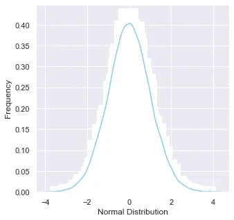
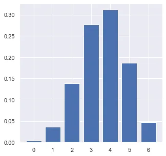
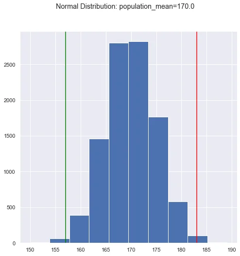
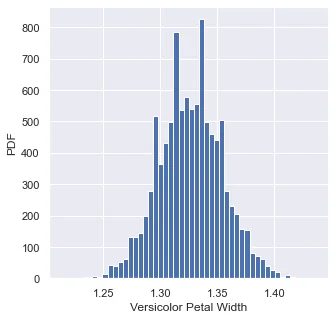

This article shows some important statistical concepts for a Data Scientist. All of the code can be accessed from the [jupyter notebook](https://github.com/AbdiTolesa/statistical-concepts-for-python/blob/master/statistical%20concepts%20for%20Data%20Science.ipynb) on github.

**Population distributions**

A normal distribution, sometimes called the bell curve, is a distribution that occurs naturally in many situations. A score of students in a given class is centered around the mean and can be a good example here.

It is used to model phenomena that have a default behavior and cumulative possible deviations from that behavior. The density curve is symmetrical, centered about its mean, with its spread determined by its standard deviation.

We can use [scipy.stats.norm](https://docs.scipy.org/doc/scipy/reference/generated/scipy.stats.norm.html) library to generate a normal distribution sample.

```python
data_normal = norm.rvs(size=10000,loc=0,scale=1)
```

The following code can be used to plot the population frequency as follow:

```python
ax = sns.distplot(data_normal,bins=100,kde=True,color='skyblue',hist_kws={"linewidth": 15,'alpha':1})ax.set(xlabel='Normal Distribution', ylabel='Frequency')
```



Another common type of distribution is called Binomial Distribution. In probability theory and statistics, the **binomial distribution** with parameters *n* and *p* is the discrete probability distribution of the number of successes in a sequence of *n* independent experiments, each asking a yes–no question, and each with its own Boolean-valued outcome: *success* (with probability *p*) or *failure* (with probability *q* = 1 − *p*). A python library scipy.stats.binom would help us generate a simple binomial distribution. The following line of code is like saying give me a binomial distribution of 0.6 success rate with a size of 6.

```python
n = 6
p = 0.6
r_values = list(range(n + 1))
dist = [binom.pmf(r, n, p) for r in r_values ]
```

Plotting the pmf shows the probability of getting *n* successes for a single trial.



**Covariance and Correlation**

Covariance is a statistical term that refers to a systematic relationship between two random variables in which a change in the other reflects a change in one variable, while correlation is a measure that determines the degree to which two or more random variables move in sequence. When an equivalent movement of another variable reciprocates the movement of one variable in some way or another during the study of two variables, the variables are said to be correlated.

Numpy provides a function that can be used to determine a covariance function for a pair of variables. This snippet calculates the covariance of two variables, i.e. petal length and petal width for the versicolor species from the famous dataset of [Iris](https://scikit-learn.org/stable/auto_examples/datasets/plot_iris_dataset.html). The output result is 0.073, which shows a positive covariance between the two variables.

```python
covariance_matrix = np.cov(versicolor_petal_length, versicolor_petal_width)
```

But a more useful technique in bivariate analysis is determining Pearson correlation coefficient, which is a measure of linear correlation between two sets of data. It is the ratio between the covariance of two variables and the product of their standard deviations; thus it is essentially a normalized measurement of the covariance, such that the result always has a value between −1 and 1.

Again, Numpy provides the np.corrcoef(x, y) function to generate a matrix of the coefficients, and for the dataset undertaken, the result is 0.79.

**P-value**

In null-hypothesis significance testing, the ***p*****-value** is the probability of obtaining test results at least as extreme as the results actually observed, under the assumption that the null hypothesis is correct. A very small *p*-value means that such an extreme observed outcome would be very unlikely under the null hypothesis.

This graph shows a p value analysis for a population of 170 mean value.



### Percentiles, Quartiles and Interquartile Range (IQR)

Quartiles are values that divide your data into quarters. Interquartile range tells you the spread of the middle half of your distribution. Here is two methods we can calculate an IQR, first with *scipy.stats.iqr* and *numpy.percentile.*

```python
from scipy.stats import iqr
# Calculate interquartile range using scipy.stats.iqr library
IQR = iqr(versicolor_petal_length)print(f"Interquartile range with scipy: {IQR} ")
# Calculate interquartile range using numpy.percentile
first_quartile = np.percentile(versicolor_petal_length, 25)
third_quartile = np.percentile(versicolor_petal_length, 75)

print(f"Interquartile range with numpy: {third_quartile - first_quartile}")
```

### Bootsrapping sampling

**Bootstrapping** is any test or metric that uses random sampling with replacement (e.g. mimicking the sampling process), and falls under the broader class of resampling methods. Bootstrapping assigns measures of accuracy (bias, variance, confidence intervals, prediction error, etc.) to sample estimates. This technique allows estimation of the sampling distribution of almost any statistic using random sampling methods.

Bootstrapping estimates the properties of an estimator (such as its variance) by measuring those properties when sampling from an approximating distribution. One standard choice for an approximating distribution is the empirical distribution function of the observed data. In the case where a set of observations can be assumed to be from an independent and identically distributed population, this can be implemented by constructing a number of resamples with replacement, of the observed data set (and of equal size to the observed data set).

In Python, we can implement bootstrapping sample using *numpy.random.choice()* function, which randomly draws samples of a given size and repeat them throughout the dataset based on the parameters of choice.

In the jupyter notebook provided, a function is written to generate 10000 bootstrapped samples and calculate mean of each sample, giving this interesting graph.


