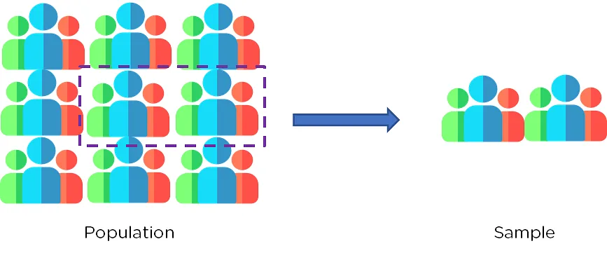
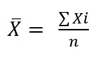
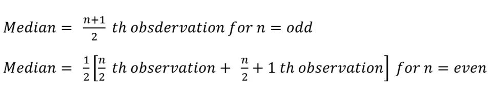
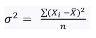
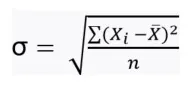
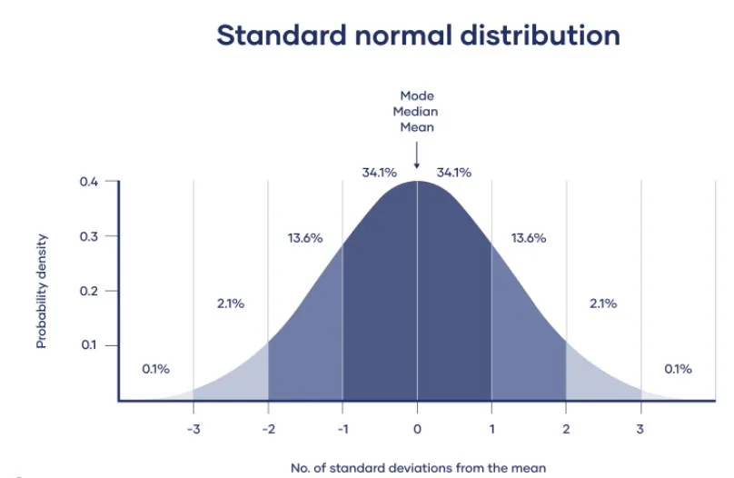
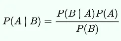

The field of statistics is the science of learning from data. Statistical knowledge helps you use the proper methods to collect the data, employ the correct analyses, and effectively present the results. Statistics is a crucial process behind how we make discoveries in science, make decisions based on data, and make predictions. Statistics allows you to understand a subject much more deeply. It thus makes an integral part of the Data Science. Here, we talk about the most common statistical concepts frequently encountered during statistical analysis.

##### Population and Sample
During a study, data is collected from objects of interest. These individuals together make up either a population or a sample. The key difference is the number of the individuals. If the data is collected from all the individual of interest, they make up the population. If the data is gathered from only a small number of individuals from the total individuals, they make up the sample.



They study on a population gives the actual data of interest, while study over a sample only gives a representative data which means The size of the sample is always less than the total size of the population. It is thus necessary to design the sample in a manner which is representative of the overall population.

When your population is large in size, geographically dispersed, or difficult to contact, it’s necessary to use a sample. With statistical analysis, you can use sample data to make estimates or test hypotheses about population data.

Eg: You want to study political attitudes in young people. Your population is the 300,000 undergraduate students in a country. Because it’s not practical to collect data from all of them, you use a sample of 300 undergraduate volunteers from three different universities – this is the group who will complete your online survey. Based on the results of the survey, you then use hypothesis testing and statistical analysis to infer the results of the overall 300,000 students.

Although, the inferred data will not be the exact data you get when surveying the entire undergraduate students, the data is however representative and close enough to derive meaningful results.

##### Measures of central tendency
Central tendency is the central (or typical) value of a probability distribution. They are the Statistical averages of a given data i.e. they are the values around which all the observations have a tendency to cluster. The central tendency can be measure using:



***Median***: divides the dataset into two equal parts



***Mode***: most frequently repeated observation

##### Measure of dispersion
Central values although gives an overall idea of the data, they fail to give an idea of the spread of the data. For eg:

• 5,5,5,5,5 – *mean* =5, *median* =5

• 3,4,5,6,7 – *mean* =5, *median* =5

• 1,3,5,7,9 – *mean* =5, *median* =5

In all the above cases, the ventral tendencies are the same, however the spread of the data is different. It is thus important to also know the spread of the data to get an overall idea of the data. The spread of the data is given by dispersion. The most common measures of dispersion are:

***Range*** – difference between extreme items in a series

- Range = max. value - min. value
- Used as a rough measure of variability
- Not considered an appropriate measure in serious research studies

***Variance*** – average of square of difference of values of items from arithmetic mean



***Standard deviation*** – square root of variance



The more spread out a data distribution is, the greater its standard deviation.

##### Normal distribution

Normal distribution, also known as the Gaussian distribution, is a probability distribution that is symmetric about the mean, showing that data near the mean are more frequent in occurrence than data far from the mean. The data in Normal distribution is symmetrically distributed with no skew. When plotted on a graph, the data follows a bell shape, with most values clustering around a central region and tapering off as they go further away from the center.



In python, you can generate the normal distribution data using the scipy.stats module.

```python
from scipy.stats import norm
sample = norm.rvs(loc = 0, scale = 1, size = 1000, random_state = 3)
```

Here the loc keyword is used to specify the mean while the scale is used to specify the standard deviation. The size keyword is used to specify the number of random values to be generated while the random_sate is used for repeatability of the code. Since in a normal distribution, the mean is used to specify the highest point in the curve while the standard deviation is used to specify the stretch of the curve, higher mean shift the curve to right while lower mean shift it to left side. Higher standard deviation stretches the curve (wide curve) while lower standard deviates squeezes the curve.

##### Binomial distribution

In probability theory and statistics, the binomial distribution with parameters n and p is the discrete probability distribution of the number of successes in a sequence of n independent experiments, each asking a yes–no question, and each with its own Boolean-valued outcome: success (*with probability p*) or failure (*with probability q = 1 − p*). in other terms, The binomial distribution is a probability distribution that summarizes the likelihood that a value will take one of two independent values under a given set of parameters or assumptions.

The underlying assumptions of the binomial distribution are:

- there is only one outcome for each trial,
- each trial has the same probability of success, and
- each trial is mutually exclusive, or independent of one another.

Flipping of a coin can be represented by a binomial distribution since it has two possible outcomes: success (heads) or failure (tails). In Python, we can simulate this by importing binom from scipy.stats and using the binom.rvs function, which takes in the number of coins we want to flip, the probability of heads or success, and an argument called size, which is number of trials. This call will return a 1, which we'll count as a head, or a 0, which we'll count as tails.

```python
from scipy.stats import binom
binom.rvs(1, 0.5, size = 100)
```

Here, we flip a single coin 100 times with 0.5 probability of success. This code returns a list of 100 1’s or 0’s. Opposed to this

```python
binom.rvs(100, 0.5, size = 1)
```

Will return a single outcome since we slip 100 coins a single time. So this code return the total number of success from among the 100 coins.

##### Poisson's distribution

The Poisson distribution is a very useful type of probability distribution that can model the frequency with which an event occurs during a fixed interval of time i.e. the distribution is used to show how many times an event is likely to occur over a specified period. The Poisson distribution is a discrete function i.e. the variable cannot take all values in any continuous range.

A Poisson distribution can be used to estimate how likely it is that something will happen "X" number of times. For example, if the average number of people who buy cheeseburgers from a fast-food chain on a Friday night at a single restaurant location is 200, a Poisson distribution can answer questions such as, "What is the probability that more than 300 people will buy burgers?"

Similar to normal distribution generation, poisson's distribution can be generated from the scipy.stats module

```python
from scipy.stats import poisson
poisson.rvs(mu = 1, size = 1000, random_state = 4)
```

##### Exponential distribution

The probability distribution of the time between events in a Poisson point process, i.e., a process in which events occur continuously and independently at a constant average rate is an exponential distribution. The exponential distribution is often concerned with the amount of time until some specific event occurs. For example, the amount of time (beginning now) until an earthquake occurs has an exponential distribution. Other examples include the length, in minutes, of long distance business telephone calls, and the amount of time, in months, a car battery lasts. In python, the exponential distribution can be generated using the numpy.random.exponential() method. For eg:

```python
from numpy import random
random.exponential(scale=2, size=(2, 3))
```

##### Central Limit Theorem

In many fields including natural and social sciences, when the distribution of a random variable is unknown, normal distribution is used.

Central limit theorem (CLT) justifies why normal distribution can be used in such cases. According to the CLT, as we take more samples from a distribution, the sample averages will tend towards a normal distribution regardless of the population distribution.

Consider a case that we need to learn the distribution of the heights of all 20-year-old people in a country. It is almost impossible and, of course not practical, to collect this data. So, we take samples of 20-year-old people across the country and calculate the average height of the people in samples. CLT states that as we take more samples from the population, sampling distribution will get close to a normal distribution.

Why is it so important to have a normal distribution? Normal distribution is described in terms of mean and standard deviation which can easily be calculated. And, if we know the mean and standard deviation of a normal distribution, we can compute pretty much everything about it.

##### Bayes theorem

The bayes theorem describes the probability of an event, based on prior knowledge of conditions that might be related to the event. For example, if the risk of developing health problems is known to increase with age, Bayes' theorem allows the risk to an individual of a known age to be assessed more accurately (by conditioning it on their age) than simply assuming that the individual is typical of the population as a whole.

Bayes' theorem is stated mathematically as the following equation:



- P(A|B) is a conditional probability: the probability of event A occurring given that B is true. It is also called the posterior probability of A given B
- P(B|A) is also a conditional probability: the probability of event B occurring given that A is true.
- P(A) and P(B) are the probabilities of observing A and B respectively without any given conditions; they are known as the marginal probability or prior probability.
- A and B must be different events.

*This blog has been written as a part of Data Scientist program by Data Insight.*
