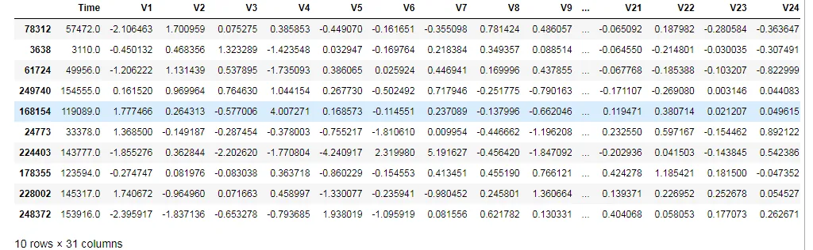
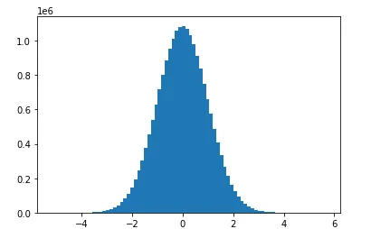
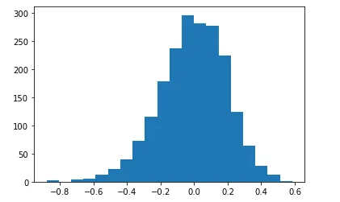

in this tutorial we will demonstrate ten keys concept in statistics for data science. we will get through many theoric things along with practical examples. we will work on popular dataset from kaggle "Credit Card Fraud Detection" wich is Anonymized credit card transactions labeled as fraudulent or genuine.

the first statistical concept that we will explain is

- population and sampling

A population is the entire group that you want to draw conclusions about.

A sample is the specific group that you will collect data from. The size of the sample is always less than the total size of the population.

for example in our example, the population is the entire dataframe, we can do the sampling using the Dataframe.sample()

```python
import pandas as pd
import random
data = pd.read_csv("C:/Users/HP/Desktop/creditcard.csv")
sample = data.sample(10)
sample
```



the next thing that we will discuss is the Measures of central tendency. There are three main measures of central tendency: the mode, the median and the mean. Each of these measures describes a different indication of the typical or central value in the distribution. The mean (or average) is the most popular and well known measure of central tendency. It can be used with both discrete and continuous data, although its use is most often with continuous data,The mean is equal to the sum of all the values in the data set divided by the number of values in the data set. The median is the middle score for a set of data that has been arranged in order of magnitude. The median is less affected by outliers and skewed data. The mode is the most frequent score in our data set. On a histogram it represents the highest bar in a bar chart or histogram. You can, therefore, sometimes consider the mode as being the most popular option.

```python
mean_v1=data['V1'].mean()
median_v1=data['V1'].median()
mode_v1=data['V1'].mode()
print('V1 mean is ', mean_v1 ,      'median is ',median_v1,'mode is ',mode_v1 )
```

```python
V1 mean is  3.918648695036257e-15 median is  0.0181087991615309 mode is  0    1.245674
1    2.055797
dtype: float64
```

- The normal distributions occurs often in nature. For example, it describes the commonly occurring distribution of samples influenced by a large number of tiny, random disturbances, each with its own unique distribution

normal distribution is characterized by mean and standard deviation

```python
import numpy as np
norm_sampling=np.random.normal(0,1,20000000)
norm_sampling
```

```python
array([ 0.11945378,  0.18652929,  1.41664043, ..., -0.06016227,
        0.01955902,  1.53164046])
```

```python
import matplotlib.pyplot as plt
plt.hist(norm_sampling,bins=80)
plt.show()
```



**central limit theorem**

The central limit theorem (CLT) states that the distribution of sample means approximates a normal distribution as the sample size gets larger, regardless of the population's distribution.

```python
cmean_list=list()
for i in range(2000):
      mean=np.mean(data['V1'].sample(100))
      mean_list.append(mean)
 plt.hist(mean_list,bins=20)
 plt.show()
```



## Measures of dispersion
## INTERQUARTILE RANGE
Interquartile range is defined as the difference between the 25th and 75th percentile (also called the first and third quartile). Hence the interquartile range describes the middle 50% of observations. If the interquartile range is large it means that the middle 50% of observations are spaced wide apart. The important advantage of interquartile range is that it can be used as a measure of variability if the extreme values are not being recorded exactly (as in case of open-ended class intervals in the frequency distribution). Other advantageous feature is that it is not affected by extreme values. The main disadvantage in using interquartile range as a measure of dispersion is that it is not amenable to mathematical manipulation.

## STANDARD DEVIATION
Standard deviation (SD) is the most commonly used measure of dispersion. It is a measure of spread of data about the mean. SD is the square root of sum of squared deviation from the mean divided by the number of observations.

```python
q3, q1 = np.percentile(data['V1'], [75 ,25])
iqr = q3 - q1
std = np.std(data['V1'])
std
```

1.9586923652174122
