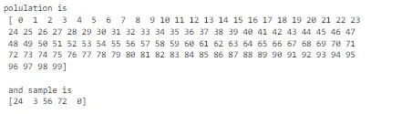
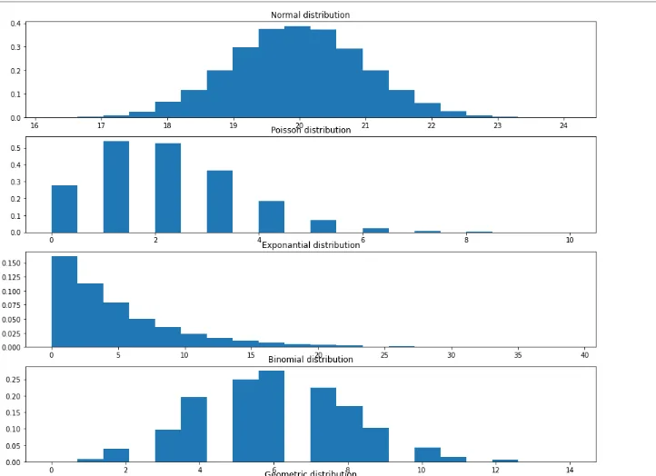
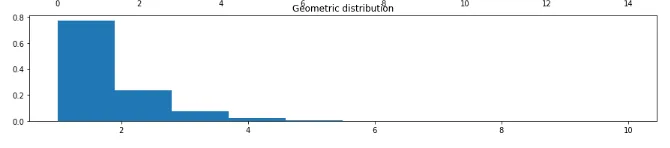

Statistics is the power house of data science. Arguably every behind every data science technique there is statistic sitting right at the corner. This being said, it is very difficult to get materials that explain statistic in a way that everyone can understand and that is the objective of this blog.

I am going to be talking about ten statistical concepts I have personally come across repeatedly in my attempt to become a very sound data scientist. Namely;

1. Population and sample
2. probability distributions
3. P- value
4. Statistical significance
5. Central Limit Theorem
6. bootstrap
7. bootstrap replicates
8. Hypothesis testing
9. Null hypothesis
10. confidence interval

**Population and Sample:** A population is every member of a particular location being considered. Relating dataset it is the data of every one in the place of interest. E.g. if we are considering a company's invoice, the population is the data of every single transaction made within the time period of interest. On the other hand, a sample is a part of the population that has been selected. This is usually done because getting data for every single event can be time consuming and expensive. People instead take a sample examine it, and draw conclusions from that that can be applied to the population. An example to help understand this concept is shown below;

**Probability Distributions**: Probability distribution is a graph of all the several values a random variable can contain on one axis and their various probabilities on the other. Because there are two kinds of random variables; Discrete and continuous, we also have discrete probability distributions and continuous probability distributions. Discrete probability functions are also referred to as probability mass functions. Continuous probability distributions are also called probability density functions. There are some types of discrete probability distributions that are popular (Poisson, uniform, binomial) and some type of continuous probability functions (Normal, lognormal) based on the shape of the distribution.

**P-value**: When doing hypothesis tests, the p-value is a metric used to determine whether or not to accept or reject the null hypothesis. it is the probability of getting a test statistic as extreme or more extreme than what was actually calculated from the data if the null hypothesis holds true.

**Statistical Significance**: This is a term closely associated with the p-value, a result that is statistically significant is unlikely to be gotten by chance. I.e. there must have been an underlying factor responsible. The p value determines statistical significance. An extremely low p value indicates high statistical significance, while a high p value means low or no statistical significance.

**Central Limit Theorem**: This is a theorem that states that the distribution of sample variable approximates a normal distribution i.e. a bell shape as the sample becomes larger, irrespective of the type of population distribution. It also says that the sample mean distribution taken from a normally distributed population is normal. The mean of the sample distribution is approximately equal to the mean of the population.

**Bootstrap**: Is any test or metric that uses random sampling with replacement I.e.. mimicking the actual sampling process. It falls under the broader class of resampling methods. It basically simulates drawing multiple samples from a single sample of data just like taking multiple samples from a population. It is used to estimate properties like confidence intervals and can also be used in hypothesis testing. A bootstrap is a single simulated data while bootstrapping is the process of generating several bootstraps.

**Bootstrap replicates**: These are the metrics or statistic obtained from the bootstraps generated

**Hypothesis testing**: This is a statistic approach to testing an assumption concerning a population.

**Null hypothesis**: This is the assumption that is being tested. we usually make an assumption about a data then test it with statistical methods.

**Confidence Interval:** this is a range of values within which any summary statistic calculated from the sample can fall within. it is calculated by taking percentiles from the bootstrap replicates. i.e. the 95% confidence interval is the range between the 2.5 percentile and the 97.5 percentile.
