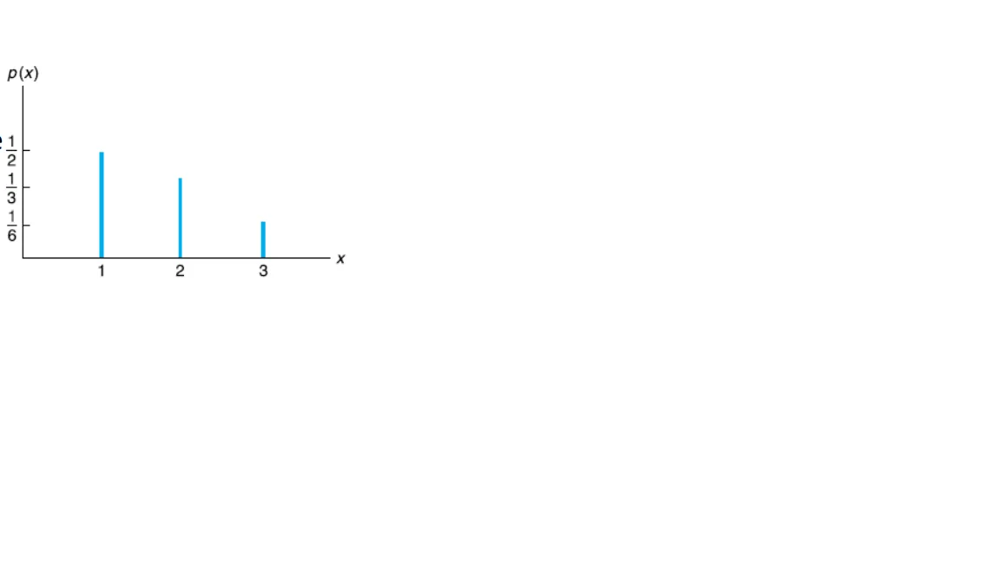
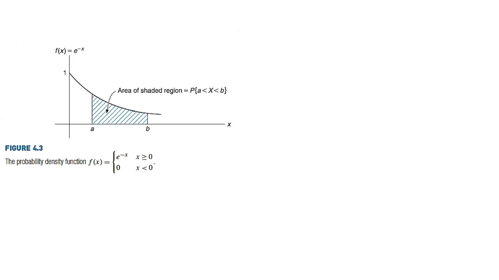
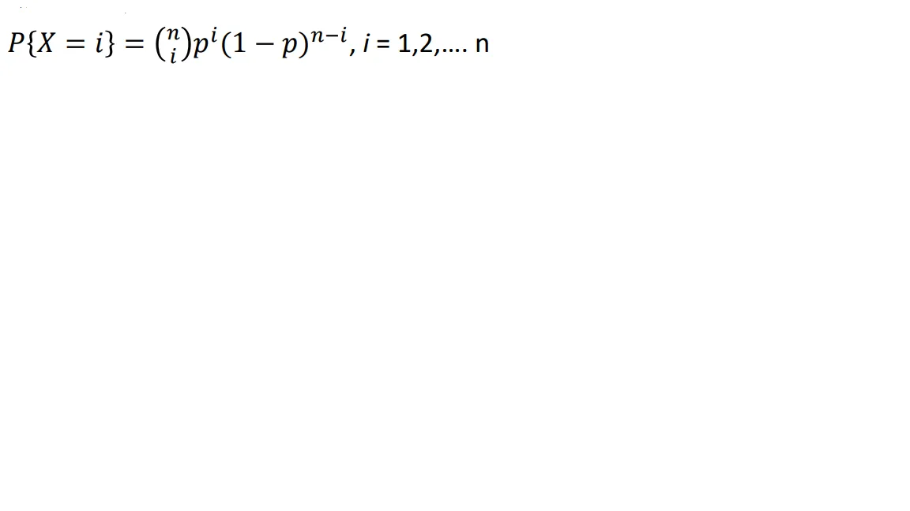
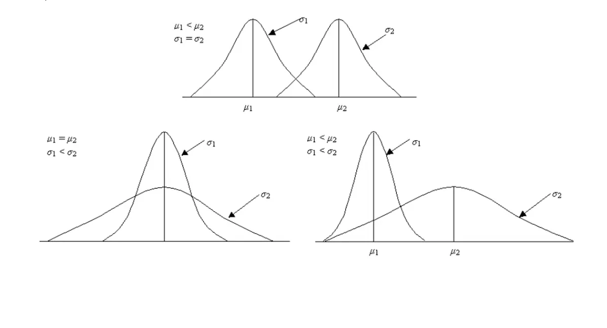
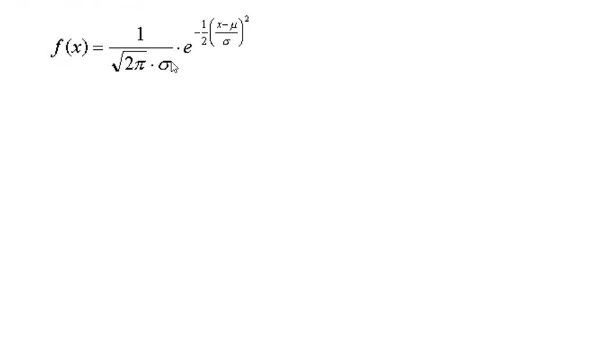

Statistics is the method of analysing ,summarize and get information from data There exist two types of statistics

1: Descriptive statistics

2: Inferential statistics

### 1: Descriptive statistics

Let's start with descriptive statistics It's the way to describe organize and summarize data and it contain 4 types of categories

Measure of frequency

Measure of dispersion

Measure of central tendency

Measure of position

### Measure of central tendency: describe your data using one value

mean ,median and mode

#### mean :

The mean is the sum of the value of each observation in a dataset divided by the number of observations. This is also known as the arithmetic average.

we can get the mean by adding all values together and divide by their number mean limitations : outliers Data points whose values is far greater or less than most the rest of the data

```python
import numpy as np
list1 = [2,4,5,6,7,8,90,10,30,3,3,4,5,2,3]
np.mean(list1)
12.133333333333333
```

#### median:[¶](http://localhost:8888/lab/tree/Downloads/dataInsightTAsks/StatConseppt.ipynb#median:)

the middle value of the data after ordering this data if it odd

and if the number of numbers is even the median is the average of the two data values in the middle.

```python
np.median(list1)
5.0

Example :
number of data is even The weights, in kilograms, of a group of 12 men are follows: 110, 82, 99, 70, 77, 87, 78, 80, 102, 79, 88, 95.
Solution: Ordering the given data from smallest to the largest weights: 70 , 77 , 78 , 79 , 80 , 82 , 87 , 88 , 95 , 99 , 102 , 110 There is a total of 12 data values and the average of the two data values 82 and 87 in the middle is the median and is equal to (82 + 87) / 2 = 84.5.
```

mode
:is the most frequency value in the data

```python
from statistics import mode
mode(list1)
3
```

##### Note

if data values (mean, median and mode)are not close to each other so we need another measure it's now called Measure of dispersion The standard deviation is a measure of the dispersion of the data values around the mean
The variance of a random variable, denoted by Var(x) or , is a weighted average of the squared deviations from the mean
The standard deviation, denoted σ, is the positive square root of the variance. Since the standard deviation is measured in the same units as the random variable and the variance is measured in squared units, the standard deviation is often the preferred measure small std is a good representation which say that data are close to each other.

```python
np.var(list1)
477.1822222222223
np.std(list1)
21.844500960704558
```

##### Percentiles

median is a special name for the 50th percentile;

other percentile we want. Percentiles are useful summary statistics, and can be computed

```python
# Specify array of percentiles:
percentiles = np.array([2.5,25,50,75,97.5])
# Compute percentiles:
ptiles_vers = np.percentile(versicolor_petal_length,percentiles)
# Print the result
print(ptiles_vers)
```

[3.3 4. 4.35 4.6 4.9775]

Correlation and covariance:

used to measure relationship between two variables interchangeably
Correlation used between two variables when one affected by the second variable
covariance when two variables vary with each other, whereas
covariance signifies the direction of the linear relationship between the two variables, shows whether they are directly proportional or inversely proportional.

positive cov(x,y): X increase when y increase
Negative cov:higher than average values of Y” tend to be paired with “lower than average values of X”
Equal Zero: if x ,y are independent and cov = 0 does not imply that 2 r.v. are independent, a non-linear relationship can exist that result in Cov = 0

Properties of Covariance:
cov(x,x):equal to var(x)
cov(x,y) = cov(y,x)
Cov(aX, bY) = ab Cov(X, Y) , for any constant a and b
Cov(X1 +X2,Y) = Cov(X1,Y) + Cov(X2,Y)
Var(X +Y) = Var(X)+ Var(Y ) +2Cov(X, Y)
Either large or small covariance values/magnitude has no direct significance because it depends on the units (scale) of the data. So we use standard deviation to get correlation
corr = cov(x, y) / sqrt(var(x) \* var(y))

Corr(X,Y) = 1 means Y = aX + b where a = + where a is the slope of the equation
Corr(X,Y) = −1 means Y = aX + b where a = −
Corr(X,Y) = 0 means absence of linear relationship
corr(x,y) value is from +1 to -1 where +1 is very strong corr

## 2: Inferential statistics:

##### by using Inferential statistics we can predict from taking sample from population and make generalizations to population haker statistics:

##### The basic idea is that instead of literally repeating the data acquisition over and over again, we can simulate those repeated measurements using Python. For our first simulation, we will take a cue from our forebears. The concepts of probability originated from studies of games of chance 1:simulate your data 2:simulate it many many times 3:and then compute the fraction of trials that had the outcome you're interested in. Population Vs Sample:

population is the large community or its all of your data, all columns and all rows . its difficult to predict new actions to your data buy reading all of it and do math operations. so we take small number of this data and make all operations to it and in the final we generalize this insights to all population

##### Random variable:

##### in some operations or experiments we may not interest in the variables but interest in the event of some variables such that throwing two dice we need to multiply the output without know each variable value to be 6 {1,6}{2,3} Discrete Vs continuous Random Variables:

Discrete: absolute value as the number of people in family ,dice and so on... continuous: you can break it to small units such as distance between to cites ,amount of water in bottle

#### pmf vs pdf:

probability mass function for discrete r.v :graphical representation that show you how probability is distributed over random number x for discrete random variable pmf is donated as f(x) The sum of the probabilities for each value of the random variable must equal one



probability density function for continuous r.v : The height or value of the pdf at any particular value of x does not directly give the probability of the random variable taking on a specific value. Instead, the area under the graph of f(x) corresponding to some interval (i.e., the integral of f(x) over that interval) provides the probability that x will take on a value within that interval.



### Distributions:

Mathematical descriptions of outcomes

#### Discrete distributions: 1: Bernoulli distribution

an experiment result is 1 if success and 0 if fail such as coin flip
mean = p where p is the probability of success
and variance = p\*q where q =(1-p) as it done one time we use binomial distributions to make game more than one time

##### 2:Binomial distribution:

Do Bernoulli more than one • For n independent trials, each of which results in a “success” with probability p and in a “failure” with probability

1 − p

If X represents the number of successes that occur in the n trials, then X is said to be a binomial random variable with parameters (n, p). The probability mass function (PMF) of a binomial random variable with parameters n and p:
Where 𝑛 is the number of different groups of i objects that can be chosen from a set of n objects



### continuous distributions

##### Normal distribution :

Gaussian distribution or bell curve or normal distribution
 it describes a continuous variable whose PDF is symmetric and has a single peak.





#### p-value:

the p-value is the probability of obtaining a value of your test statistic that is at least as extreme as what was observed, under the assumption the null hypothesis is true. The p-value is exactly that. It is not the probability that the null hypothesis is true. Further, the p-value is only meaningful if the null hypothesis is clearly stated, along with the test statistic used to evaluate it. When the p-value is small, it is often said that the data are
