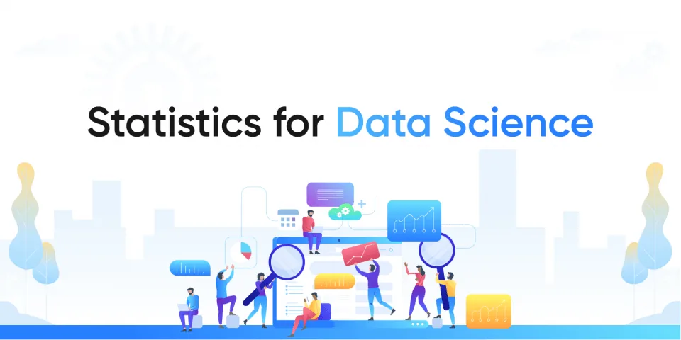

In this blog we will discuss some statistics concepts for data science

At first, we might ask ourselves what is the importance of statistics in data science?

### Importance of Statistics in Data Science
As we know that Data science is the study of data in different forms to make healthy assumptions about behaviors and tendencies and to make these assumptions the information needs to be organized according to the concepts of statistics so that the study becomes easy and hence the findings become more accurate.

statistics plays a powerful role When the data is big and unorganized.

you can use statistics to find insights, it makes the tedious task look minimalist and easy in front of the big and buffer information that was provided earlier.

Some ways in which Statistics helps in Data Science are:

**1-Prediction and Classification:** Statistics help in prediction and classification of data

**2-Helps to create Probability Distribution and Estimation**

Probability Distribution and Estimation are crucial in understanding the basics of machine learning and algorithms.

**3-Powerful Insights:** Dashboards, charts, reportsin the form of interactive and effective representations give much more powerful insights than plain data and it also makes the data more readable and interesting.

### Categories of statistics
There are 2 main categories in the statistics Descriptive vs. Inferential Statistics.

**Descriptive Statistics:**

is about describing our collected data by using measures of center, measures of spread, shape of our distribution, and outliers. We can also use plots of our data to gain a better understanding.

## Inferential Statistics:
is about using our collected data to draw conclusions to a larger population. Performing inferential statistics well requires that we take a sample that accurately represents our population of interest.

Now let's take a look at the types of data we may collect

### Types of Data
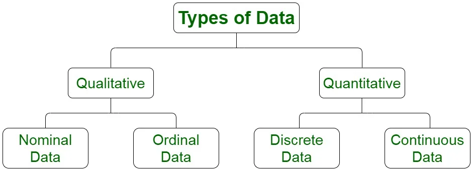

## Qualitative Data Type
Qualitative or Categorical Data describes the object under consideration using a finite set of discrete classes. It means that this type of data can’t be counted or measured easily using numbers . The gender of a person male or female is a good example of this data type. These are usually extracted from audio, images, or text medium. Another example can be of a smartphone brand that provides information about the current rating, the color of the phone, category of the phone, and so on. All this information can be categorized as Qualitative data. There are two subcategories under this:

## -Nominal
These are the set of values that don’t possess a natural ordering as gender, names …etc.

## -Ordinal
These types of values have a natural ordering while maintaining their class of values. If we consider the size of a clothing brand then we can easily sort them according to their name tag in the order of small < medium < large.

## Quantitative Data Type
Data takes on numeric values that allow us to perform mathematical operations like the number of dogs. There are two subcategories under this:

**-Continuous**

data can be split into smaller and smaller units, and still a smaller unit exists. An example of this is the age of the dog - we can measure the units of the age in years, months, days, hours, seconds, but there are still smaller units that could be associated with the age.

**-Discrete**

data only takes on countable values. The number of dogs we interact with is an example of a discrete data type.

### Population and Sample
we use sample and population in Inferential Statistics so what is population and sample mean?

**-population**

In statistics, population is the entire set of items from which you draw data for a statistical study. It can be a group of individuals, a set of items, etc. It makes up the data pool for a study.

Generally, population refers to the people who live in a particular area at a specific time. But in statistics, population refers to data on your study of interest. It can be a group of individuals, objects, events, organizations, etc. You use populations to draw conclusions.

**-Sample**

A sample represents the group of interest from the population, which you will use to represent the data. The sample is an unbiased subset of the population that best represents the whole data.

### Measures of central tendency
A measure of central tendency is a single value that attempts to describe a set of data by identifying the central position within that set of data.

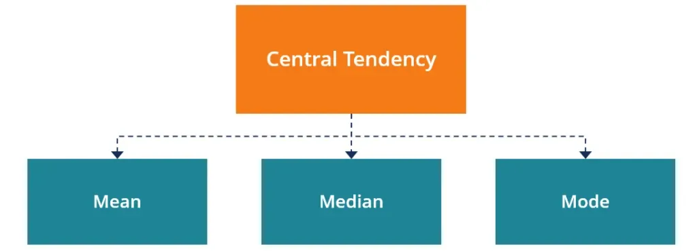

as we shown in the figure above there are three measures of central tendency: Mean, Median and Mode.

## Mean
The mean is often called the average or the expected value in mathematics. We calculate the mean by adding all of our values together, and dividing by the number of values in our dataset

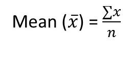

we can use pandas library in python to calculate the mean by using .mean( ) .

```python
Fare_mean=data['Fare'].mean()
print(Fare_mean)
```

## Median
**Median for Odd Values**

If we have an **odd** number of observations, the **median** is simply the number in the **direct middle**. For example, if we have 7 observations, the median is the fourth value when our numbers are ordered from smallest to largest. If we have 9 observations, the median is the fifth value.

**Median for Even Values**

If we have an **even** number of observations, the **median** is the **average of the two values in the middle**. For example, if we have 8 observations, we average the fourth and fifth values together when our numbers are ordered from smallest to largest.

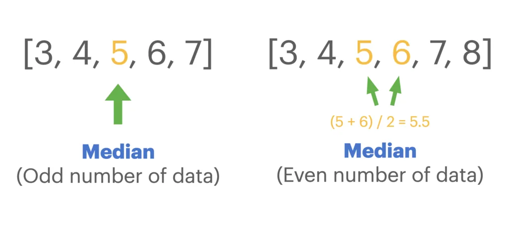

we can use pandas library in python to calculate the mean by using .median ( ) .

```python
Fare_median=data['Fare'].median()
print(Fare_median)
```

## Mode
The mode is the most frequently observed value in our dataset

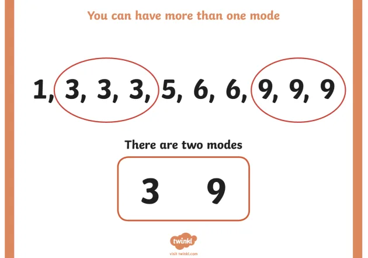

we can use pandas library in python to calculate the mean by using .mode ( ) .

```python
Fare_mode=data['Fare'].mode()
print(Fare_mode)
```

### Measures of dispersion
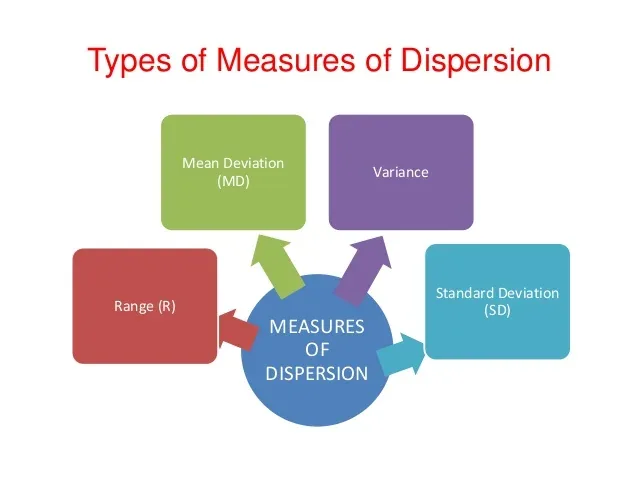

In statistics, the measures of dispersion help us to interpret the variability of data to know how much homogenous or heterogeneous the data is. In simple terms, it shows how squeezed or scattered the variable is.

## Range
It is simply the difference between the maximum value and the minimum value given in a data set

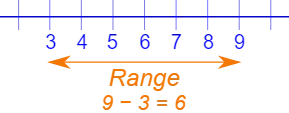

## Variance
Deduct the mean from each data in the set then squaring each of them and adding each square and finally dividing them by the total no of values in the data set is the variance.

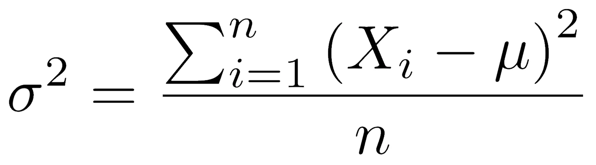

we can use pandas library in python to calculate the mean by using .var() .

```python
Fare_var=data['Fare'].var()
print(Fare_var)
```

## Standard Deviation
The square root of the variance is known as the standard deviation.

we can use pandas library in python to calculate the mean by using .std().

```python
Fare_std=data['Fare'].std()
print(Fare_std)
```

we can take a quick look of data statistics in python by using .describe()

```python
data.describe()
```

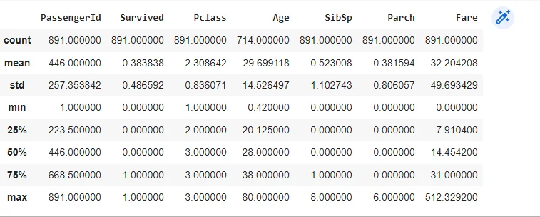

### Covariance and Correlation
## Covariance
Covariance signifies the direction of the linear relationship between the two variables. By direction we mean if the variables are directly proportional or inversely proportional to each other.

The value of covariance between 2 variables is achieved by taking the summation of the product of the differences from the means of the variables as follows:

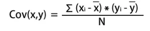

## Correlation
Correlation analysis is a method of statistical evaluation used to study the strength of a relationship between two, numerically measured, continuous variables.

To calculate it we have to normalize the covariance by dividing it with the product of the standard deviations of the two variables, thus providing a correlation between the two variables.

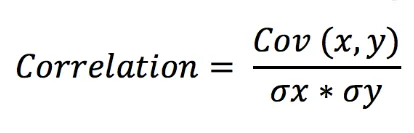

we can know how strongly a pair of variables are related to each other by using .corr( )

```python
data.corr()
```

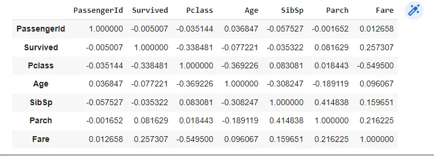

### SKEWED DISTRIBUTION
A skewed distribution occurs when one tail is longer than the other.

## Left -Skewed
Left -Skewed distributionhas a long left tail. Left-skewed distribu

tions are also called *negatively-skewed* distributions. That’s because there is a long tail in the negative direction on the number line. The mean is also to the left of the peak.

## Right -Skewed
right-skewed distribution has a long right tail. Right-skewed distributions are also called positive-skew distributions. That’s because there is a long tail in the positive direction on the number line. The mean is also to the right of the peak.

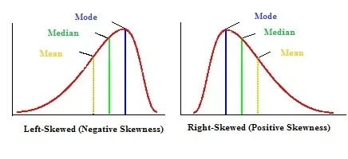

### Probability distributions
A probability distribution is a table or an equation that links each possible value that a random variable can assume with its probability of occurrence.

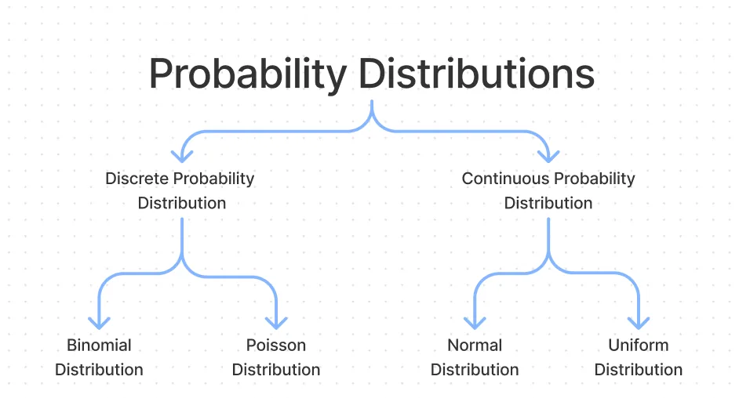

as we show in the figure above there are two types of probability distributions Discrete & Continuous probability distributions.

## Discrete probability distributions
**Binomial Distribution**

A binomial distribution can be thought of as simply the probability of a SUCCESS or FAILURE outcome in an experiment or survey that is repeated multiple times. The binomial is a type of distribution that has two possible outcomes . For example, a coin toss has only two possible outcomes: heads or tails and taking a test could have two possible outcomes: pass or fail.

we can calculate it as:

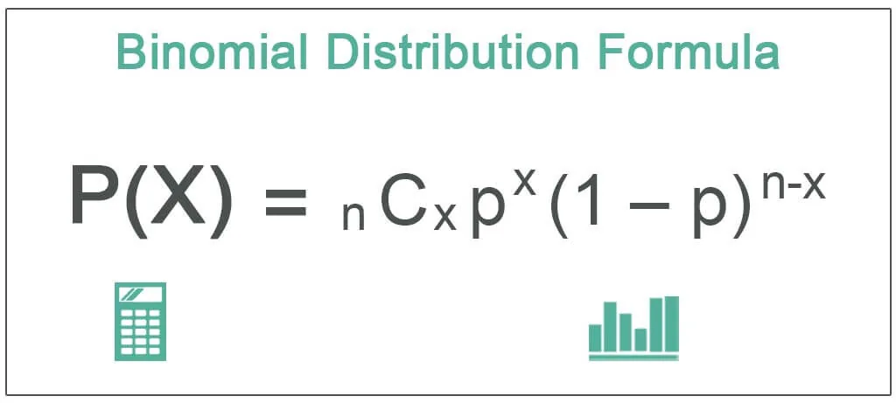

## Poisson** **Distribution
Poisson distribution is a probability distribution that is used to show how many times an event is likely to occur over a specified period. In other words, it is a count distribution. Poisson distributions are often used to understand independent events that occur at a constant rate within a given interval of time.

we can calculate it as:

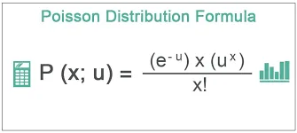

## Continuous probability distributions
## Normal** **Distribution
Normal distribution, also known as the Gaussian distribution, is a probability distribution that is symmetric about the mean, showing that data near the mean are more frequent in occurrence than data far from the mean. In graph form, normal distribution will appear as a bell curve .

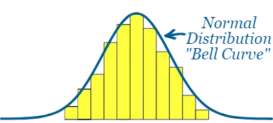

we can calculate it as:

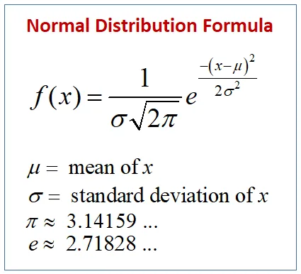

At the end of this article, I hope you enjoyed it and found it useful. Thank you for your time

### Resources:

**1-**[**analyticssteps.com/blogs/importance-statistics-data-science**](https://www.analyticssteps.com/blogs/importance-statistics-data-science)

**2-**[**upgrad.com/blog/types-of-data**](https://www.upgrad.com/blog/types-of-data/)

**3-**[**simplilearn.com/tutorials/machine-learning-tutorial/population-vs-sample**](https://www.simplilearn.com/tutorials/machine-learning-tutorial/population-vs-sample)

**4-**[**byjus.com/maths/dispersion/**](https://byjus.com/maths/dispersion/)

**5-**[**mygreatlearning.com/blog/covariance-vs-correlation/**](https://www.mygreatlearning.com/blog/covariance-vs-correlation/)
