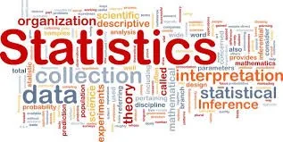

***"Statistical thinking will one day be as necessary for efficient citizenship as the ability to read and write." H.G.Wells***

*Throughout this blog, we'll be travelling in the world of uncertainty, starting from taking random samples from a population to visualizing probabilities distributions and finally doing some predictions with regression, I mean why not? if we decide to go in, than we'll go deep.*

*In addition to Pandas, Numpy, Matplotlib and Seaborn, the Python Libraries will be using in our code are :*

[SciPy](https://docs.scipy.org/doc/scipy/index.html) : a collection of mathematical algorithms and convenience functions built on the NumPy extension of Python. It adds significant power to the interactive Python session by providing the user with high-level commands and classes for manipulating and visualizing data.

```python
import scipy.stats as stats
```

[scikit-learn](https://scikit-learn.org/stable/index.html) : an open source machine learning library that supports supervised and unsupervised learning. It also provides various tools for model fitting, data preprocessing, model selection, model evaluation, and many other utilities.

```python
from sklearn.model_selection import train_test_split
from sklearn.linear_model import LinearRegression
import sklearn.metrics as metrics
```

**-****Random Variables** **:** It’s a real valued function defined over the sample of a random experiment. The values of a random variable corresspond to the outcomes of the random experiment.

Example :Throw a dice once :

- Random Variable X is the score shown on the top face.

- Sample space is {1,2,3,4,5,6}

in Scipy we have a function called **rvs()**, which gives a Random variates of given type. We'll be using to create all our samples in different distrubtions.

**How to calculate the mean and variance of a random variable ?**

**-****Mean** **:** If X is the random variable and P is its respective probability, the mean of a random variable is defined by :

*Mean(µ) = ∑XP*

*with python we use: np.mean()*

**-****Variance** **:** It tells how much is a spread of a random variable X around the mean value :

Var(x) = σ2 = E(x2) – [E(x)]2

In python we use : np.var()

**We have two types of random variables:**

**-****Discrete Random Variable** **:** It’s a countable number of distinct values, usually counts.

Example : Number of childs in one family, Number of patients…etc.

The pobability distribution of a distinct random variable is a list of probabilities associated with called :

***-******The probability mass function or PMF*** ***:*** is a function that gives the probability that a [discrete random variable](https://en.wikipedia.org/wiki/Discrete_random_variable) is exactly equal to some value. Sometimes it is also known as the discrete density function. The probability mass function is often the primary means of defining a [discrete probability distribution](https://en.wikipedia.org/wiki/Discrete_probability_distribution).

**-****Continuous Random Variable** **:** Takes on an infinite number of possible values, usually measurements.

Example : Height, Weight, Time…etc.

The pobability distribution of a continuous random variable is a list of probabilities associated with called :

**The cumulative distribution function or CDF** ***:*** of a random variable *X* is the function that accumulates the probabilities from a specified value. It’s a function that gives the probability that X will take a value less than or equal to x.

**-****Uniform Distribution** **:** Describe a form of probability distribution where every possible outcome has an equal likelyhood of happenning, which mean that the probability is constant.

*Example* *:* A deck of card has a uniform distribution : an individual has an equal chance of drawing a spade, a heart, a club or a diamond.

We have 2 types of a uniform distribution :

-Discrete Uniform Distibution : a statistical distribution where the probability of an outcome is equally likely and with finite values : like rolling a six sided dice : each side has a 1/6 chance of happening.

```python
#generate 100000 data points from uniform distribution in the range of 0 to 10
uni_data = stats.uniform.rvs(size = 100000,
                             loc = 0,
                             scale = 10)
uni_data[0:10]
```

```python
array([0.46666554, 0.96909452, 8.87157303, 3.25602261, 9.60698043,        5.1787817 , 1.62663601, 6.19140132, 4.92249016, 8.66100276])
```

```python
sns.distplot(uni_data)
plt.show()
```

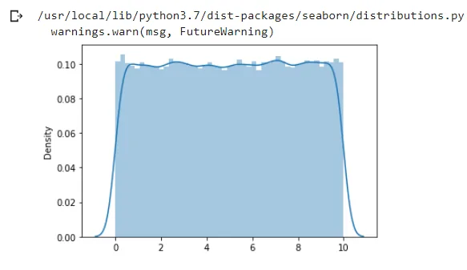

**-****Bernoulli Distribution** **:** It’s a discrete probability distribution for Bernoulli trial.

What is a Bernoulli Trial ? well, it’s a randome experiment that has only 2 outcomes : success or failure.

*Example* *: Getting heads while flipping a coin is 0.5 while the probability of failure is 1-P.*

The bernoulli trial is a special cas of the binomial distribution for n=1 (a single trial). Each action is independent : the probability stay the same throughout the trial.

*Example* *: Coin tosses, Births, Rolling dice..*

The probability mass function for [bernoulli](https://docs.scipy.org/doc/scipy/reference/generated/scipy.stats.bernoulli.html#scipy.stats.bernoulli) is:

f(k)= 1−p if k=0

p if k=1

for k in {0,1}, 0≤p≤1

[bernoulli](https://docs.scipy.org/doc/scipy/reference/generated/scipy.stats.bernoulli.html#scipy.stats.bernoulli) takes p as shape parameter, where p is the probability of a single success and 1−p is the probability of a single failure.

Let's generate a sample of 100000 data points from a bernoulli distribution where the probability of getting heads is 0.75, and let's plot its PMF.

```python
#generate 100000 data points from bernoulli distribution for p=0.75
bd= stats.bernoulli(0.75)
bd
```

```python
x=[0,1]
plt.bar(x,bd.pmf(x))
plt.show()
```

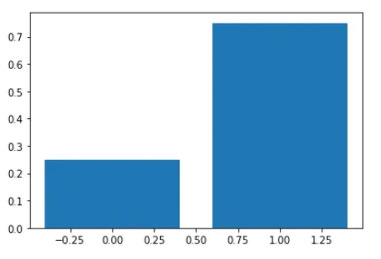

**-****Binomial Distibution** **:** A discret probability distribution which gives only two ossible results in one experiment, just like the bernoulli trial but with n number of independant trials. Described by two parameters :n : number of trials P : probability of an outcome.

P(x) = nCr Pr(1-P)n-r

n : number of trials.

r : total number of successful events

P : probability of sucess on a single trial

1-P : probability of failure.

As the bernoulli distribution is a binomial distribution with n=1(one trial), let's do it again but with 100 trials and a sample of 100000 data points from a binomial distribution and a chance of getting heads equal to 0.5.

```python
coin_toss = stats.binom.rvs(n=10,
                            p=0.5,
                            size = 100000,
                            random_state=10)
print(pd.crosstab(index='counts',columns=coin_toss))
```

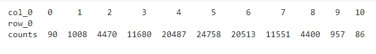

We can see that in our 5th trial, we got the highest number of heads which will be the peak in our plot..wanna check?

```python
pd.DataFrame(coin_toss).hist(bins=11)
plt.show()
```

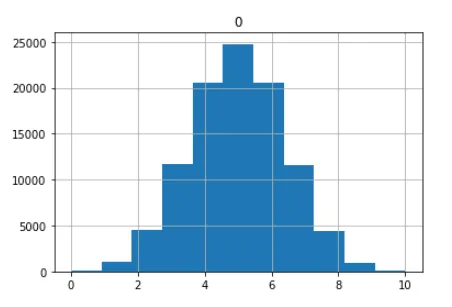

**-****Poisson Distribution** **:** A discreteprobability distribution that result from a poisson experiment and describes the probability of how many times an event is likely to happen within ‘x’ period of time.

**What is a poisson experiment ?** Its a process where events appear to happen at a certain rate, but randomly :

*example**: Number of patients arriving in a clininic between 10 to 11 am.*

*Number of emails recieved by a manager beyond the office hours.*

It is described by a value called lambda which represent the average number of events per time period. The distribution peak is always at its lambda value.

```python
poisson_dist = stats.poisson.rvs(mu=10,
                            size = 10000,
                            random_state=10)
poisson_dist[0:10]
```

```python
array([13, 11, 10,  7,  6, 13, 12, 15, 10,  9])
```

```python
plt.hist(poisson_dist, density=True)
plt.show()
```

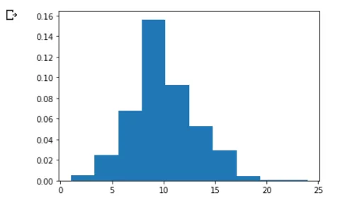

**-****Sample mean and Population Mean** **:**

The mean is defined as the average number of the given numbers of data:

*Mean(µ)= Sum of the given data / Total number of data*

***The sample mean :***is the average value foind in the sample : X where a sample is the smallest part of a whole.

The sample mean allows us to estimate what the whole population is doing :

X = ( ∑xi) /  n

xi : each data point of the sample

n : total number of data points in a sample.

***The population mean :*** is the average of a group characteristic, for example : school of 1103 students, average GPA is 31. It’s very rare to calculate the whole population mean because it’s time consuming. So, what we do instead, is take a sample, calculate it’s mean, and we can use it to approximate the population mean.

**-****Normal Distribution** **:** Also called the Gaussian Distribution. It’s a continuous probability distribution. The normal distribution is characterized by two parameters: the mean, μ, and standard deviation σ. The normal distribution with μ=0 and σ=1 is called the standard normal distribution.

The mean determines the line symmetry of a graph wherease the standard deviation helps to know how the data is spread out.

Lets generate a sample of 1000 weight of random people. As we said, the main parameters of the normal dsitribution are; the mean and the standard deviation, we need to specify them as arguments to the rvs() function:

```python
#Measure of weight (mean = 80 kg, SD = 10)
#generating 1000 random weights
sample= stats.norm.rvs(loc=80, scale=20,size=1000, random_state=14)
sample[0:10]
```

```python
sns.distplot(sample)
plt.show()
```

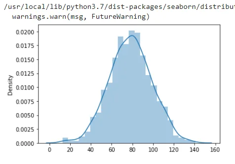

The standard deviation subdivide the area under the normal curve, each subdivided function defines the percentage of data which falls into a specific region of the graph.

***Is this the empirical rule ?*** *Yes indeed … Here’s a definition :*

**-****The Empirical Rule** **:** states that, for a normal distributution, almost all observed data will fall within three standard deviations (denoted by σ) of the mean or average (denoted by µ).

In particular, the empirical rule predicts that 68% of observations falls within the first standard deviation (µ ± σ), 95% within the first two standard deviations (µ ± 2σ), and 99.7% within the first three standard deviations (µ ± 3σ).

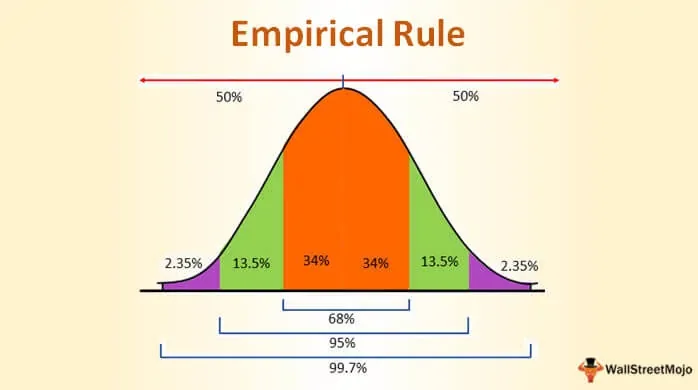

**-****Central Limit Theoreme** **:** The sampling distribution of a statistic become closer to normal distribution as the number of the trials increases. It become handy when you have a huge population and you don’t have time or ressources to collect data of the whole population, instead you can collect several samples and create a sampling distribution to estimate what the mean and standard deviation is.

The Central Limit Theorem explains the prevalence of normal distributions in the natural world. Many characteristics of living things are affected by genetic and environmental factors whose effect is additive. The characteristics we measure are the sum of a large number of small effects, so their distribution tends to be normal.

How about a liitle experiment to show how all this works?

We plot earlier a poisson distribution, let's use sns.distplot and plot it again to show the distribution clearly:

```python
sns.distplot(poisson_dist)
plt.show()
```

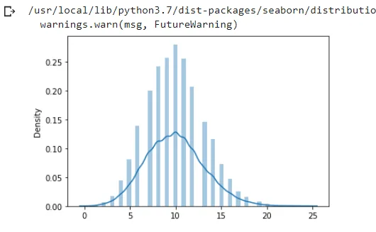

Let's collect samples of a poisson distribution 1000 times and plot it :

```python
def MakePoissonSamples(mu=10, iters=1000):
 samples = []
 for n in [1, 10, 100]:
    sample = [stats.norm.rvs(mu, n) for _ in range(iters)]
    samples.append(sample)
 return samples
```

```python
 sample = MakePoissonSamples(10,1000)
 sample
```

```python
sns.distplot(sample)
plt.show()
```

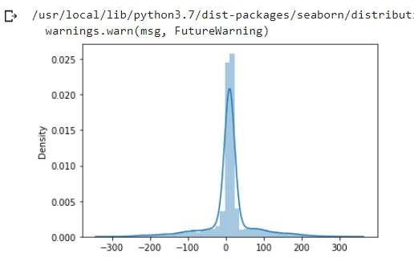

And this is pretty much a normal distribution.

**-****Linear Regression** **:** The linear function is a constant relationship between an independant variable x and a dependent variable y that is represented by a line. The relationship is expressed between 2 parameters, the slope and the intercept value :

*Y = slope \* x + intercept*

The Linear regression is the foundation for many models in data science : we look for the model parameter that minimize the distance between the model and the data.

Regression analysis is done in three steps :

The first step is analyzing the correlation that is strength and directionality of the data.

The next step is fitting the regression or least squares line, and the last step is evaluating the validity and usefulness of the model.

**-****The method of least square** **:** A statistical method that is practiced to find the regression line or the best fit line for a given pattern. It is described by an equation with specific parameters.

This ethod is a process of finding the best fixed line for a set of data points by reducing the sum of the squares of the risiduals i.e errors during the process of finding the relationship between variables.

***How it is calculated ?***

Suppose we have a set of ordered pairs(x1,y1),(x2,y2) up to (xn,yn).

1- Calculate the mean of the x-values and y-values.

2- Calculate the slope of the line :

3- Calculate the Y-intercept

We have a dataframe of study hours and scores of sutudents:

```python
df=pd.read_csv('https://bit.ly/w-data')
df.head()
```

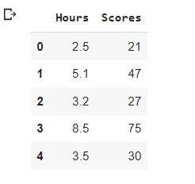

```python
plt.scatter(x='Hours',y='Scores', data=df)
plt.show()
```

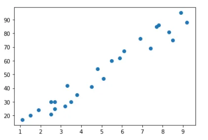

We can see that there is a linear relationship between the variable The first step into creating our regression model is splitting the data into 2 df

```python
x = df['Hours']
y=df['Scores']
```

Next, we need to split the data into train and test. we use train_size=0.7 means that we split the data into 70/30 ratio 70% for testing and 30% for training our model.

```python
x_train, x_test, y_train, y_test = train_test_split(x,y,train_size=0.7,random_state=10)
```

We need to reshape our data because linearRegression() expect a 2D arrays while we hae a 1D array data.

```python
x_train_lm = x_train.values.reshape(-1,1)
y_train_lm=  y_train.values.reshape(-1,1)
x_test_lm =  x_test.values.reshape(-1,1)
y_test_lm =  y_test.values.reshape(-1,1)
```

```python
lm = LinearRegression()
lm.fit(x_train_lm,y_train_lm)
```

after creating our regression model we need to get the slope and the intercept of our model.

```python
#slope
lm.coef_
```

```python
array([[10.06790391]])
```

```python
#intercept
lm.intercept_
```

```python
array([1.21396494])
```

Now it's time to do some predictions:

```python
y_train_pred = lm.predict(x_train_lm)
y_test_pred = lm.predict(x_test_lm)
```

```python
plt.scatter(x_train_lm,y_train_lm)
plt.plot(x_train_lm,y_train_pred, 'r')
plt.show()
```

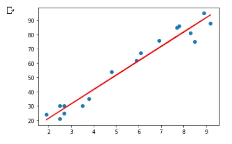

```python
plt.scatter(x_test,y_test)
plt.plot(x_test, y_test_pred,'r')
plt.show()
```

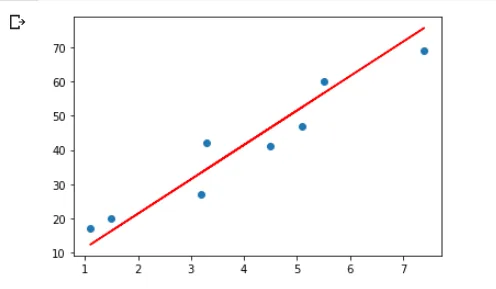

```python
score_train = metrics.r2_score(y_true=y_train, y_pred=y_train_pred)
score_test= metrics.r2_score(y_true= y_test, y_pred= y_test_pred)
print('r2 score for the training set is: ', score_train)
print('r2 score for the test set is: ', score_test)
```

```python
r2 score for the training set is:  0.9579593063012181
r2 score for the test set is:  0.8944542088325093
```

it means that for the train data 95% variance is explained by the model and for the test data 89% is explained by the model. The difference between the two scores is 0.06. it shows that our model is good, because any model having the difference between the two scores is less than 0.5 shows that the model is performing well.

If we have a student that study for 8.5 hours what score is he going to get?

```python
hours = [[8.5]]
pred= lm.predict(hours)
print(pred)
```

```python
[[86.79114814]]
```

Using our model, we can predict the score for any given hour, and this is the magic of regression analysis.

Well, here we reach the end of our statistics with python how to tutorial! i tried to highlight the most basic yet important statistical concepts to begin your journey. But remember, there's always plenty fish in the sea so try to learn as much as you can and for that i'm going to provide you with some important links that helped me throughout this tutorial:

- Think Stats e-book:

- <https://blogs.ubc.ca/math105/discrete-random-variables/lesson-1-summary/>

- <https://towardsdatascience.com/bernoulli-distribution-with-python-from-scratch-89fda3c822b>

You can find the code for this Tutorial [here](https://github.com/asmakrl/datacampstd/blob/main/Statistical_Concepts.ipynb).

Happy learning.
