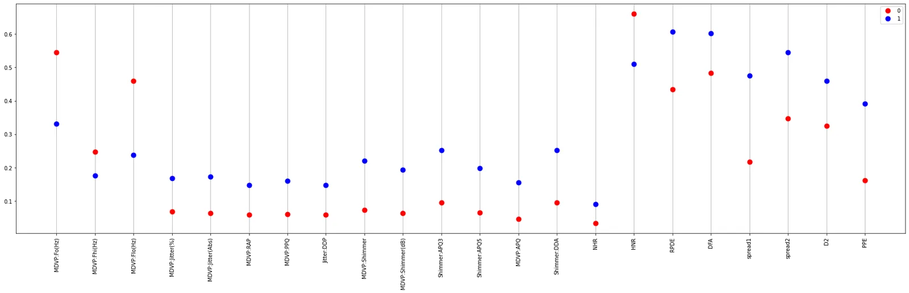
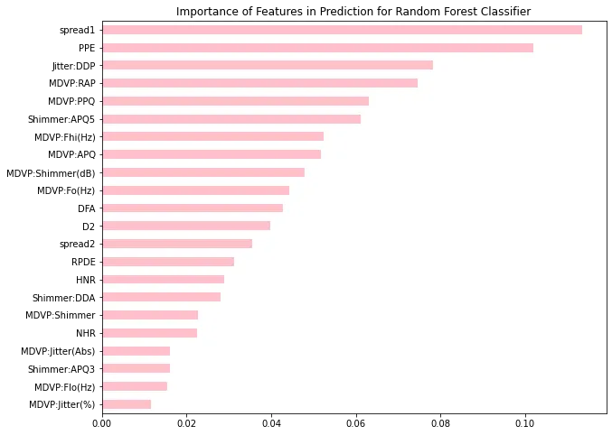

**Parkinson's Disease** is a neurological disorder where the brain cells of the patient breaks down and gradually causes impairment.

We have analyzed the **UCL Parkinson's disease dataset** where a range of biomedical voice measurements from 31 people, 23 with **Parkinson's disease (PD)** is provided for analysis and drawing inference.

The step by step approach we took for analyzing the dataset includes:

We used **violinplot** to visualize the distribution of each feature for normal patient(0) and Parkinson's patient(1) and see how the measurements differ in case both. A violinplot gives good insights on the measurement values.

For eg: in the above plot we could see the distribution of **DFA(****Signal fractal scaling exponent)** feature.

2. Secondly we showed the **correlation** of one feature with other in tabular format. High correlation denotes one feature is dependent on another and change/vary according to the change of other. This feature is called **collinearity or multi-collinearity** for many such features and can be a problem while building ML models like Linear Regression, Logistic Regression et.

3. Then we standardized the values of the features within a range and used **dotplot** to compare each one's mean for both normal and Parkinson's patient.

It gives an idea on which particular measurements increase on average in case of Parkinson's disease and thus their increase can be considered as a symptom of Parkinson's and medical-researchers can research more on those features.

The difference in mean can be by chance so to check their statistical significance we performed **t-test** which is a kind of Hypothesis test.

We found that the dataset is imbalanced i.e, there is more Parkinson patient data than normal one.

This kind of data may bias the result of ML model so we tried applying **oversampling and undersampling** techniques but this time simple ML model(Random Forest Classifier) without sampling techniques performed better which is a bit exception. But it's always advisable to apply sampling or other suitable techniques in case of **imbalanced class dataset.**

We used the feature importance features of **Random Forest Classifier and Variable Importance Permutation** method to find the most importance features helping in prediction for the model. In latter, we simply swap(permute) values of a column between different rows and then use these modified cases for prediction.

spread1, PPE are two features which are above in both the plots, so they are important features for the model.

We then clustered the standardized dataset into 2 and plotted it in 2D space using **TSNE** plot. The required clustering algorithm and number of clusters are chosen after careful evaluation.

This gave an idea on which features are important for classifying both patients.

Sometimes, we need to analyze the features of a particular patient. He might be in critical condition so we need to examine them. To examine that specifically for a particular datapoint we used the **LIME** package of Python.

Link to notebook: https://colab.research.google.com/drive/1IfbbGke1Grt61hNhQ2IoDbJX54oH7U6W?usp=sharing
