**Introduction to Python**

Python is a high level & general purpose programming language. It was created in 1991 by Guido Van Rossum. Code readability is one of the major emphasis of Python design philosophy. Python supports functional, procedural & object oriented programming paradigms. It’s object oriented approach help programmers to write clear & logical code for small & large projects.

Since 2003, Python has been ranked among top 10 popular programming languages. It was nominated as the Programming Language of the Year in 2007, 2010 & 2018. For String manipulations & search in a dictionary, scripting languages such as Python, PHP are more efficient than conventional programming languages such as Java or C.

Python’s large library support is one of the major reasons for its strength. It provides a vast majority of tools used to accomplish a variety of tasks. It contains over 130,000 packages and covers a large ground in terms of functionality, including Text Processing (used in projects related to Natural Language Processing), Image Processing (Computer Vision related projects), Machine Learning (Data Science & Data Analytics), Web scraping, Databases, Graphical User Interfaces and Web Frameworks.

Libraries such as Numpy, SciPy & Matplotlib allow python to be effectively used in scientific computing. Also, libraries like TensorFlow, Keras, Scikit-learn allow python to be used in projects related to artificial intelligence.

**Anaconda**

Anaconda is an open source and free distribution of Python & R programming languages. Simplification of package deployment & management is one of the major aims of Anaconda. It is mainly used in applications related to machine learning, data science & scientific computing. For Windows, Linux and MacOS it includes 1500 popular data science packages.

**Step by Step Installation Guide**

**Step No. 1:**

Go to Anaconda website. This [link](https://www.anaconda.com/distribution/) redirects you to the official site of Anaconda.

**Step No. 2:**

Scroll Down on the page you will see a block like the one shown below.

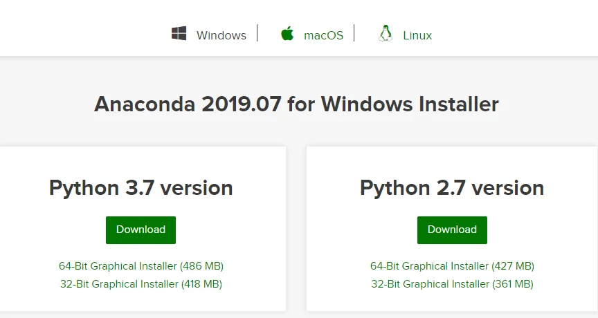

Download the suitable distribution from official site of anaconda by clicking the download button. If you have a 64 bit computer opt for 64-Bit Graphical Installer otherwise opt for 32-Bit Graphical Installer.

**Step No. 3:**

After the completion of download simply **double-click** the following icon.

**Step No. 4:**

Now wait for the setup to load.

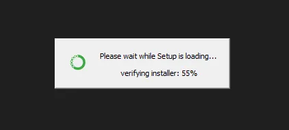

**Step No. 5:**

After the setup is successfully loaded an installation wizard will be displayed on your screen. Simply click **"Next"** button.

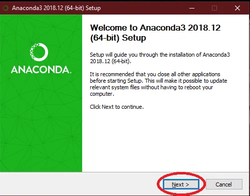

**Step No. 6:**

After reading all the terms and conditions click the **“ I Agree ”** button to proceed.

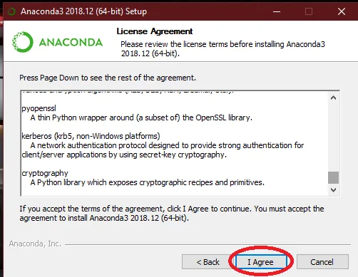

**Step No. 7:**

Select the installation the from the given options. Simply go for the recommended option if you are unaware of the details.

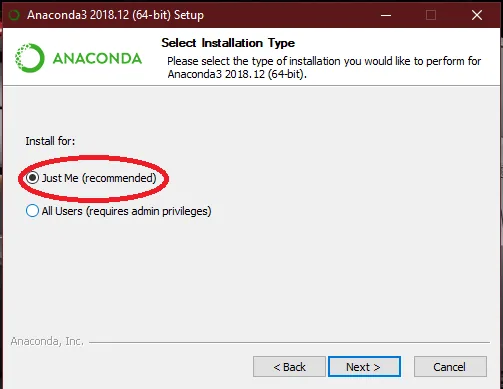

**Step No. 8:**

Choose the destination folder with appropriate space in which you want to install Anaconda. Simply click the **“ Browse ”** Button to accomplish this task.

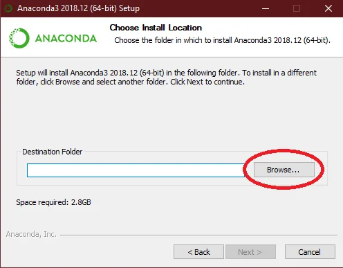

**Step No. 9:**

Take care of the available space and the space required to install Anaconda.

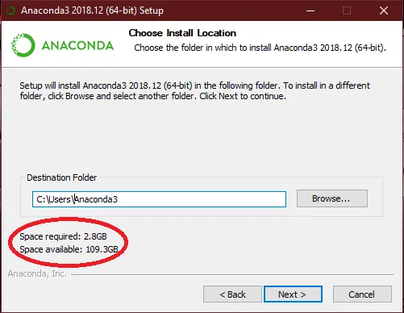

**Step No. 10:**

After checking all the requirements click **“ Next ”**.

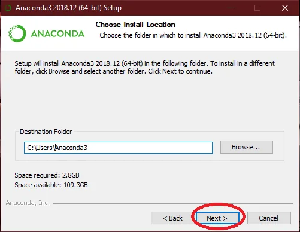

**Step No. 11:**

Check both the check boxes to ensure proper installation.

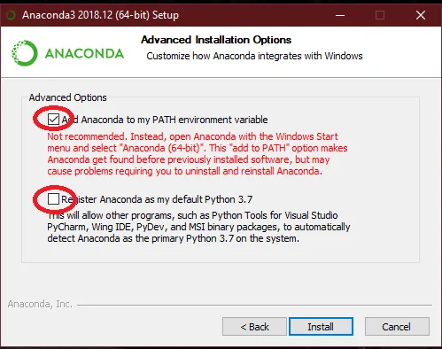

**Step No. 12:**

Click the **“ Install ”** button to install the IDE.

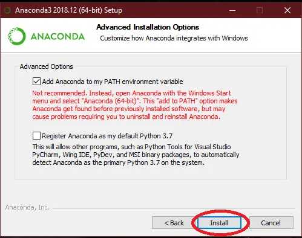

**Step No. 13:**

It will take a while, so you can enjoy a cup of tea or coffee.

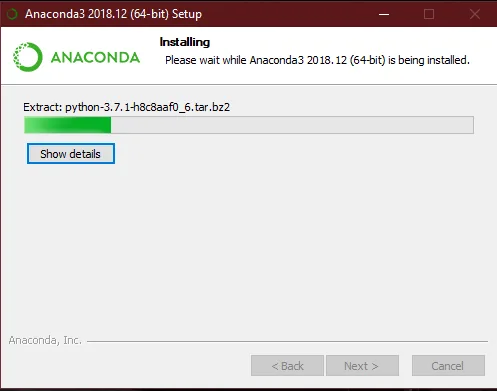
