**Introduction to R**

R is a programming language and free software for graphics and statistical computing supported by R Foundation. Data Miners and Statisticians widely use R language for Data Analysis and for developing Statistical Software. As of July 2019, R is ranked as the 20th most popular programming language by TIOBE index. Also, data mining surveys, polls and studies have shown substantial increase in popularity of R. R was created by Ross Ihaka and Robert Gentleman at the University of Auckland, New Zealand, but now it is developed by the R Development Core Team.

Implementation of a wide variety of graphical and statistical techniques including time-series analysis, classification & clustering is made possible and easy with the help of wide variety of R libraries. With the help of vast majority of functions and extensions, R has been made easily extensible for its users. In terms of packages, R community is noted for its active contributions. C and C++ is used by R to perform computationally intensive tasks. As compared to other statistical computing languages R has much stronger Object-Oriented facilities for programming.

With the help of various additional packages, R becomes quite good as static, dynamic and interactive graphics. It can also produce publication quality graphics. Like many other programming languages such as MATLAB (Matrix Laboratory), R also supports variety of matrix operations.

The major data structures supported in R are:

1) Vectors.

2) Matrices.

3) Arrays.

4) Data Frames (similar to Tables in Databases).

5) Lists.

Scalars cannot be represented in R as a scalar data type, rather it is represented as a vector with length one.

Although R has a command line interface, there are several Graphical User Interfaces (GUI’s). The most specialized Integrated Development Environment (IDE) for R language is R studio. A similar integrated development environment is R Tools for Visual Studio. Some generic IDE’s such as Eclipse also provide facility to work with various R packages.

As RStudio Incorporation has no formal connection to the R Foundation (an organization which is responsible for overseeing development of R environment for statistical computing) so we have to separately install R language and RStudio.

First, we will install R language in this tutorial, and then we will install R studio in the tutorial available at this link.

The following is the step by step guide to install R language.

**Step by Step Installation Guide for R language**

**Step No. 1:**

Go to R language website. This [link](https://cran.r-project.org/bin/windows/base/) redirects you to the official site of R language.

**Step No. 2:**

Click on the link highlighted in the image given below:

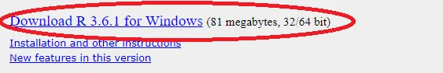

**Step No. 3:**

Wait for a few minutes because depending upon the speed of your internet it will take a bit to download.

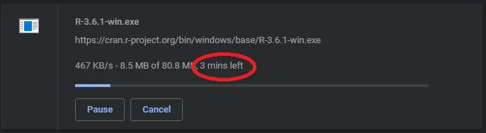

**Step No. 4:**

After the completion of download simply double-click the following icon.

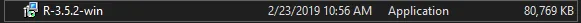

**Step No. 5:**

Select the language in which you want to proceed.

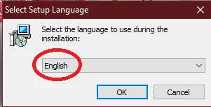

**Step No. 6:**

After selecting the language click “ Ok ”.

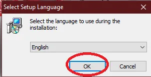

**Step No. 7:**

Carefully read all the instructions in License Agreement.

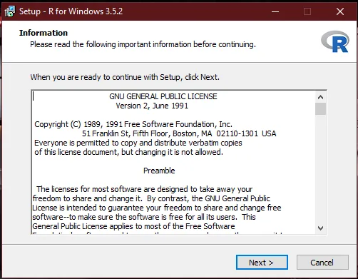

**Step No. 8:**

Click “ Next ” to proceed with installation.

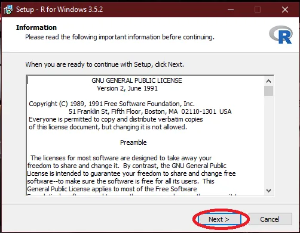

**Step No. 9:**

Click “ Browse ” button to select the directory in which you want to install the R language.

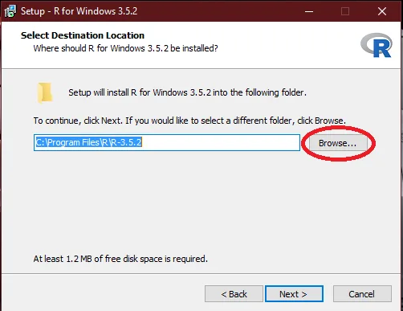

**Step No. 10:**

Click “ Next ” to proceed with installation.

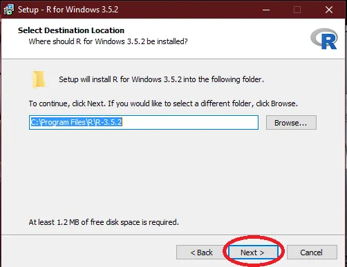

**Step No. 11:**

Select the components you want to install by selecting the check boxes. It is recommended to install all the components.

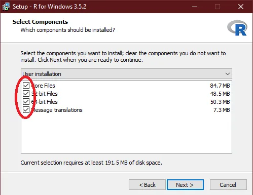

**Step No. 12:**

Click “ Next ” to proceed installation.

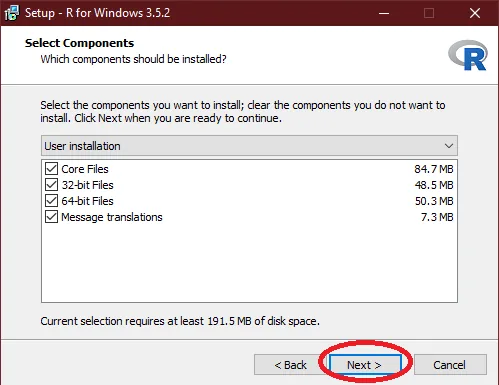

**Step No. 13:**

Select the startup options the from the given options. Simply go for the recommended option if you are unaware of the details.

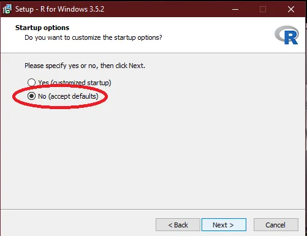

**Step No. 14:**

Click “ Next ” to proceed with installation.

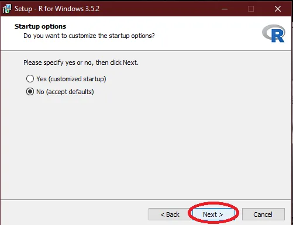

**Step No. 15:**

By using the “ Browse ” Button select the directory or folder in which you want to create the shortcuts for the program.

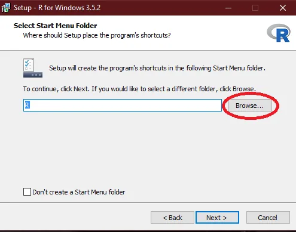

**Step No. 16:**

Click “ Next ” to proceed with installation.

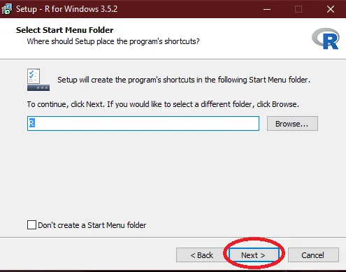

**Step No. 17:**

Select the additional options such as additional shortcuts and registry entries.

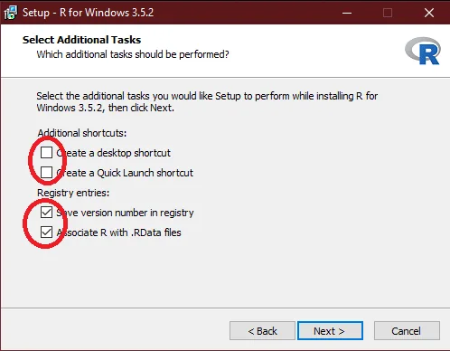

**Step No. 18:**

Click “ Next ” to proceed with installation.

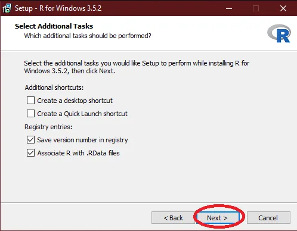

**Step No. 19:**

Wait for installation to complete.

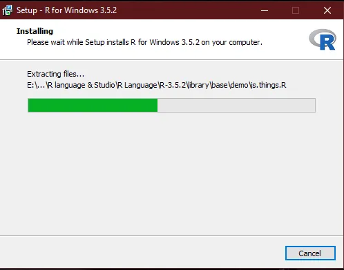

**Step No. 20:**

Congrats, you have successfully completed the installation of R language. Click the [link](https://www.datainsightonline.com/post/step-by-step-guide-for-installation-of-rstudio-for-data-science-machine-deep-learning) for step by step guide to install RStudio; an integrated development environment (IDE) for R language so that you can run your programs on R language.
