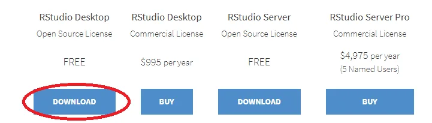
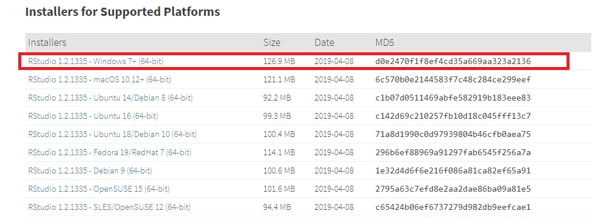
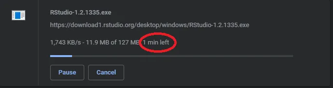
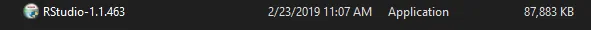
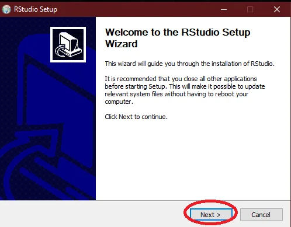
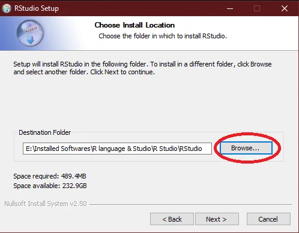
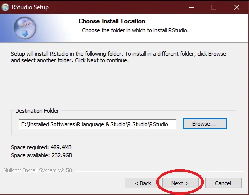
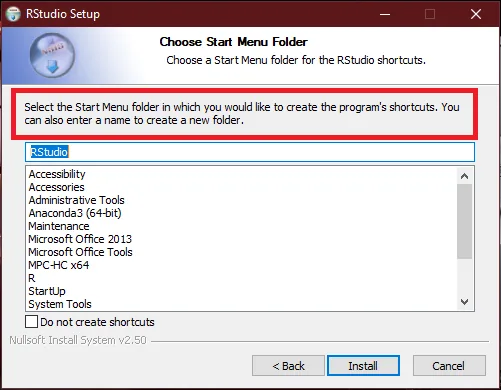
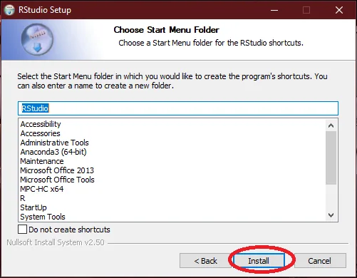
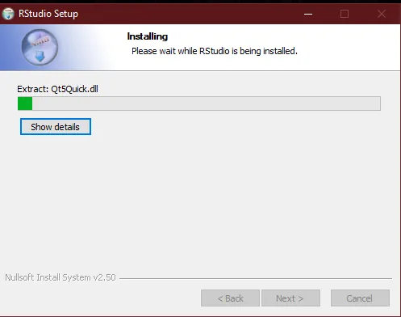

Although R has a command line interface, there are several Graphical User Interfaces (GUI’s). The most specialized Integrated Development Environment (IDE) for R language is R studio. A similar integrated development environment is R Tools for Visual Studio. Some generic IDE’s such as Eclipse also provide facility to work with various R packages.

**RStudio**

R-studio is an integrated development environment (IDE) for R programming language. It is designed by R Studio Incorporation. JJ Allaire is the Chief Scientist of RStudio. It is a set of integrated tools designed to help you to be more productive with R. It includes a console, syntax-highlighting editor that supports direct code execution, and a variety of robust tools for plotting, viewing history, debugging and managing your workspace.

RStudio is available in two versions:

1) RStudio Desktop Version.

2) RStudio Server Version.

RStudio Desktop Version restricts the users to run their programs locally on a regular desktop application while RStudio Server Version allows users to access it with the help of any web browser because all the R scripts are provided with proper resources to execute the instructions on a remote Linux server.

RStudio Desktop version and RStudio Server Version are both available in free and paid versions (for commercial purposes with advanced features and facilities).

RStudio Desktop Version is available is prepackaged distributions for following platforms:

1) Windows.

2) MacOS.

3) Linux.

RStudio Server Version is mostly for following distributions:

1) Debian.

2) Red hat Linux.

3) CentOS.

As RStudio Incorporation has no formal connection to the R Foundation (an organization which is responsible for overseeing development of R environment for statistical computing) so we have to separately install R language and RStudio.

We will install RStudio in this tutorial but first you have to install R language. If you haven’t installed it, click the [link](https://www.datainsightonline.com/post/step-by-step-guide-for-installation-of-r-language-for-data-science-machine-deep-learning) for step by step guide to install R language.

The following is the step by step guide to install RStudio.

**Step by Step Installation Guide for RStudio**

**Step No. 1:**

Go to RStudio website. This [link](https://www.rstudio.com/products/rstudio/download/) redirects you to the official site of RStudio.

**Step No. 2:**

Scroll down the page. You will see different versions of RStudio. Click on the highlighted “Download” button on the webpage as shown in image:

**Step No. 3:**

It will take you to the following links. Click on the link highlighted in the image to download R Studio.

**Step No. 4:**

Wait for a few minutes because depending upon the speed of your internet it will take a bit to download.

**Step No. 5:**

After the completion of download simply double-click the following icon.

**Step No. 6:**

Click “ Next ” to proceed with installation.

**Step No. 7:**

Click “ Browse ” button to select the directory in which you want to install the RStudio.

**Step No. 8:**

Click “ Next ” to proceed with installation.

**Step No. 9:**

Select the directory or folder in which you want to create the shortcuts for the program.

**Step No. 10:**

Click “ Install ” to proceed with installation.

**Step No. 11:**

Wait for installation to complete. It will take a while so you can have a cup of tea or coffee.

Congrats, you have successfully completed the installation of RStudio. Feel free to run your programs on RStudio.
