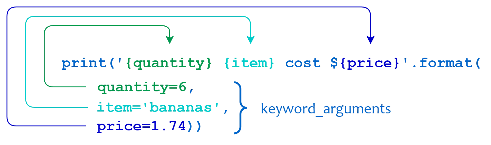
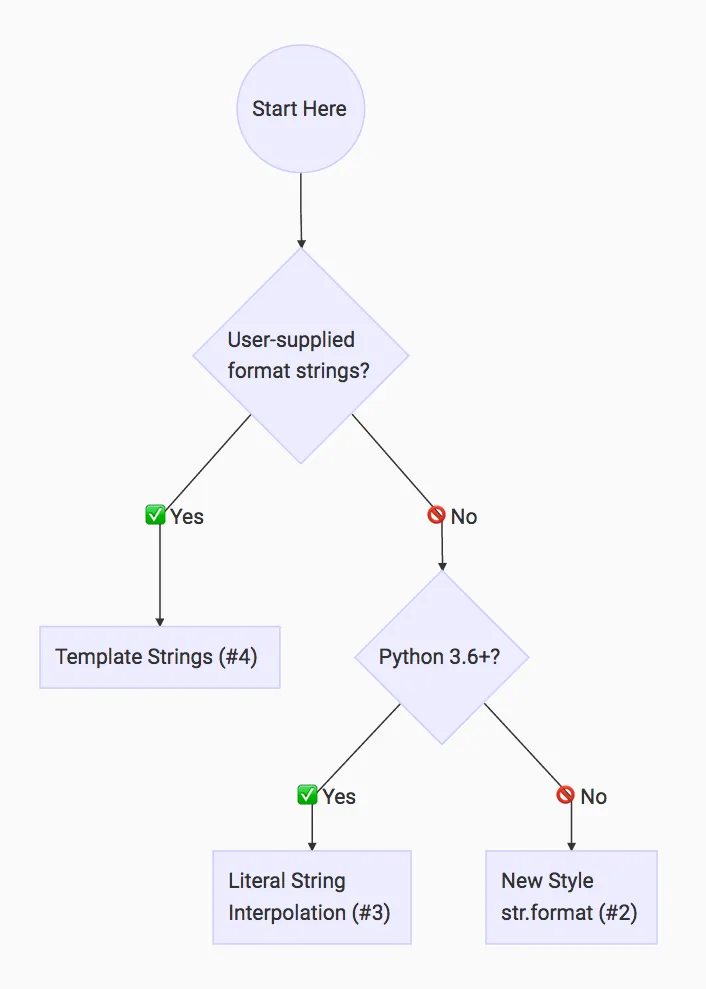

string formatting provides a more powerful way to embed non_strings within strings. string formattinguses a string's format methos to substitute a number of arguments in the string.

for example :

nums = [4,5,6]

ms="numbers : {0} {1} {2}".format(num[0], num[1] , num[2] )

```python
nums = [4,5,6]
msg = "numbers : {0} {1} {2} ".format(num[0],num[1],num[2])
print(msg)
output : numbers : 4 5 6
```

each argument of the format function is placed in the string at the corresponding position, which is determined using the curly braces {}.

string formatting can also be done with named arguments.

example :

```python
a="{x},{y}".format(x=,y=10)
print(a)
output : "5,10"
```

there is also a string formatting method with modulo %

```python
name = 'bob'
print('hello, %s' % name)
output : hello, bob
```

another string formatting method is string interpolation, This new way of formatting strings lets you use embedded Python expressions inside string constants. Here’s a simple example:

```python
name = 'bob'
print(f'hello, {})
output : hello, bob
```

another example for string interpolation

```python
a=5
b=10
print(f'five plus ten equal : {a+b} )
output : five plus ten equal : 15
```

the last string formatting technique is template strings, Here’s one more tool for string formatting in Python: template strings. It’s a simpler and less powerful mechanism, but in some cases this might be exactly what you’re looking for.

example :

```python
from string import template
# we should first import template class from string module which is in standard python library )
name = 'bob'
t= template('hey,$name')
t.subtitute(name=name
output : hey, bob
```

Perhaps surprisingly, there’s more than one way to handle string formatting in Python.

Each method has its individual pros and cons. Your use case will influence which method you should use.

maybe this image will help to use the appropriate python string formatting



string formatting is a great tool for pythonist and especially for data scientist, mastering it will help you to make cleaner and effective code.
