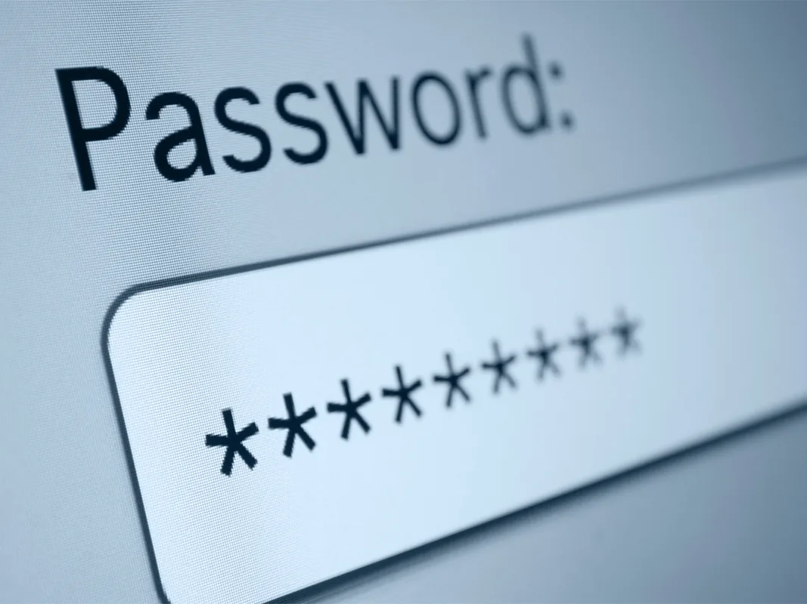
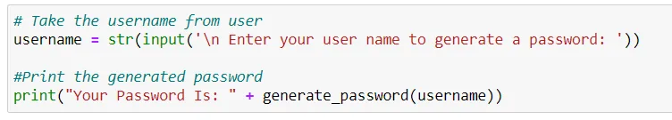
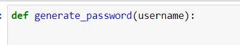
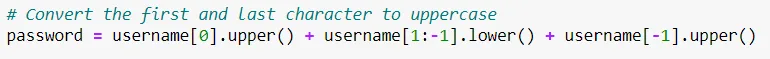
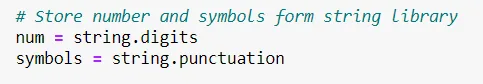
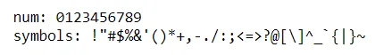
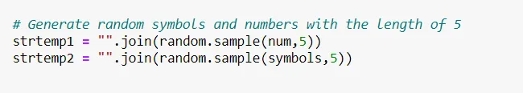
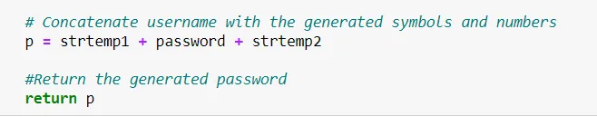
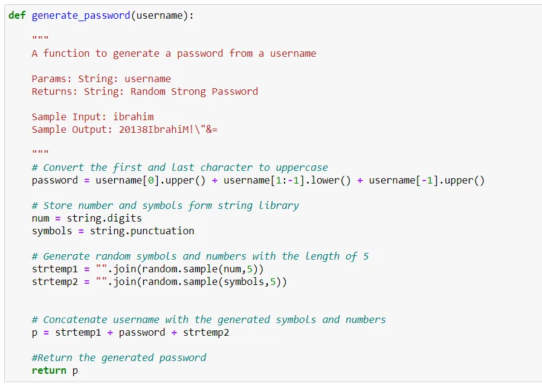
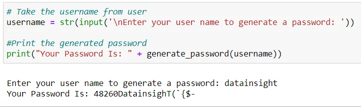

Your passwords grant access into your own personal kingdom, so you are probably thinking 'what are the best practices to create a strong password' to protect your accounts against these cybercriminals. If your passwords were part of a breach, you will want to change them immediately.

So, what's the solution? **Uncrackable passwords**.

You have to stay away from the obvious. Never use sequential numbers or letters, and for the love of all things cyber, do not use “*password”* as your password*.* Come up with unique passwords that do not include any personal info such as your name or date of birth. If you’re being specifically targeted for a password hack, the hacker will put everything they know about you in their guess attempts.

Passwords should contain three of the four character types:

1. Uppercase letters: A-Z
2. Lowercase letters: a-z
3. Numbers: 0-9
4. Symbols: ~`!@#$%^&\*()_-+={[}]|\:;"'<,>.?/

Let's code a function that generates a strong password from the username.

1- Import Libraries

```python
import random
import string
```

2- Take the username from the user



3- Let's define our function: generate_password(username)



4- Convert the first and last character of the username to uppercase so it contains uppercase and lowercase letters.



5- Store number and symbols form string library.



That's how these variables look like



6- Generate random numbers and symbols of 5 length



7- Concatenate the edited username with the random numbers and symbols and return the generated password



**That's it!**

Here is how our function should look like:



Let's test our function with new username: datainsight



**Congratulations on building your strong password generator with python!**

You can find the whole project on my [GitHub.](https://github.com/96ibman/datainsight_datascience_program/tree/main/password_generator)
