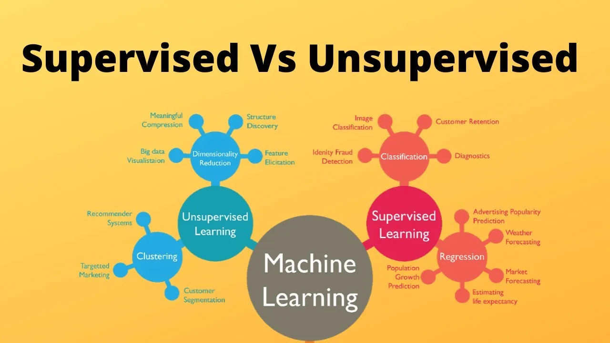
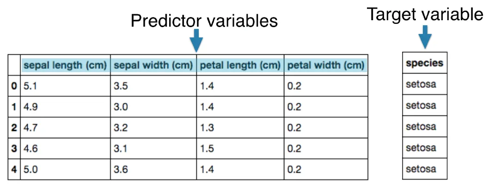
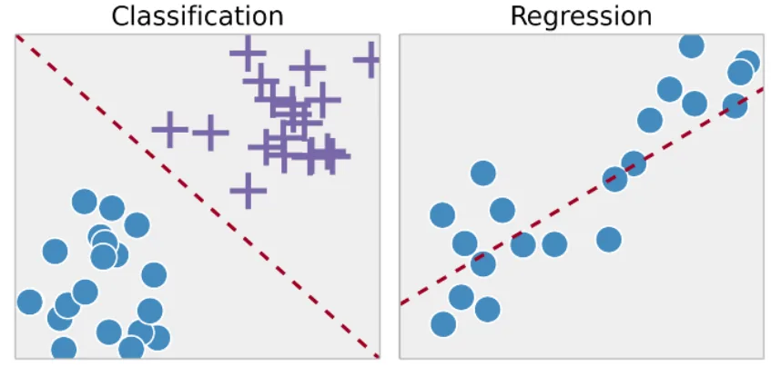
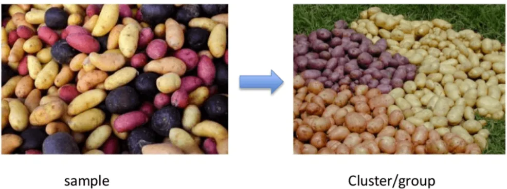

### **Supervised** Learning

Supervised Learning is a machine learning approach that’s defined by its use of labeled datasets. These datasets are designed to train or “supervise” algorithms into classifying data or predicting outcomes accurately. Using labeled inputs and outputs, the model can measure its accuracy and learn over time.

Supervised Learning consists of Predictor variables/features and a target variable

Aim: Predict the target variable, given the predictor variables

**Naming conventions**

Features = predictor variables = independent variables

Target variable = dependent variable = response variable

Supervised learning can be separated into two types of problems when data mining: classification and regression.

**1. Classification**

A classification problem is when the output variable is a category, such as “Red” or “blue” or “disease” and “no disease”. Supervised learning algorithms can be used to classify spam in a separate folder from your inbox. Linear classifiers, support vector machines, decision trees and random forest are all common types of classification algorithms.

**2. Regression**

A regression problem is when the output variable is a real value, such as “dollars” or “weight”.Regression models are helpful for predicting numerical values based on different data points, such as sales revenue projections for a given business. Some popular regression algorithms are linear regression, logistic regression and polynomial regression.

**Advantages:-**

1. Supervised learning allows collecting data and produces data output from previous experiences.

2. Supervised machine learning helps to solve various types of real-world computation problems.

**Disadvantages:-**

1. Classifying big data can be challenging.

2. Training for supervised learning needs a lot of computation time. So, it requires a lot of time.

### **Unsupervised** Learning

Unsupervised Learning uses machine learning algorithms to analyze and cluster unlabeled data sets. These algorithms discover hidden patterns in data without the need for human intervention (hence, they are “unsupervised”).

Unsupervised learning models are used for three main tasks: clustering, association and dimensionality reduction:

**1. Clustering** is a data mining technique for grouping unlabeled data based on their similarities or differences. For example, K-means clustering algorithms assign similar data points into groups, where the K value represents the size of the grouping and granularity. This technique is helpful for market segmentation, image compression, etc.

**2. Association** is another type of unsupervised learning method that uses different rules to find relationships between variables in a given dataset. These methods are frequently used for market basket analysis and recommendation engines, along the lines of “Customers Who Bought This Item Also Bought” recommendations.

**3. Dimensionality reduction** is a learning technique used when the number of features (or dimensions) in a given dataset is too high. It reduces the number of data inputs to a manageable size while also preserving data integrity. Often, this technique is used in the preprocessing data stage, such as when autoencoders remove noise from visual data to improve picture quality.

#### Supervised vs Unsupervised Learning

|  |  |  |
| --- | --- | --- |
| ​**Parameters** | **Supervised Learning** | ​ **Unsupervised Learning** |
| ​Input Data | ​Algorithms are trained using labeled data. | ​Algorithms are used against data that is not labeled |
| Computational Complexity | ​Simpler Method | Computational Complexity |
| ​Accuracy | ​Higher Accuracy | ​Less Accuracy |
