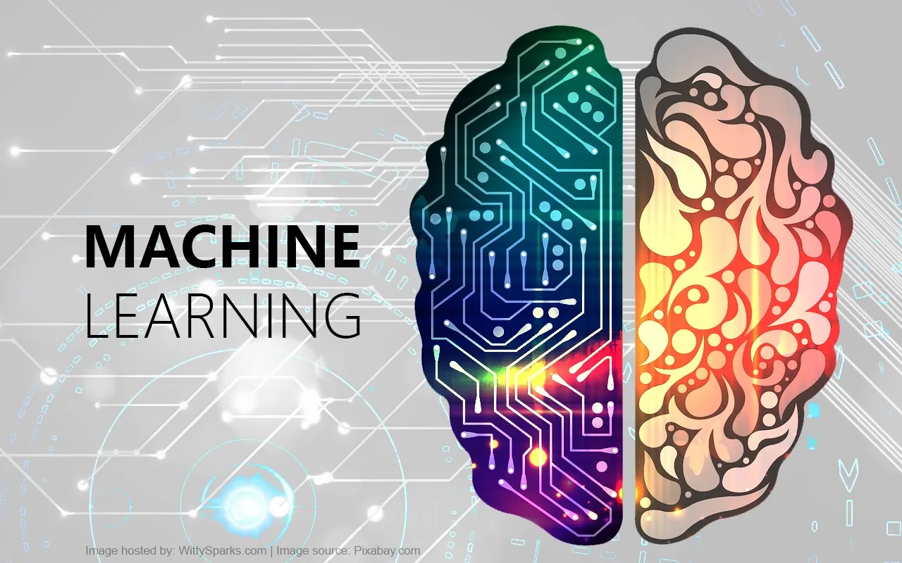
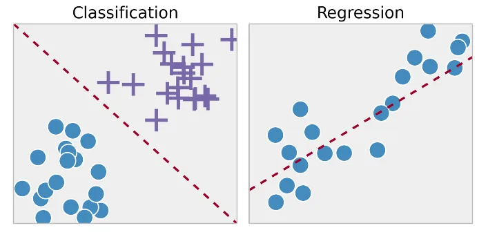
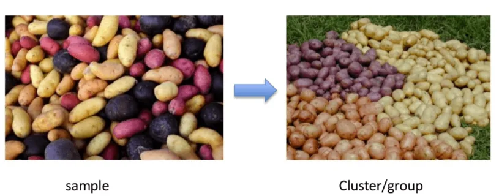

**Machine Learning**

Machine Learning is the branch of Artificial Intelligence (AI) which enables the system the ability to automatically enable human behaviour. Machine learning focuses on the development of computer programs that can access data and use it learn for themselves without having to be explicitly programmed.

There are two basic approaches, namely Supervised learning and unsupervised learning. The main difference is one uses labeled data to help predict outcomes, while the other does not. Let us look into it in detail below.

**What is label is Data Science?**

Label is simply the distinct features that separates our data.

For example, ff we are trying to predict the type of cats based on the information on that cat, then that is the label. If we are trying to predict if the cat is sick or healthy based on symptoms, then that is the label. If we are trying to predict the age age of the cat, then the age is the label.

**Labeled data:** Data that comes with a label.
**Unlabeled data:** Data that comes without a label.

**Supervised Learning**

The set of algorithms in which we use a labeled dataset is called *supervised learning*. These datasets are designed to train or “supervise” algorithms into classifying data or predicting outcomes accurately. Using labeled inputs and outputs, the model can measure its accuracy and learn over time.

A supervised learning model predicts the label of a new data point by using previous dataset.

There are two types of supervised learning models.

1. **Regression models**

These are the types of models that predicts a number, such as the weight of the animal. The output of a regression model is *continuous*, since the prediction can be any real value, picked from a continuous interval.

It uses an algorithm to understand the relationship between dependent and independent variables. Regression models are used for predicting numerical values based on different data points, such as sales revenue projections for a given business.

Regression technique predicts a single output value using training data.

2. **Classification models**

These are the types of models which predicts a **state**, such as the type of animal (cat or dog). the output of a classification model is *discrete*, since the prediction can be a value from a finite list.

In real world, supervised learning algorithms can be used to classify spam in a separate folder from your inbox.

**Unsupervised Learning**

Unsupervised learning deals with unlabelled data. It uses machine learning algorithms to analyse and cluster unlabeled data sets. These algorithms discover hidden patterns in data without the need for human intervention.

In Unsupervised learning there is no outcome to be predicted, and the algorithm just tries to find patterns in the data.

Unsupervised learning models uses clustering.

**Clustering** is used for grouping unlabeled data based on their similarities or differences.

For example, K-means clustering algorithms assign similar data points into groups, where the K value represents the size of the grouping and granularity.

In K-means clustering, we have to specify the number of clusters we want the data to be grouped into. The algorithm randomly assigns each observation to a cluster, and finds the centroid of each cluster. Then, the algorithm iterates through two steps: Reassign data points to the cluster whose centroid is closest. Then calculate new centroid of each cluster.

These two steps are repeated until the cluster variation cannot be reduced any further.

**Supervised Vs Unsupervised learning**

|  |  |
| --- | --- |
| Supervised Learning | Unsupervised Learning |
| It uses labeled Data | It used unlabeled Data |
| Input and output variables will be given. | only input data will be given |
| Support vector machine, Neural network, Linear and logistics regression, random forest, and Classification trees. | It can be divided into different categories like Cluster algorithms, K-means, Hierarchical clustering. |
| ​Supervised learning is a simpler method. | Unsupervised learning is computationally complex |
