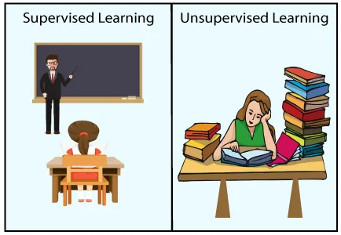

Supervised Learning

As the name implies, supervised learning involves the presence of a supervisor who also serves as an instructor. In a sense, supervised learning is when we instruct or train a machine using well-labeled data. This signifies that some information has already been labeled with the correct answer. The machine is then given a new collection of examples (data) to analyze the training data (set of training examples) and produce a proper result from labeled data using the supervised learning method.

Consider the following scenario: you are given a basket containing various fruits. The first step now is to teach the machine all of the different fruits one by one, as follows:

If the shape of the object is rounded and has a depression at the top, is red in color, then it will be labeled as – Apple.
If the shape of the object is a long curving cylinder having Green-Yellow color, then it will be labeled as – Banana.

Now suppose after training the data, you have given a new separate fruit, say Banana from the basket, and asked to identify it.

Because the system has already learned from past data, it must use it intelligently this time. It will classify the fruit based on its shape and color, then confirm its name as BANANA and place it in the Banana category. As a result, the machine learns from training data (a fruit basket) and then applies what it has learned to test data (new fruit).
There are two types of algorithms for supervised learning:

Classification: A classification problem is when the output variable is a category, such as “Red” or “blue” or “disease” and “no disease”.
Regression: A regression problem is when the output variable is a real value, such as “dollars” or “weight”.

Supervised learning deals with or learns with “labeled” data. This implies that some data is already tagged with the correct answer.

Types:- Regression Logistic Regression Classification Naive Bayes Classifiers K-NN (k nearest neighbors) Decision Trees Support Vector Machine

Advantages: Supervised learning enables for the collection of data and the output of data from prior experiences. With the help of experience, it is possible to optimize performance criteria. Supervised machine learning aids in the resolution of a variety of real-world computation issues.

Disadvantages: Classifying large amounts of data might be difficult. Computation time is required for supervised learning training. As a result, it takes a long time.

Example : Nearest Centroid classifier

The Nearest Centroid classifier is a simple algorithm that represents each class by the centroid of its members. In effect, this makes it similar to the label updating phase of the KMeans algorithm. It also has no parameters to choose, making it a good baseline classifier. It does, however, suffer on non-convex classes, as well as when classes have drastically different variances, as equal variance in all dimensions is assumed. See Linear Discriminant Analysis (LinearDiscriminantAnalysis) and Quadratic Discriminant Analysis (QuadraticDiscriminantAnalysis) for more complex methods that do not make this assumption. Usage of the default NearestCentroid is simple:

```python
from sklearn.neighbors import NearestCentroid
import numpy as np
X = np.array([[-1, -1], [-2, -1], [-3, -2], [1, 1], [2, 1], [3, 2]])
y = np.array([1, 1, 1, 2, 2, 2])
clf = NearestCentroid()
clf.fit(X, y)
NearestCentroid()
print(clf.predict([[-0.8, -1]]))
```

The NearestCentroid classifier has a shrink_threshold parameter, which implements the nearest shrunken centroid classifier. In effect, the value of each feature for each centroid is divided by the within-class variance of that feature. The feature values are then reduced by shrink_threshold. Most notably, if a particular feature value crosses zero, it is set to zero. In effect, this removes the feature from affecting the classification. This is useful, for example, for removing noisy features.

UnSupervised Learning

Unsupervised learning is the process of training a machine with data that hasn't been classed or labeled, and then letting the algorithm to act on that data without supervision. The machine's job here is to sort unsorted data into groups based on similarities, patterns, and differences without any prior data training.
Unlike supervised learning, there is no teacher present, which implies the computer will not be trained. As a result, the machine is limited in its ability to discover hidden structure in unlabeled data on its own. Assume it is shown an image with both dogs and cats that it has never seen before.

As a result, the machine has no understanding of the characteristics of dogs and cats, and we are unable to classify it as such. However, it can classify them based on their similarities, patterns, and differences, allowing us to simply divide the above image into two sections. The first section may have all photos with dogs, while the second part may contain all photos with cats. You haven't learned anything yet, thus there isn't any training data or examples.
It enables the model to identify patterns and information that were previously undetectable on its own. It is mostly concerned with unlabeled data.

There are two types of algorithms for unsupervised learning:
Clustering: A clustering problem is one in which you wish to find the data's underlying groupings, such as classifying customers based on their purchasing habits.
Association: An association rule learning problem is where you want to discover rules that describe large portions of your data, such as people that buy X also tend to buy Y.

Types of Unsupervised Learning:-
Clustering Exclusive (partitioning) Agglomerative Overlapping Probabilistic
Clustering Types:- Hierarchical clustering K-means clustering Principal Component Analysis Singular Value Decomposition Independent Component Analysis

Example : Nearest Neighbors

Nearest Neighbors implements unsupervised nearest neighbors learning. It acts as a uniform interface to three different nearest neighbors algorithms: BallTree, KDTree, and a brute-force algorithm based on routines in sklearn.metrics.pairwise. The choice of neighbors search algorithm is controlled through the keyword 'algorithm', which must be one of ['auto', 'ball_tree', 'kd_tree', 'brute']. When the default value 'auto' is passed, the algorithm attempts to determine the best approach from the training data. For a discussion of the strengths and weaknesses of each option

Finding the Nearest Neighbors

For the simple task of finding the nearest neighbors between two sets of data, the unsupervised algorithms within sklearn.neighbors can be used:

```python
from sklearn.neighbors import NearestNeighbors
import numpy as np
X = np.array([[-1, -1], [-2, -1], [-3, -2], [1, 1], [2, 1], [3, 2]])
nbrs = NearestNeighbors(n_neighbors=2, algorithm='ball_tree').fit(X)
distances, indices = nbrs.kneighbors(X)
```

Because the query set matches the training set, the nearest neighbor of each point is the point itself, at a distance of zero.

It is also possible to efficiently produce a sparse graph showing the connections between neighboring points:

```python
nbrs.kneighbors_graph(X).toarray()
```

KDTree and BallTree Classes

Alternatively, one can use the KDTree or BallTree classes directly to find nearest neighbors. This is the functionality wrapped by the NearestNeighbors class used above. The Ball Tree and KD Tree have the same interface; an example of using the KD Tree here:

```python
from sklearn.neighbors import KDTree
import numpy as np
X = np.array([[-1, -1], [-2, -1], [-3, -2], [1, 1], [2, 1], [3, 2]])
kdt = KDTree(X, leaf_size=30, metric='euclidean')
kdt.query(X, k=2, return_distance=False)
```
