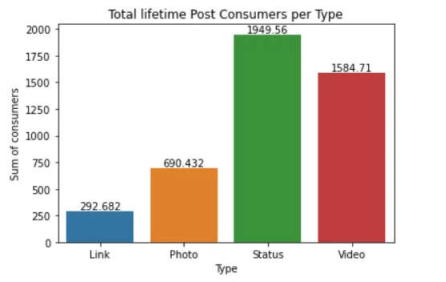
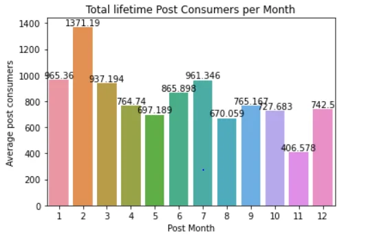
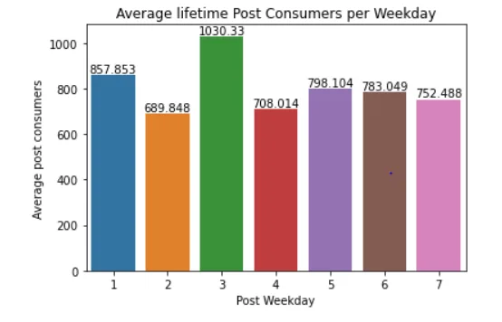
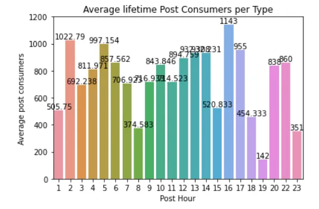
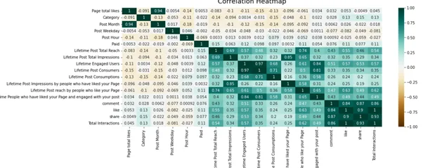
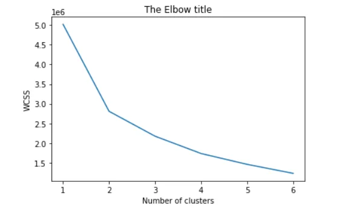

Machine learning is a method of data analysis that automates analytical model building. It is a branch of [artificial intelligence](https://www.sas.com/en_za/insights/analytics/what-is-artificial-intelligence.html) based on the idea that systems can learn from data, identify patterns and make decisions with minimal human intervention. Machine learning uses robust models to solve simple as well complex problems. This article gives a gentle introduction on how some of the machine learning models work.

There are generally 3 classes of machine learning methods which are supervised, unsupervised and reinforcement learning models. Supervised learning model predict an outcome, whose variable is known and recorded. The model learns the relationship that lies between the target variable and the independent variables. The unsupervised model learn on their own the complex relationships and bundles up the datasets into groups called clusters. These clusters are then intuitively given names or labels in better understanding the grouped variables.

To be able to execute these sophisticated models we need to use libraries.

These libraries if not installed can be loaded. For example, seaborn, a package for plotting graphs can installed by the following command:

```python
Pip install seaborn
```

This you can do for the following libraries

```python
import pandas as pd
import seaborn as sn
import numpy as np
import matplotlib.pyplot as plt
from sklearn.linear_model import LinearRegression
from sklearn.model_selection import train_test_split
from sklearn.metrics import mean_squared_error
from sklearn.metrics import mean_absolute_percentage_error
from sklearn.model_selection import cross_val_score
from sklearn.linear_model import Ridge
from sklearn.linear_model import Lasso
from sklearn.pipeline import Pipeline
from sklearn.impute import SimpleImputer
```

We will test the Linear Regression model, the Ridge regression and the Lasso model in modelling the Facebook Metric data set. Moro et al. (2016) wrote a paper on this dataset where they employed state of the art models. It includes 7 features known prior to post publication and 12 features for evaluating post impact (see Tables 2 and 3 from Moro et al., 2016 - complete reference in the 'Citation Request').

Moro et al argued that a system that can predict the impact of individual published posts can provide a valuable advantage when deciding to communicate through social media, tailoring the promotion of products and services. Therefore, advertising managers could make judged decisions on the receptiveness of the posts published, thus aligning strategies toward optimizing the impact of posts, benefiting from the predictions made.

We load the data as follows:

```python
facebook_data = pd.read_csv('https://raw.githubusercontent.com/JazzKriss21/Facebook-Metrics-Data-Analysis/main/dataset_Facebook.csv',  sep=';')
```

Before doing any analysis we first look at the Exploratory data analysis:

```python
df = facebook_data.groupby(['Type']).agg(Sum = ('Lifetime Post Consumers', 'mean'))
df = df.reset_index()
ax = sn.barplot(x="Type",
           y= "Sum",
           data= df)
ax.bar_label(ax.containers[0])
ax.set_title('Total lifetime Post Consumers per Type')
ax.set_ylabel('Sum of consumers')
ax.set_xlabel('Type')
```



We observe that on average, Status type of posts receive most likes, whereas links and photos have the least likes.

```python
# Post Month
df = facebook_data.groupby(['Post Month']).agg(Sum = ('Lifetime Post Consumers', 'mean'))
df = df.reset_index()
ax = sn.barplot(x="Post Month",
           y= "Sum",
           data= df)
ax.bar_label(ax.containers[0])
ax.set_title('Total lifetime Post Consumers per Month')
ax.set_ylabel('Average post consumers')
ax.set_xlabel('Post Month')
```



Another important dimension to look at, is that on average if one posts in the beginning of the month or mid year his/her posts have the highest lifetime consumers.

```python
# Post Weekday
df = facebook_data.groupby(['Post Weekday']).agg(Sum = ('Lifetime Post Consumers', 'mean'))
df = df.reset_index()
ax = sn.barplot(x="Post Weekday",
           y= "Sum",
           data= df)
ax.bar_label(ax.containers[0])
ax.set_title('Average lifetime Post Consumers per Weekday')
ax.set_ylabel('Average post consumers')
ax.set_xlabel('Post Weekday')
```



We can also observe that the first and third days of the week receive most lifetime consumers.

```python
# Post Hour
df = facebook_data.groupby(['Post Hour']).agg(Sum = ('Lifetime Post Consumers', 'mean'))
df = df.reset_index()
ax = sn.barplot(x="Post Hour",
           y= "Sum",
           data= df)
ax.bar_label(ax.containers[0])
ax.set_title('Average lifetime Post Consumers per Type')
ax.set_ylabel('Average post consumers')
ax.set_xlabel('Post Hour')
```



And lastly posting early morning or late afternoon increases the chances of getting post consumers on average. Such analysis shows with just a glimpse of when one should post to get the highest engagement.

Lastly the regression model assumptions is vulnerable to multicollinearity. To assess this we can plot a correlation heat map.

```python
# Heat Map
plt.figure(figsize=(16, 6))
heatmap = sn.heatmap(facebook_data.corr(), vmin=-1, vmax=1, annot=True, cmap='BrBG')
heatmap.set_title('Correlation Heatmap', fontdict={'fontsize':18}, pad=12);
```



Since the Independent variables (Page likes:Paid) variables show very low correlations, we can safely say there is no multicollinearity. The other variables are predicted separately. However, for this exercise we will look at just one of the target variables.

```python
# Splitting the data
X= facebook_data[['Page total likes', 'Category', 'Post Month', 'Post Weekday', 'Post Hour', 'Paid']]
y= facebook_data['Lifetime Post Total Reach']
X_train, X_test, y_train, y_test = train_test_split(X, y, test_size= 0.2, random_state=263)
```

We select our independent variables and y variable. We go a step further in splitting the data frame so that we evaluate how good the model is. Observe that we are using 80% of the data train and the 20% will be used to test the model. We also add the random_state (seed) so to have reproducibility of our results.

```python
facebook_data.isnull().sum(axis = 0)
```

Observe that we have missing values. We have basically, 2 options, that of removing and of covering the hole using the mean/mode/median. Removing points results to few data points to be used in the analysis. We will use the mead to impute.

We will include the imputer in a pipeline as well as the 3 models earlier given. We will run the model and use the mean absoluter percentage error as a metric to assist us determining the best model

```python
imputer = SimpleImputer(missing_values=np.nan, strategy='mean')
lin_model = LinearRegression()
ridge_model = Ridge()
lasso_model= Lasso()

steps = [('imputation', imputer),
         ('Linear Regression', lin_model)]

pipeline = Pipeline(steps)
pipeline.fit(X_train, y_train)
#y_pred= pipeline.predict(y_test)
pipeline.score(X_test, y_test)

y_pred_lin = pipeline.predict(X_test)
#mean_squared_error(y_test, y_pred),
mape_lin = mean_absolute_percentage_error(y_test, y_pred_lin)
print('Mean Absolute Percantage Error for the Linear Regression Model is {}'.format(mape_lin))

# Ridge Regression
steps_r = [('imputation', imputer),
         ('Ridge Regression', ridge_model)]

pipeline_r = Pipeline(steps_r)
pipeline_r = pipeline_r.fit(X_train, y_train)
#y_pred= pipeline.predict(y_test)
#pipeline_r.score(X_test, y_test)

y_pred_ridge = pipeline_r.predict(X_test)
mape_ridge = mean_absolute_percentage_error(y_test, y_pred_ridge)
print('Mean Absolute Percantage Error for the Linear Regression Model is {}'.format(mape_ridge))

# Lasso Rregression
steps_l = [('imputation', imputer),
         ('Lasso Regression', lasso_model)]

pipeline_l = Pipeline(steps_l)
pipeline_l = pipeline_l.fit(X_train, y_train)
#y_pred= pipeline.predict(y_test)
#pipeline_l.score(X_test, y_test)

y_pred_lasso = pipeline_l.predict(X_test)
mape_lasso = mean_absolute_percentage_error(y_test, y_pred_lasso)
print('Mean Absolute Percantage Error for the Linear Regression Model is {}'.format(mape_lasso))
```

The following results are given

Mean Absolute Percantage Error for the Linear Regression Model is 3.49089999139159

Mean Absolute Percantage Error for the Linear Regression Model is 3.4898795854012117

Mean Absolute Percantage Error for the Linear Regression Model is 3.49075443510284

Indeed, the Ridge regression gives the lowest MAPE, therefore we select it as the best model. If data is sufficiently large, we can split data into train, validation and test sets. Then we can then use the best that would have performed best in the 2 sets and predict the test set. We can also make use of the cross validation to adequately choose the right model.

The Unsupervised models as earlier mentioned try to bunch up variables, bundle up data points into sets or groups called clusters. Let us employ the most used clustering model that is, the KMeans model. We use the Absentism dataset a machine learning data set that can be found online. The data set allows for several new combinations of attributes and attribute exclusions, or the modification of the attribute type (categorical, integer, or real) depending on the purpose of the research.The data set (Absenteeism at work - Part I) was used in academic research at the Universidade Nove de Julho - Postgraduate Program in Informatics and Knowledge Management.

Let us drop the employeed ID as this is not necessary

```python
# Dropping ID
absent_data = absent_data.drop('ID', axis=1)
```

We use the following code. If you observe, we scale the data as one or two variables have high scores whilst some have small scores

```python
from sklearn.cluster import KMeans
from sklearn.preprocessing import StandardScaler

scaler = StandardScaler()
scaled_data = scaler.fit_transform(absent_data)

wcss=[]
for i in range(1,7):
    kmeans = KMeans(i)
   kmeans.fit(absent_data)
    wcss_iter = kmeans.inertia_
   wcss.append(wcss_iter)

number_clusters = range(1,7)
plt.plot(number_clusters,wcss)
plt.title('The Elbow title')
plt.xlabel('Number of clusters')
plt.ylabel('WCSS')
```



We observe that 4 clusters are the optimal clusters

We therefore rerun with the optimal number of clusters in mind

```python
kmeans = KMeans(
   init="random",
    n_clusters=4,
    n_init=10,
    max_iter=200,
    random_state=263)

kmeans.fit(scaled_data)
kmeans.inertia_
```

This short gentle introduction sought to give an insight on how these models work. Should you face any challenge, feel free to ask and I will give the assistance.

Github link for the code is [here](https://github.com/Matshisela/Supervised-and-Unsupervised-ML-Models)
