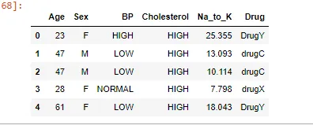
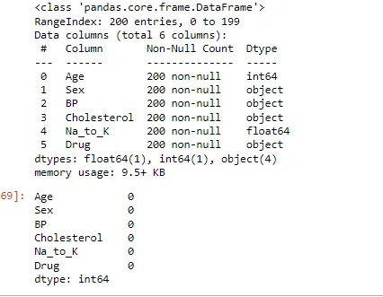
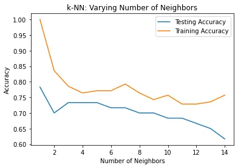

Machine learning is the science and art of giving computers the ability to learn to make decisions from data without being explicitly programmed. It is a research field at the intersection of statistics, artificial intelligence, and computer science and is also known as predictive analytics or statistical learning. Machining learning methods in recent years have been integrated into our everyday life. From automatic recommendations of which movies to watch on Netflix, what foods to order, or products to purchase on platforms like Amazon and analyzing DNA sequences, and providing personalized cancer treatments. Machining learning that learns from known inputs and output pairs is called supervised learning. When there are labels present, we call it supervised learning. When there are no labels present, we call it unsupervised learning.

There are two types of supervised learning problems called classification and regression. In this article, we will be discussing the supervised classification learning algorithm K- Nearest Neighbors. We build a machine learning model from these input/output pairs, which comprise our training set. Our goal is to make accurate predictions for new, never-before-seen data.

**K-Nearest Neighbors (KNN)**

KNN is a lazy learner. It is called lazy not because of its apparent simplicity, but because it doesn't learn a discriminative function from the training data but memorizes the training dataset instead. To predict a new data point, the algorithm finds the closest data points in the training dataset its “nearest neighbors.” In its simplest version, the k-NN algorithm only considers exactly one nearest neighbor, which is the closest training data point to the point we want to predict.

By executing the following code, we will now implement a KNN model in scikit-learn using the [drug classification](https://www.kaggle.com/prathamtripathi/drug-classification/download) dataset on Kaggle.

Firstly, we import the necessary libraries

```python
import pandas as pd
import seaborn as sns
import matplotlib.pyplot as plt
from sklearn.model_selection import  train_test_split
from sklearn.neighbors import KNeighborsClassifier
import numpy as np
```

We read the data and load the first few rows

```python
#load data
drugs_df = pd.read_csv('drug200.csv')
print(drugs_df.head())
```

Output: The data set contains various information that affects the predictions like Age, Sex, BP, Cholesterol levels, Na to Potassium Ratio, and finally the drug type.



We perform EDA to determine whether there are missing values or not.

```python
# check for missing values
drugs_df.info()
drugs_df.isnull().sum()
```

The output shows there are no missing values in the dataset.



Then, now it is ready to prepare our data set. We need to split the data into X and y. X is the features data and y is the output data. we will split the into train and test sets using the train-test-split model from the scikit-learn model selection library. We initialize the KNeighborsClassifier to object knn and assign the closest data points in the training dataset parameter (n_neighbors) to 4.

```python
X=drugs_df.drop('Drug',axis=1).values
y=drugs_df['Drug'].values
X_train,X_test,y_train,y_test=train_test_split(X,y,random_state=15,test_size=0.3,stratify=y)
knn=KNeighborsClassifier(n_neighbors=4)
```

We then fit the training data to knn

```python
knn.fit(X_train,y_train)
```

To check out the accuracy of our model, we use the score method of the model and pass it X test and y test. K-nearest neighbors model is approximately 62%, which is above average for an out-of-the-box model.

```python
knn.score(X_test,y_test)
```

output:

```python
0.6166666666666667
```

Note that, as the value of the n_neighbors (K) increases, the decision boundary gets smoother and less curvy. Therefore, we consider it to be a less complex model than those with a lower K. Generally, complex models run the risk of being sensitive to noise in the specific data that you have, rather than reflecting general trends in the data. This is known as overfitting. If you increase K even more and make the model even simpler, then the model will perform less well on both test and training sets, this is called underfitting. By observing how the accuracy scores differ for the training and testing sets with different values of K, We will develop a for loop over a range of K values. Compute accuracy scores the training set and test set separately using the .score() method and assign the results to the train_accuracy and test_accuracy arrays respectively. Then we plot the test and training accuracy according to the k values.

```python
neighbors = np.arange(1, 15)
train_accuracy = np.empty(len(neighbors))
test_accuracy = np.empty(len(neighbors))
for i, k in enumerate(neighbors):
    knn = KNeighborsClassifier(n_neighbors=k)
    knn.fit(X_train,y_train)
    train_accuracy[i] = knn.score(X_train, y_train)
    test_accuracy[i] = knn.score(X_test, y_test)
plt.title('k-NN: Varying Number of Neighbors')
plt.plot(neighbors, test_accuracy, label = 'Testing Accuracy')
plt.plot(neighbors, train_accuracy, label = 'Training Accuracy')
plt.legend()
plt.xlabel('Number of Neighbors')
plt.ylabel('Accuracy')
plt.show()
```

Output:



It looks like the test accuracy using between 1 and 2 neighbors seems to result in overfitting. Using 6 neighbors or more seems to result in a simple model that underfits the data. Using the neighbors from 3 to 5 results seems to be the best fit for our model.

References:

## [Supervised Learning with scikit-learn](https://campus.datacamp.com/courses/supervised-learning-with-scikit-learn)

Introduction to Machine Learning with Python A Guide for Data Scientists by Andreas C. Müller and Sarah Guido.

Code can be found in my Github [Repository](https://github.com/Storerun/knn_classification/blob/main/supervised_learning_classification.ipynb)
