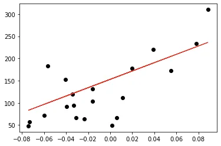

The world is getting “smarter” every day, and to keep up with consumer expectations, companies are increasingly using machine learning algorithms to make things easier. Machine Learning is the science of making computers learn and act like humans by feeding data and information without being explicitly programmed.

In machine learning, there are two basic approaches:

1. Supervised Learning
2. Unsupervised Learning

In this article we will be forced on what‘s supervised learning and how to build classification and regression models using Python librarie.

## What's Supervised Learning?
Supervised Learning is a machine learning approach that’s defined by its use of labeled datasets. These datasets are designed to train or “supervise” algorithms into classifying data or predicting outcomes accurately. Using labeled inputs and outputs, the model can measure its accuracy and learn over time.

Based on the given data sets, the machine learning problem is categorized into two types:

- **Classification**

Classification is used when the output variable is categorical i.e. with 2 or more classes. For example, yes or no, male or female, true or false, etc.

There are several classification techniques that one can choose based on the type of dataset they're dealing with. Below is a list of a few widely used traditional classification techniques:

1. K — nearest neighbor
2. Decision trees
3. Naïve Bayes
4. Support vector machines

The first step in applying any machine learning algorithm is to understand and explore the given dataset. In next example, we'll use the Iris dataset imported from the scikit-learn package.

Now let’s import essential libraries :

```python
from sklearn import datasets
import pandas as pd
import matplotlib.pyplot as plt
```

Then, load IRIS dataset and explore it :

```python
# Loading IRIS dataset from scikit-learn object into iris variable.
iris = datasets.load_iris()

# Prints the type/type object of iris
print(type(iris))
# <class 'sklearn.datasets.base.Bunch'>

# prints the dictionary keys of iris data
print(iris.keys())

# prints the type/type object of given attributes
print(type(iris.data), type(iris.target))

# prints the no of rows and columns in the dataset
print(iris.data.shape)

# prints the target set of the data
print(iris.target_names)

# Load iris training dataset
X = iris.data

# Load iris target set
Y = iris.target

# Convert datasets' type into dataframe
df = pd.DataFrame(X, columns=iris.feature_names)

# Print the first five tuples of dataframe.
print(df.head())
```

Output:

```python
<class 'sklearn.utils.Bunch'>
dict_keys(['data', 'target', 'frame', 'target_names', 'DESCR', 'feature_names', 'filename', 'data_module'])
<class 'numpy.ndarray'> <class 'numpy.ndarray'>
(150, 4)
['setosa' 'versicolor' 'virginica']
   sepal length (cm)  sepal width (cm)  petal length (cm)  petal width (cm)
0                5.1               3.5                1.4               0.2
1                4.9               3.0                1.4               0.2
2                4.7               3.2                1.3               0.2
3                4.6               3.1                1.5               0.2
4                5.0               3.6                1.4               0.2
<class 'sklearn.utils.Bunch'>
dict_keys(['data', 'target', 'frame', 'target_names', 'DESCR', 'feature_names', 'filename', 'data_module'])
<class 'numpy.ndarray'> <class 'numpy.ndarray'>
(150, 4)
['setosa' 'versicolor' 'virginica']
   sepal length (cm)  sepal width (cm)  petal length (cm)  petal width (cm)
0                5.1               3.5                1.4               0.2
1                4.9               3.0                1.4               0.2
2                4.7               3.2                1.3               0.2
3                4.6               3.1                1.5               0.2
4                5.0               3.6                1.4               0.2
```

The next step building our model and we will use (K-NN classifier ):

```python
from sklearn import datasets
from sklearn.neighbors import KNeighborsClassifier

# Load iris dataset from sklearn
iris = datasets.load_iris()

# Declare an of the KNN classifier class with the value with neighbors.
knn = KNeighborsClassifier(n_neighbors=6)

# Fit the model with training data and target values
knn.fit(iris['data'], iris['target'])

# Provide data whose class labels are to be predicted
X = [
    [5.9, 1.0, 5.1, 1.8],
    [3.4, 2.0, 1.1, 4.8],
]

# Prints the data provided
print(X)

# Store predicted class labels of X
prediction = knn.predict(X)

# Prints the predicted class labels of X
print(prediction)
```

Output:

```python
[[5.9, 1.0, 5.1, 1.8], [3.4, 2.0, 1.1, 4.8]]
[1 1]
```

Based on the given input, the machine predicted the both flowers are versicolor using k-NN.

- **Regression**

Regression is used when the output variable is a real or continuous value. In this case, there is a relationship between two or more variables i.e., a change in one variable is associated with a change in the other variable. For example, salary based on work experience or weight based on height, etc.

Some of the commonly used regression models are:

1. Linear regression
2. Logistic regression
3. Polynomial regression

**Linear regression** establishes a relationship between dependent variable (*Y*) and one or more independent variables (*X*) using a best fit straight line (also known as regression line).

Now we will apply a linear regression method to fit the training data and then predict the output using the test dataset.

```python
from sklearn import datasets, linear_model
import matplotlib.pyplot as plt
import numpy as np

# Load the diabetes dataset
diabetes = datasets.load_diabetes()

# Use only one feature for training
diabetes_X = diabetes.data[:, np.newaxis, 2]

# Split the data into training/testing sets
diabetes_X_train = diabetes_X[:-20]
diabetes_X_test = diabetes_X[-20:]

# Split the targets into training/testing sets
diabetes_y_train = diabetes.target[:-20]
diabetes_y_test = diabetes.target[-20:]

# Create linear regression object
regr = linear_model.LinearRegression()

# Train the model using the training sets
regr.fit(diabetes_X_train, diabetes_y_train)

# Input data
print('Input Values')
print(diabetes_X_test)

# Make predictions using the testing set
diabetes_y_pred = regr.predict(diabetes_X_test)

# Predicted Data
print("Predicted Output Values")
print(diabetes_y_pred)

# Plot outputs
plt.scatter(diabetes_X_test, diabetes_y_test, color='black')
plt.plot(diabetes_X_test, diabetes_y_pred, color='red', linewidth=1)

plt.show()
```

Output:

Input Values

[[ 0.07786339]

[-0.03961813]

[ 0.01103904]

[-0.04069594]

[-0.03422907]

[ 0.00564998]

[ 0.08864151]

[-0.03315126]

[-0.05686312]

[-0.03099563]

[ 0.05522933]

[-0.06009656]

[ 0.00133873]

[-0.02345095]

[-0.07410811]

[ 0.01966154]

[-0.01590626]

[-0.01590626]

[ 0.03906215]

[-0.0730303 ]]

Predicted Output Values

[225.9732401 115.74763374 163.27610621 114.73638965 120.80385422

158.21988574 236.08568105 121.81509832 99.56772822 123.83758651

204.73711411 96.53399594 154.17490936 130.91629517 83.3878227

171.36605897 137.99500384 137.99500384 189.56845268 84.3990668 ]



References:

1. <https://www.simplilearn.com/tutorials/machine-learning-tutorial/supervised-and-unsupervised-learning>
2. <https://builtin.com/data-science/supervised-learning-python>
3. <https://www.ibm.com/cloud/blog/supervised-vs-unsupervised-learning>
4. code source : [https://github.com/tahanijaber/Suervised-learning-](https://github.com/tahanijaber/Suervised-learning-/blob/main/README.md)
