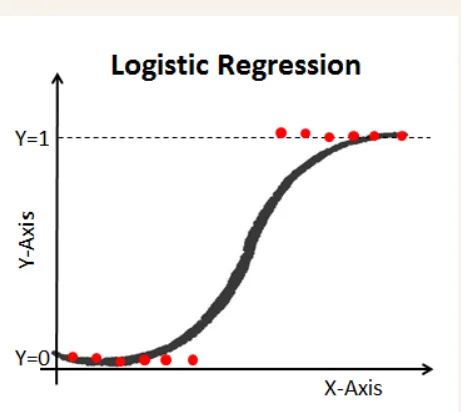
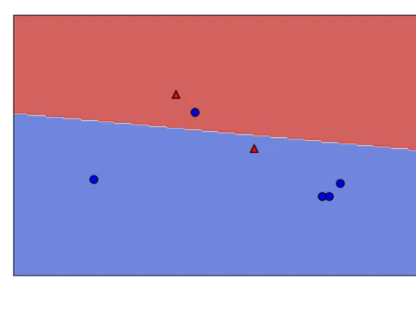
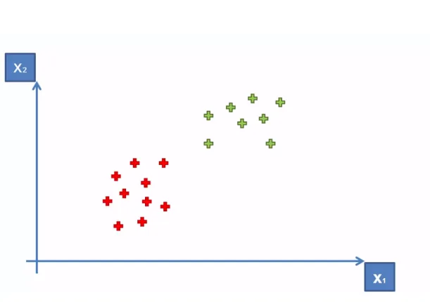
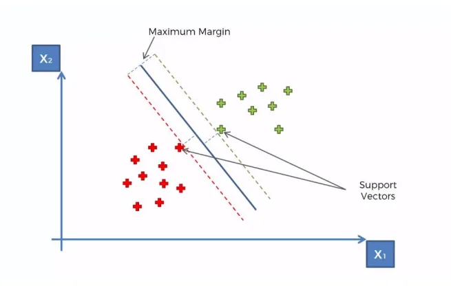
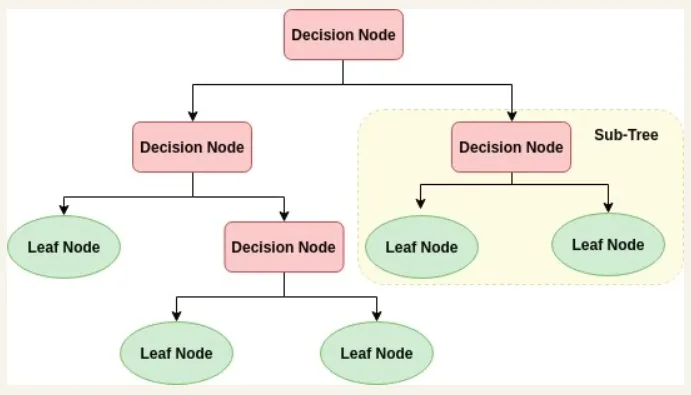
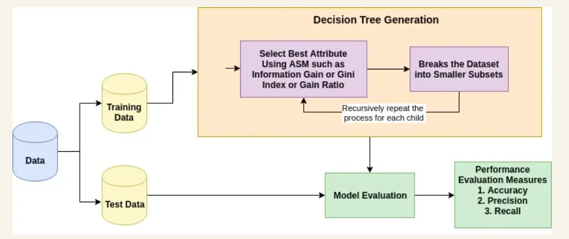
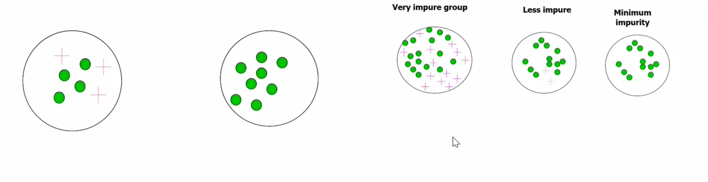
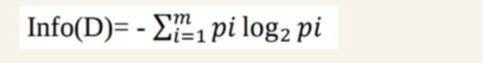

Logistic regression

Classification Techniques are an important part of machine learning and logistic regression is the most used part.it used in many problems such spam detection and Diabetes prediction.

we use it in multi class classification such as (benign or malignant )

In logistic we have discrete classification and we use segmoid function in linear equation:

𝑦=𝛽0+𝛽1𝑋1+𝛽2𝑋2+.....+𝛽𝑛𝑋𝑛 (1)

In logistic we have discrete classification and we use segmoid function in linear equation 𝑝=1/1+𝑒−𝑦(2)

if we substitute in (1) by (2)

𝑝 = 1/1+𝑒−(𝛽0+𝛽1𝑋1+𝛽2𝑋2+.....+𝛽𝑛𝑋𝑛)

in the image below we have two classes one greater than o.5 and one from 0 to 0.5 so logistic regression represent values in binary form from 0 to one

## Segmoid function:

Also called logistic function which represent values in 0 and one

its format is

𝑝=1/1+𝑒−x (3)

### Loss function:

we use it to reduce the error of the predictions and the other true values

in the image below there exist 2 errors of classification one for red rectangle and one for blue circle

### Regularization: we use it to avoid overfitting the data

### which mean our model go through every point in the train due to more features in the data

### so the solution of this is to reduce the number of parameters of the data For example, a simple way to regularize a polynomial model is to reduce the number of polynomial degrees.

### Regularization algorithms :ridge,lasso and Elastic Net

SVM: support vector machine

we want to separate this tow groups which hyperplane is the best ?

a hyperplane is a line that optimally divides the data points into two different classes

so svm is a discriminative algorithms that try to find the best or the optimal hyperplane.

support vector is the most supported point in the data to the decision

### Decision Tree:

decision tree is like the flowchart which internal node is the feature and branch represent decision or condition and each leaf is the output

we Select the best attribute using Attribute Selection Measures(ASM) to split the records.

we split attribute to small nodes and so on until one condition is meet

1- All the tuples belong to the same attribute value.

2-There are no more remaining attributes.

3-There are no more instances.

As we see we split our data to two groups train and test and work with train by select best attribute using Gain or gain index

information gain: which measures the impurity of the input set .if we have group of data not unique meaning that group have different types of data(apple,orange,pens ) the impurity of this group would be high

we measure impurity by Entropy and if the entropy is small this group of data is pure if Entropy = 0 it mean that it have only one group

pi=> probability of class i

Resourses:

1: https://www.datacamp.com/tutorial/understanding-logistic-regression-python
