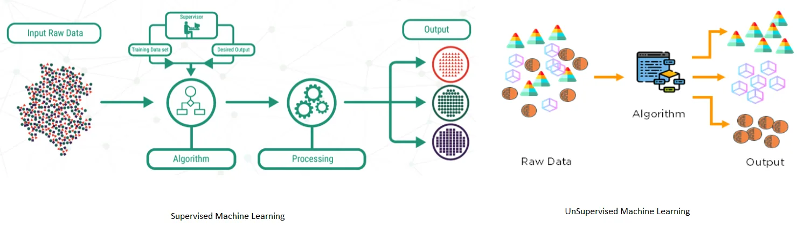

There is a wide variety of machine learning (ML) algorithms for discovering patterns which exist within a pool of data. They are broadly classified into supervised and unsupervised ML algorithms.

Supervised learning is a computational technique which takes an input data and maps it onto an output. As an example, if we take a look at a boy who is learning how to walk. Yes, he is under protection and guidance of his parents. Assuming he is able to take a few steps walking smoothly before suddenly falling down. At this point he must learn with the help of his parents how to get up or how to have some support with any object. And this is how he actually learns to walk nicely.

The above scenario is just an example. When we talk about machines, they can also learn from examples similarly.

> In supervised learning, we have input variable(x) and an output variable(y), and use an algorithm to learn the mapping function from the input to the output.

*y = f(x)*

The goal is to approximate the mapping function so well that when you have new input data (x), you can then predict the output variable (y) for that data. Here, algorithms make predictions on the training data with the guidance or supervision of the practitioner or trainer. This process by which algorithms learn the pattern in a data set is known as model training.

On the other side is unsupervised learning. Here, we only have input data (x) and no corresponding output variable (y). Again, the goal is to model the underlying structure in the data in order to learn the pattern in it. These are called unsupervised learning because unlike supervised learning above there is no correct answers. Algorithms are left to their own devises to discover and present the interesting structure in data.

Supervised learning problems can be further grouped into **regression** and **classification**.

Classification: In classification problems, we classify objects of similar nature or properties into a single group. When the algorithm learns how the groups are formed, it will be able to classify any unknown object. A classification problem is when the output variable is a category, like color, country, occupation, etc.

A classification problem requires that examples be classified into one of two or more classes. Classifications can have real-valued or discrete input variables. A problem with two classes is often called a **two-class or binary** classification problem while a problem with more than two classes is often called a **multi-class** classification problem. And a problem where an example is assigned multiple classes is called a **multi-label** classification problem.

Regression: Regression is the case where we give concrete known examples to the algorithm. We then let the algorithm to figure out an empirical relationship between input and output. In regression problems, the output variable is a real value, like age, price, etc.

A regression problem requires the prediction of a quantity. Regression can have real valued or discrete input variables. A problem with multiple input variables is often called a **multivariate** regression problem. A regression problem where input variables are ordered by time is called a **time series forecasting** problem.

In addition to classification and regression, common types of problems include **recommendation** and **time series prediction** respectively. A few admired supervised ML algorithms are: **Logistic Regression**, **Decision tree**, **Support Vector Machine** (SVM), **k-Nearest Neighbors**, **Naive Bayes**, **Random Forest**, **Linear Regression**, **Polynomial Regression**, etc.

For the admired unsupervised ML algorithms, they include: **K-means** for clustering problems, **Apriori** algorithm for association rule learning problem **Hierarchical clustering**, **Hidden Markov** models, etc.

Semi-Supervised Machine Learning

> Problems where you have a large amount of input data (x) and only some data is labeled (y) are called **semi-supervised learning** problems.

These problems sit in between both supervised and unsupervised learning. A good example is a photo archive where only some images are labeled, (e.g. dog, cat, person) and the majority are unlabeled.

Many real-world machine learning problems fall into this category. This is because it can be expensive or time-consuming to label data as it may require access to domain expertise. However, unlabeled data is cheap and easy to collect and store.

We can also use supervised learning techniques to make best guess predictions for the unlabeled data, feed that data back into the supervised learning algorithm as training data and use the model to make predictions on new unseen data.

In this post you learned the difference between supervised, unsupervised and semi-supervised machine learning. I noted that in:

**Supervised learning**: All data is labeled and the algorithms learns to predict the output from the input data.

**Unsupervised learning**: All data is unlabeled and algorithms learn the inherent structure from the input data.

**Semi-supervised learning**: Only some data is labeled, most of it is unlabeled and a mixture of supervised and unsupervised techniques is used.
