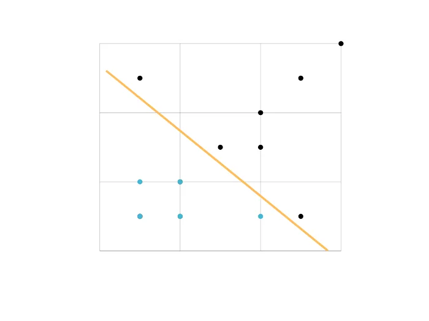
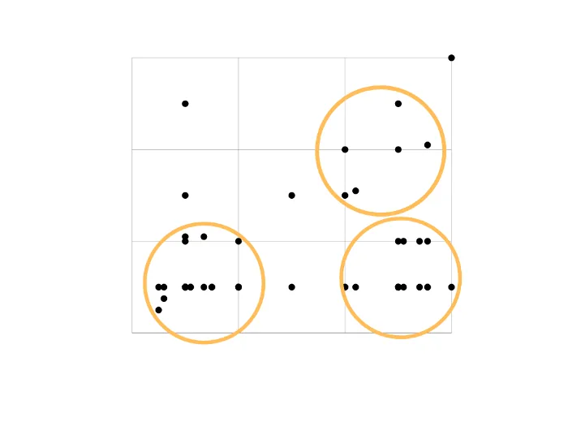

Machine learning is already an important part of how modern organisations and services function. Whether in social media platforms, healthcare, or finance, machine learning models are deployed in a variety of settings. But the steps needed to train and deploy a model will differ depending on the task at hand and the data that’s available.

Supervised and unsupervised learning are examples of two different types of machine learning model approaches. They differ in the way the models are trained and the condition of the training data that are required. Each approach has different strengths, so the task or problem faced by a supervised vs unsupervised learning model will usually be different.

As machine learning becomes more and more common, it’s important to understand the core differences in supervised vs unsupervised learning. If an organisation is looking to deploy a machine learning model, the choice will be made by understanding the data that’s available and the problem that needs to be solved. This guide explores supervised vs unsupervised machine learning, including the main differences in approach, how they are utilised, and examples of both types.

**Supervised Learning**

In supervised learning, the dataset of interest contains the explanatory variables (also known as the input or features) as well as the target responses (also known as the output labels). Such algorithms attempt to learn a function that approximates the relationship between the feature values and the labels in a way that it’d be able to generalise well to new unseen data.

In other words, supervised learning algorithms associate the input features of the training examples to the corresponding output labels so that they can perform good enough predictions for all possible inputs. This learning method is also called learning from exemplars.

Problems that require supervised learning methods can be further grouped into classification and regression problems. The former is when the output variable (label) corresponds to a category; for example, spam vs ham emails while the latter is when the output variable is a real value; for example a distance or a price.

**Unsupervised Learning**

On the other hand, unsupervised learning is suitable for problems that require the algorithms to identify and extract similarities between the inputs so that similar inputs can be categorised together. In contrast to supervised learning, unsupervised learning methods are suitable when the output variables (i.e the labels) are not provided.

The two fundamental types of unsupervised learning methods are clustering and density estimation. The former (which is probably the most commonly used) involves problems where we need to group the data into specific categories (known as clusters) while the latter involves summarizing the distribution of the data.

**Semi-Supervised Learning**

Now there’s also another type of learning called semi-supervised that comes in handy when we do not have target labels for all the examples in the training dataset. Therefore, such problems require a mixture of supervised and unsupervised learning techniques.

A very common problem that requires such methods is Image classification or Object Detection. Usually, datasets containing images may only have labels only for a subset of the examples included while the remaining come with no label at all.

**Final Thoughts**

In today’s article, we discussed the main differences between the two fundamental Machine Learning methods namely supervised and unsupervised learning.

To summarise, supervised learning methods are useful when the dataset available contains both the features and the correct labels for each example. Such methods are useful when we want to perform some sort of prediction over the data of interest such as classifying whether an email is spam or not. On the other hand, unsupervised learning methods come in handy when we don’t have access to the output label and we need to categorise (or cluster) the data together into groups.

It is also important to mention that these are not the only learning methods in the context of Machine Learning. A few other types include Reinforcement Learning and Evolutionary Learning which are all beyond the scope of this article.
