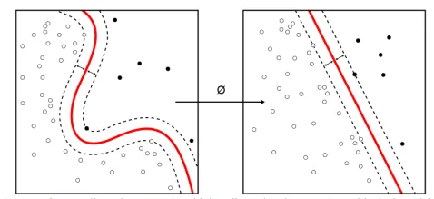
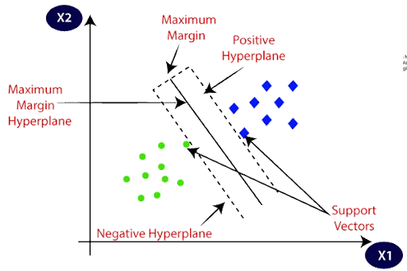
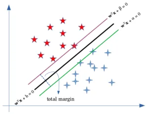
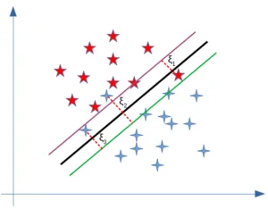
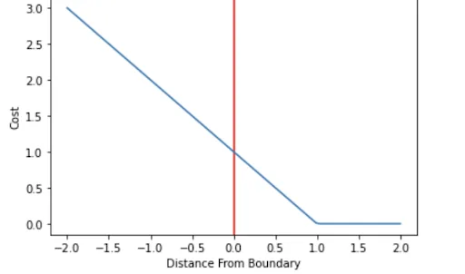

Support vector machine (SVM) was first identified by Vladimir Vapnik and his colleagues in 1992. SVMs are also known as one of the most powerful black box learning algorithms. SVMs have been widely used in learning nonlinear complex functions of different applications. SVM is a supervised learning method that generates input-output mapping functions from a set of labeled training data and it is a powerful machine learning tool for classification. But also in regression and time series prediction applications, SVM usually exhibits excellent performances. Therefore, the mapping function can be either a classification function or a regression function. It can be also applied for outlier detection. SVM is robust to outliers.

In some cases that data cannot be linearly separated, nonlinear kernel functions are often used to transform input data to high-dimensional feature space and create maximum-margin hyperplanes so that the input data come to be more separable in high-dimensional space compared to the original input space and can classify well. Mapping input data into high-dimensional feature space is known as "Kernel Trick". The following figure shows transforming input data into high dimensional feature space using kernel machine.

Image source: [here](https://en.wikipedia.org/wiki/File:Kernel_Machine.svg)

### Applications of SVM
The main purpose of SVM is to correctly classify unseen data. It has been widely applied in classification and categorizing problems and gained a lot of success. Examples of SVM’s successful applications are Face detection, handwriting recognition, Bioinformatics such as protein classification and cancer classification and Image Classification. Moreover, SVM has been used to classify documents into different categories which are known as text and hypertext categorization. For instance, spam filtering in email. SVM can also be used in GPC (Generalized Predictive Control) to control chaotic dynamics with useful parameters.

### How SVM works?
The goal of the SVM algorithm is to create the best line or decision boundary that can segregate n-dimensional space into classes so that we can easily put the new data point in the correct category in the future. This best decision boundary is called a hyperplane.

SVM chooses the extreme points/vectors that help in creating the hyperplane. These extreme cases are called support vectors, and hence the algorithm is termed as Support Vector Machine. Consider the below diagram in which there are two different categories that are classified using a decision boundary or hyperplane:

Image source: [here](https://www.javatpoint.com/machine-learning-support-vector-machine-algorithm)

### Types of SVM

**SVM can be of two types:**

- **Linear SVM:** Linear SVM is used for linearly separable data, which means if a dataset can be classified into two classes by using a single straight line, then such data is termed as linearly separable data, and classifier is used called as Linear SVM classifier.
- **Non-linear SVM:** Non-Linear SVM is used for non-linearly separated data, which means if a dataset cannot be classified by using a straight line, then such data is termed as non-linear data and classifier used is called as Non-linear SVM classifier.

### Hyperplane and Support Vectors in the SVM algorithm:

**Hyperplane:** There can be multiple lines/decision boundaries to segregate the classes in n-dimensional space, but we need to find out the best decision boundary that helps to classify the data points. This best boundary is known as the hyperplane of SVM. The dimensions of the hyperplane depend on the features present in the dataset, which means if there are 2 features (as shown in image), then the hyperplane will be a straight line. And if there are 3 features, then the hyperplane will be a 2-dimension plane. We always create a hyperplane that has a maximum margin, which means the maximum distance between the data points.

**Support Vectors:** The data points or vectors that are the closest to the hyperplane and which affect the position of the hyperplane are termed as Support Vectors. These vectors support the hyperplane, hence called a Support vector.

### Roles of Margins in SVM
When the data is linearly separable, and we don’t want to have any misclassifications, we use SVM with a hard margin. However, when a linear boundary is not feasible, or we want to allow some misclassifications in the hope of achieving better generality, we can opt for a soft margin for our classifier.

#### SVM with a Hard Margin

They are the green and purple lines in the above figure. Without allowing any misclassifications in the hard margin SVM, we want to maximize the distance between the two hyperplanes.

#### SVM with a Soft Margin

The soft margin SVM follows a somewhat similar optimization procedure with a couple of differences. First, in this scenario, we allow misclassifications to happen. So we’ll need to minimize the misclassification error, which means that we’ll have to deal with one more constraint. Second, to minimize the error, we should define a loss function. A common loss function used for soft margin is the hinge loss.

### Hard Margin vs. Soft Margin

The difference between a hard margin and a soft margin in SVMs lies in the separability of the data. If our data is linearly separable, we go for a hard margin. However, if this is not the case, it won’t be feasible to do that. In the presence of the data points that make it impossible to find a linear classifier, we would have to be more lenient and let some of the data points be misclassified. In this case, a soft margin SVM is appropriate.

Sometimes, the data is linearly separable, but the margin is so small that the model becomes prone to overfitting or being too sensitive to outliers. Also, in this case, we can opt for a larger margin by using soft margin SVM in order to help the model generalize better.

### Hinge Loss

The hinge loss is a specific type of cost function that incorporates a margin or distance from the classification boundary into the cost calculation. Even if new observations are classified correctly, they can incur a penalty if the margin from the decision boundary is not large enough. The hinge loss increases linearly.

The hinge loss is mostly associated with soft-margin support vector machines.

The loss is defined according to the following formula, where t is the actual outcome (either 1 or -1), and y is the output of the classifier.

l(y) = max(0, 1 -t \cdot y)

*l*(*y*)=*max*(0,1−*t*⋅*y*)

The hinge loss function is most commonly employed to regularize soft margin support vector machines. The degree of regularization determines how aggressively the classifier tries to prevent misclassifications and can be controlled with an additional parameter C. Hard margin SVMs do not allow for misclassifications and do not require regularization.

### Kernels

In machine learning, a kernel refers to a method that allows us to apply linear classifiers to non-linear problems by mapping non-linear data into a higher-dimensional space without the need to visit or understand that higher-dimensional space.

In other words, Kernels are just a smart way of adding more features to the data in order to separate linearly. Two popular kernels are the polynomial kernel and the Gaussian Radial Basis Function, or RBF, kernel.

#### Polynomial Kernel

A Polynomial Kernel is a more generalized form of the linear kernel. This kernel is used when data cannot be separated linearly.

The polynomial kernel has a degree parameter (d) which functions to find the optimal value in each dataset. The d parameter is the degree of the polynomial kernel function with a default value of d = 2. The greater the d value, the resulting system accuracy will be fluctuating and less stable. This happens because the higher the d parameter value, the more curved the resulting hyperplane line.

#### RBF Kernel

The RBF kernel is the most widely used kernel concept to solve the problem of classifying datasets that cannot be separated linearly. This kernel is known to have good performance with certain parameters, and the results of the training have a small error value compared to other kernels.

When training an SVM with the Radial Basis Function (RBF) kernel, two parameters must be considered: C and gamma. The parameter C, common to all SVM kernels, trades off misclassification of training examples against simplicity of the decision surface. A low C makes the decision surface smooth, while a high C aims at classifying all training examples correctly. gamma defines how much influence a single training example has. The larger gamma is, the closer other examples must be to be affected.

Proper choice of C and gamma is critical to the SVM’s performance. One is advised to use GridSearchCV with C and gamma spaced exponentially far apart to choose good values.

### Scikit Learn SVM for Classification

Scikit learn library supports SVC, NuSVC and LinearSVC are classes capable of performing binary and multi-class classification on a dataset. SVC and NuSVC are similar methods, but accept slightly different sets of parameters and have different mathematical formulations (see section Mathematical formulation). On the other hand, LinearSVC is another (faster) implementation of Support Vector Classification for the case of a linear kernel. Note that LinearSVC does not accept parameter kernel, as this is assumed to be linear.

References:

[Support Vector Machine (SVM) Algorithm - Javatpoint](https://www.javatpoint.com/machine-learning-support-vector-machine-algorithm)

[Using a Hard Margin vs. Soft Margin in SVM | Baeldung on Computer Science](https://www.baeldung.com/cs/svm-hard-margin-vs-soft-margin#:~:text=The%20difference%20between%20a%20hard%20margin%20and%20a,case%2C%20it%20won%E2%80%99t%20be%20feasible%20to%20do%20that.)

[Understanding Hinge Loss and the SVM Cost Function - Programmathically](https://programmathically.com/understanding-hinge-loss-and-the-svm-cost-function/)

[What is a Kernel in Machine Learning? - Programmathically](https://programmathically.com/what-is-a-kernel-in-machine-learning/)

[SVM Kernels: What Do They Actually Do? | by Michał Oleszak | Towards Data Science](https://towardsdatascience.com/svm-kernels-what-do-they-actually-do-56ce36f4f7b8)

[Support Vector Machine (SVM) and Kernels Trick | by Indriani Sitorus | Analytics Vidhya | Medium](https://medium.com/analytics-vidhya/introduction-to-svm-and-kernel-trick-part-1-theory-d990e2872ace)

[1.4. Support Vector Machines — scikit-learn 1.0.2 documentation](https://scikit-learn.org/stable/modules/svm.html#svm-kernels)

[1.4. Support Vector Machines — scikit-learn 1.0.2 documentation](https://scikit-learn.org/stable/modules/svm.html#classification)
