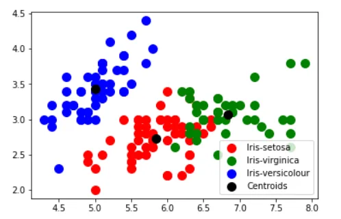
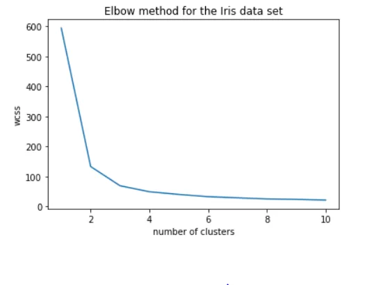

Cluster analysis has become a common tool in both research and business cycles alike. Cluster analysis is a statistical tool making no prior assumptions about the differences within a population. Pretty much, the cluster analysis sorts similar items together and classifies the elements into different groups. These groups are disjoint subsets. It is a form of a data reduction technique, other forms being that of multidimensional scaling, factor analysis, and discriminant analysis.

One method, which is popular, is the K-means clustering method which follows the following 'iterative' steps:

1. It starts by picking *K* random points and setting them as the cluster centroids.

2. Then, it assigns each data point to the nearest centroid to it to form *K* clusters.

3. Then, it calculates a new centroid for the newly formed clusters.

4. Since the centroids have been updated, we need to go back to *step 2* to reassign the samples to their new clusters based on the updated centroids. However, if the centroids didn't move much, we know that the algorithm has converged, and we stop.

Cluster analysis has been used in marketing for

1. Market segmentation,

2. Understanding buyer behaviours (homogeneous groups of buyers).

3. Test Market selection

There are various types similarity/ dissimilarity measurement tools which are:

1. Minkowski distance

2. Mahalanobis distance

3. Bregman divergence (measures dissimilarity

4. Cosine distance

5. Power distance

We will use the Iris dataset without the species variable to see how the data is grouped.

```python
# Importing packages

from sklearn.cluster import KMeans
import pandas as pd
import numpy as np

from sklearn import datasets
iris = datasets.load_iris()

#creating dataframe
iris_df = pd.DataFrame(iris.data, columns = iris.feature_names)
x = iris_df.iloc[:, :-1].values #last column values excluded
y = iris_df.iloc[:,   -1].values #last column value

kmeans = KMeans(n_clusters=3, init = 'k-means++',
                max_iter = 100,
                n_init = 10,
                random_state = 0)
print(kmeans.cluster_centers_) #display cluster centers

import matplotlib.pyplot as plt
plt.scatter(x[y_kmeans   == 0, 0], x[y_kmeans == 0, 1],s = 100, c = 'red', label = 'Iris-setosa')
plt.scatter(x[y_kmeans   == 2, 0], x[y_kmeans == 2, 1],s = 100, c = 'green', label = 'Iris-virginica')
plt.scatter(x[y_kmeans   == 1, 0], x[y_kmeans == 1, 1],s = 100, c = 'blue', label = 'Iris-versicolour')
plt.scatter(kmeans.cluster_centers_[:,   0], kmeans.cluster_centers_[:,1],s = 100, c = 'black', label = 'Centroids')
plt.legend()
plt.show()
```

As can be seen below there are predominantly 3 groups with 3 centers



Is three clusters the right number of clusters? we inlude k-means++: since ‘k-means++’ is a method for initialization rather than ‘random’. These algorithms are used to choose initial values for K-means clustering. k-means++ uses a smarter way to initialize the centroids for better clustering.

wcss = []

```python
#Iterating over 1, 2, 3, ---- 10 clusters
for i in range(1, 11):
    kmeans = KMeans(n_clusters = i, init = 'k-means++', max_iter = 300, n_init = 10, random_state = 0)
    kmeans.fit(x)
    wcss.append(kmeans.inertia_) # intertia_ is an attribute that has the wcss number
plt.plot(range(1,11), wcss)
plt.title("Elbow method for the Iris data set")
plt.xlabel("number of clusters")
plt.ylabel("wcss")
plt.show()
```

We observe that the elbow is at 3 meaning 3 is the optimal number of clusters.



**Silhouette Score**

Silhouette Score is a measure of how similar a sample is to its own cluster compared to the samples in other clusters.

```python
# Silhouette Score
from sklearn.metrics import silhouette_score
n_clusters_options = [1,2,3,4]#range(1,11)
silhouette_scores = []
for i, n_clusters in enumerate(n_clusters_options):
    kmeans = KMeans(n_clusters=n_clusters, random_state=7)
    y_pred = kmeans.fit_predict(x)
    silhouette_scores.append(silhouette_score(x, y_pred))

fig, ax = plt.subplots(1, 1, figsize=(12, 6), sharey=False)
pd.DataFrame(
    {
        'n_clusters': n_clusters_options,
        'silhouette_score': silhouette_scores,
    }).set_index('n_clusters').plot(
    title='KMeans: Silhouette Score vs # Clusters chosen',
    kind='bar',
    ax=ax
)
```

**Standadised Data**

In most cases we need to standardise data as the data has different scales we do this by

```python
from sklearn.preprocessing import StandardScaler
from sklearn.cluster import KMeans
# Load data
iris = datasets.load_iris()
features = iris.data
# Standardize features
scaler = StandardScaler()
features_std = scaler.fit_transform(features)
# Create k-mean object
cluster = KMeans(n_clusters=3, random_state=0, n_jobs=-1)
# Train model
model = cluster.fit(features_std)
```

**Mini Batch**

We can use the Mini-batch as follows

```python
from sklearn.cluster import MiniBatchKMeans
# Load data
iris = datasets.load_iris()
features = iris.data
# Standardize features
scaler = StandardScaler()
features_std = scaler.fit_transform(features)
# Create k-mean object
cluster = MiniBatchKMeans(n_clusters=3, random_state=0, batch_size=100)
# Train model
model = cluster.fit(features_std)
```

**Mini-Shift**

We can use the Mini Shaft as follows

```python
from sklearn.cluster import MeanShift
# Load data
iris = datasets.load_iris()
features = iris.data
# Standardize features
scaler = StandardScaler()
features_std = scaler.fit_transform(features)
# Create meanshift object
cluster = MeanShift(n_jobs=-1)
# Train model
model = cluster.fit(features_std)
```

**Agglomerative Clustering**

We can use the agglomerative clustering

```python
from sklearn.cluster import AgglomerativeClustering
# Load data
iris = datasets.load_iris()
features = iris.data
# Standardize features
scaler = StandardScaler()
features_std = scaler.fit_transform(features)
# Create meanshift object
cluster = AgglomerativeClustering(n_clusters=3)
# Train model
model = cluster.fit(features_std)
```

The code can be found here [Github](https://github.com/Matshisela/Survey-of-Clustering-algorithms)
