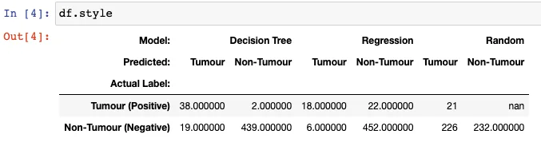

This demonstrates visualization of tabular data using the Styler class.

Styler Object and HTML

Styling should be performed after the data in a DataFrame has been processed. The Styler creates an HTML
and leverages CSS styling language to manipulate many parameters including colors, fonts, borders, background, etc. This allows a lot of flexibility out of the box, and even enables web developers to integrate DataFrames into their exiting user interface designs.
The DataFrame.style attribute is a property that returns a Styler object.

Now lets start with the import

```python
import pandas as pd
```

```python
import numpy as np
```

```python
df = pd.DataFrame(
[
  [38.0, 2.0, 18.0, 22.0, 21, np.nan],
  [19, 439, 6, 452, 226,232]
],
index=pd.Index(
['Tumour (Positive)', 'Non-Tumour (Negative)'],
name='Actual Label:'
),
columns=pd.MultiIndex.from_product(
 [
 ['Decision Tree', 'Regression', 'Random'],
 ['Tumour', 'Non-Tumour']],
 names=['Model:', 'Predicted:']
 )
)
```

Lets see the output

```python
df.style
```



The above output looks very similar to the standard DataFrame HTML representation. But the HTML here has already attached some CSS classes to each cell, even if we haven’t yet created any styles. We can view these by calling the .render() method, which returns the raw HTML as string, which is useful for further processing or adding to a file - read on in More about CSS and HTML. Below we will show how we can use these to format the DataFrame to be more communicative.
