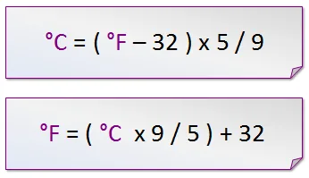
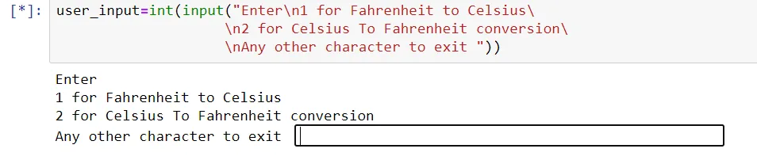
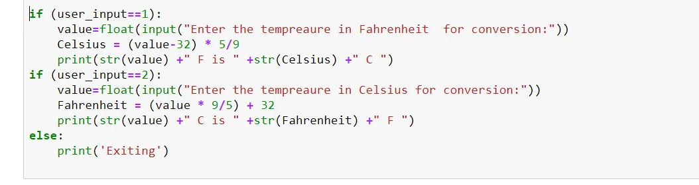

Two frequently used temperature scales are degree Celsius and degree Kelvin. In this blog a simple python application is built that converts temperature in Celsius to that in Kelvin or vice versa.

The general formula for this conversion are as follow:

Firstly we take user input based on which the desired conversion takes place.

Then based on the user input using if else conditions we either perform the conversion using the above mentioned formula and display the original scale value along with converted value or exit as shown below:

The entire code is and an output instance are as follow:

