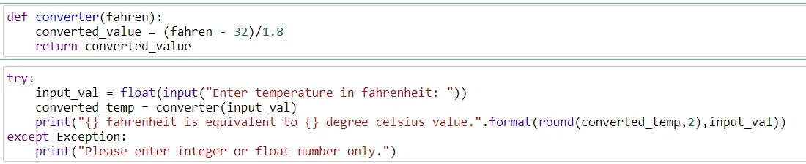
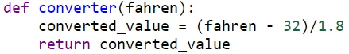
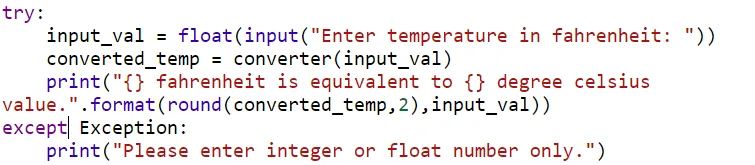
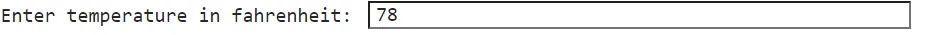
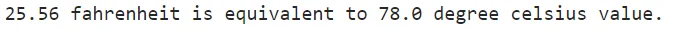

The **Temperature In Fahrenheit To Celsius Converter** is the first blog of my career. The title clearly says that it will convert the value of temperature in the Fahrenheit unit to degrees Celsius value.

Before we go to the programming part, we must have an idea about what is Fahrenheit and degree Celsius, the relationship between Fahrenheit and degree Celsius.

**Temperature** is a physical quantity that expresses hot and cold. Temperature can be measured in different kinds of units.The most common scales are the Celsius scale (formerly called *centigrade*, denoted as °C), the Fahrenheit scale (denoted as °F), and the Kelvin scale (denoted as K).

Now, we can focus on Celsius and Fahrenheit units of temperature.

The relationship between Celsius degree and Fahrenheit is shown as below relationship

Now move towards the programming part. I have attached a snippet of the code below.

Now we will try to understand code line by line. First, describe a function converter. The function converter accepts an argument fahren, value fahren is then performed a mathematical calculation which is saved to variable converted_value. Finally, the value of the variable converted_value is returned.

Now go to the next part of the code. The next part contains a code within try...exception block which is known as exception handling. The exception handling helps to catch an exception in the code. If there are any exception occurs on try block then exception message will be displayed.

Firstly, the program asks for input from the user as in the image below.

The float type value of the input is then saved to the variable input_val. The function converter with input value from a user as an argument. The result of the function converter assigned to the variable converted_temp and print result at last.

The output of the program above is displayed as follows:

