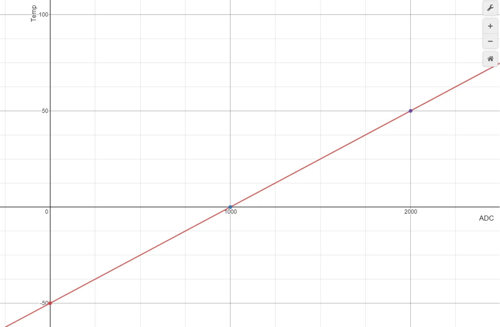
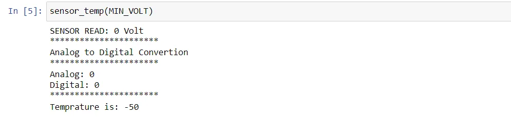
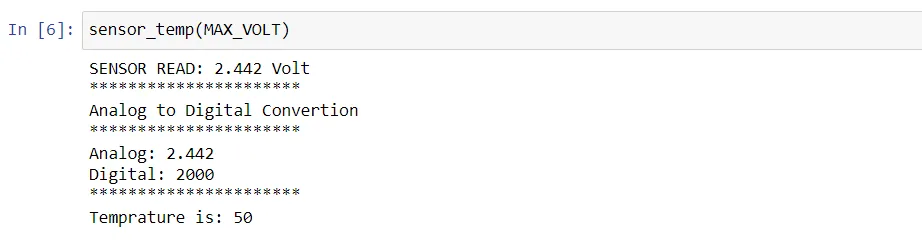
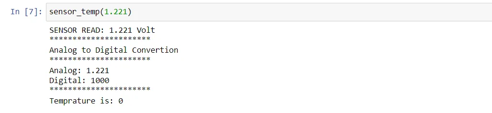

Hello all, in this blog, we will go through the process of creating a virtual implementation of a temperature sensor using python!

But first, let's understand how temperature sensors work in real life!

## How temperature sensors work?
Temperature sensors in real life read a voltage value that represents the current temperature, then this value goes through an **ADC** (Analog to Digital Converter), which converts the analog signal to a digital one resulting in what we call **ADC raw value.**

Afterwards, based on the sensor sheet and equations, each ADC raw value get converted to the corresponding temp value that we can read and interpret!

**Let's consider the following sensor sheet:**

- System voltage: 5 v
- Sensor's Min Volt = 0
- Sensor's Max Volt = 2.442
- Min Temp = - 50 Celsius
- Max Temp = 50 Celsius

And another important information you find in a sensor's sheet, is the **ADC resolution.**

Let's suppose that our sensor has an ADC of **12-bit** resolution, which means, the maximum value measured is **4095** (in our numbering system)

**Now, given the above information, we can compute the ADC raw value for a given voltage input!**

> ADC = input voltage \* ( resolution / system voltage )

**Alright, now it's time to know how ADC raw values get converted to temperatures.**

Consider the following linear graph for different ADC, TEMP points:

**What is the equation of this line?**

Easy, if you remember from your math classes, the equation of the straight line is:

> y = mx + c

let's calculate *m* (the slope of the line)

> m = (y2-y1) / (x2-x1)

Taking any two points on the line, *m* = 0.05

Great! what about *c*? *c* is the y-intercept of the line, which is - 50

Hence, the equation of our straight line is:

> y = 0.05x - 50

**Note: there is a relation between the points, we can use that relation in building our ADC to TEMP function.**

**What is it?**

When x = 0. y = -50

When x = 1000. y = 0

When x = 2000. y = 50

Look at y values!

Using this clue we can write our function **recursively!**

## Alright, enough theory, let's code.
**First, configuration variables:**

**Analog to Digital Converter:**

**ADC to TEMP:**

**A function we can call in the main:**

## Test our program
**Input the min volt:**

**Input the max volt:**

**Input 1.1221:**

## And that's it!
## Thanks for reading!
**Congrats on building a virtual temperature sensor using python!**

You can find the code in my [GitHub](https://github.com/96ibman/datainsight_datascience_program/tree/main/adc_to_temp). Happy Learning!
