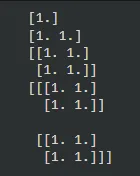
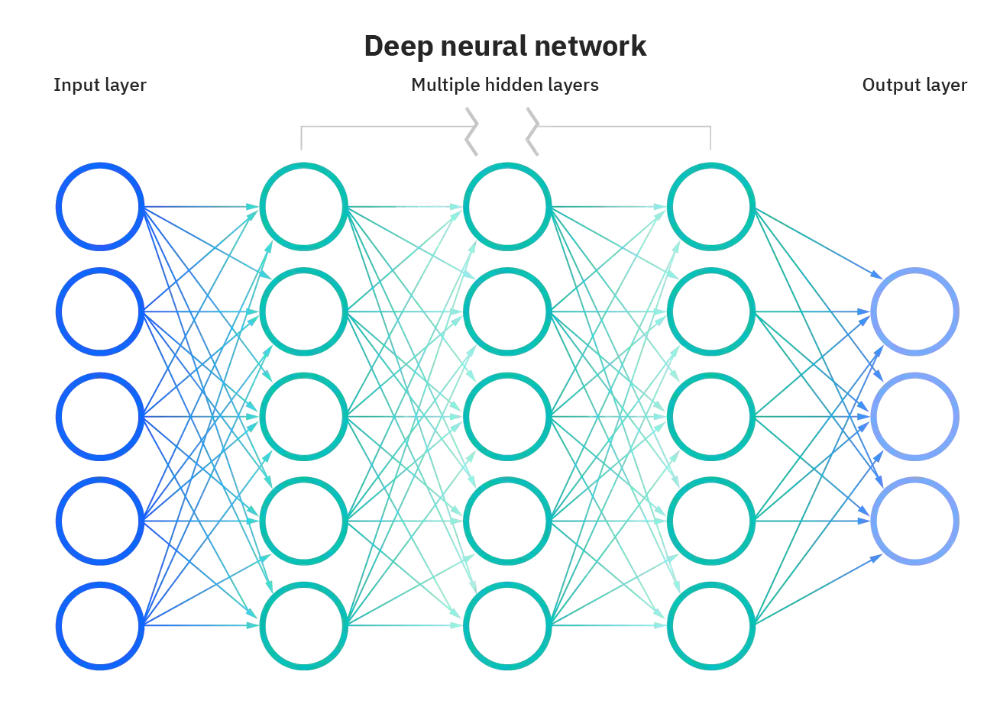

## TensorFlow
**TensorFlow** is a free and open-source software library for artificial intelligence and machine learning. Although it may be applied to many different tasks, its main focus is deep neural network inference and training. Dataflow graphs—structures that depict how data flows through a graph, or a collection of processing nodes—can be created by developers using TensorFlow. It was developed by **Google Brain Team**.

## What is a tensor?
A **tensor** is a generalization of vectors and matrices. It can be seen as a collection of numbers which has been arranged into a particular shape. A **constant** is the simplest category of a tensor.

```python
#Importing the necessary libraries
import tensorflow as tf
import numpy as np

#Zero deimensional Tensor
d0 = tf.ones((1,))

#One dimensional Tensor
d1 = tf.ones((2,))

#Two dimensional Tensor
d2 = tf.ones((2, 2))

#Three dimensional Tensor
d3 = tf.ones((2, 2, 2))

#Printing the initialized tensors
print(d0.numpy())

print(d1.numpy())

print(d2.numpy())

print(d3.numpy())
```

**Output:**



**Linear Regression In TensorFlow**

A machine learning algorithm built on supervised learning is linear regression. It executes a regression operation. Based on independent variables, regression models forecast a target value. It is primarily used to determine how variables and forecasting relate to one another. Below is an example:

```python
import pandas as pd
import tensorflow as tf
import numpy as np

from google.colab import files
files.upload()

housing = pd.read_csv('/content/kc_house_data.csv', parse_dates = True)
housing.head()

price = np.array(housing['price'], np.float32)
size = np.array(housing['sqft_living'], np.float32)

intercept = tf.Variable(0.1, np.float32)
slope = tf.Variable(0.1, np.float32)

def linear_func(intercept, slope, features = size):
  return intercept + features*slope

def loss_func(intercept, slope, targets=price, features=size):
  predictions = linear_func(intercept, slope)
  return tf.keras.losses.mse(targets, predictions)

opt = tf.keras.optimizers.Adam()

for j in range(1000):
 opt.minimize(lambda: loss_func(intercept, slope), \
 var_list = [intercept, slope])
 print(loss_func(intercept, slope))

print(intercept.numpy(), slope.numpy())
```

**Output:**

1.0991763 1.0991884

**Neural Networks In Tensorflow**

Deep learning techniques are built around neural networks, which are a subset of machine learning. In order to mirror the way that organic neurons communicate with one another, their name and structure are both modeled after the human brain. They consist of node levels, with each layer having an input, one or more hidden layers, and an output layer. Below is an example of how neural networks are implemented with Tensorflow:

```python
#Importing the needed libraries
import tensorflow as tf
from tensorflow import keras
import numpy as np
import matplotlib.pyplot as plt

%matplotlib inline

#Splitting dataset into train and test set
(X_train, y_train), (X_test, y_test) = keras.datasets.mnist.load_data()

#Checking length of X_train
len(X_train)

#Checking length of X_test
len(X_test)

#Checking the shape of the first X train input
X_train[0].shape

#Showing the first X input
plt.matshow(X_train[0])

#Normalizing the data
X_train = X_train/255
X_test = X_test/255

#Flattening the dataset
X_train_flattened = X_train.reshape(len(X_train), 28*28)
X_test_flattened = X_test.reshape(len(X_test), 28*28)

#Displaying the flattened shape
X_train_flattened.shape

#Creating the neural network
model = keras.Sequential([
    keras.layers.Dense(10, input_shape=(784,), activation='sigmoid')
])

model.compile(optimizer='adam',
              loss='sparse_categorical_crossentropy',
              metrics=['accuracy'])

model.fit(X_train_flattened, y_train, epochs=5)

#Evaluating the model
model.evaluate(X_test_flattened, y_test)
```

**Output:**

loss: 0.2726 - accuracy: 0.9241

## Deep Learning
**Deep learning** is a subset of machine learning that uses artificial neural networks as its foundation. It uses numerous layers of processing to gradually extract higher-level features from data. It is a method of teaching computers to learn by doing what comes easily to people: by observation. Driverless cars use deep learning as a vital technology to detect a stop sign or tell a pedestrian from a lamppost.

Deep learning usually deals with **deep neural network**. Deep neural network (DNN), often known as a "deep net," is a neural network that has some degree of complexity, typically at least two layers. Deep neural networks use advanced mathematical modeling to analyze data in complex ways.

Some types of algorithms used in deep learning include:

1. Convolutional Neural Networks (CNN)
2. Long Short Term Memory Networks (LSTMs)
3. Recurrent Neural Networks (RNNs)
4. Generative Adversarial Networks (GANs)
5. Radial Basis Function Networks (RBFNs)
6. Multilayer Perceptron (MLPs)
7. Self Organizing Maps (SOMs)
8. Deep Belief Networks (DBNs)
9. Restricted Boltzmann Machines (RBMs)
10. Autoencoders



Below is a deep neural sequential network made from TensorFlow Keras:

```python
#Importing needed libraries
from tensorflow import keras

#Creating a deep neural network with 2 hidden layers
ann = keras.Sequential([
    keras.layers.Flatten(input_shape=(32,32,3)),
    keras.layers.Dense(3000, activation='relu'),
    keras.layers.Dense(1000, activation='relu'),
    keras.layers.Dense(10, activation='softmax')
])
```

**Output:**

<keras.engine.sequential.Sequential at 0x7f2f1116f8e0>

The output above shows a deep neural network has been made.

GitHub Link with Jupyter Notebook:

<https://github.com/Jegge2003/tensordeep>
