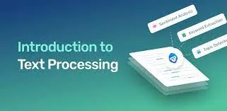

#### What is text processing?

The term text processing refers to the automation of analyzing electronic text. This allows machine learning models to get structured information about the text to use for analysis, manipulation of the text, or generating new text.

Text processing is one of the most common tasks used in machine learning applications such as language translation, sentiment analysis, spam filtering, and many others.

#### What’s the difference between text processing and natural language processing?

Text processing refers to only the analysis, manipulation, and generation of text, while natural language processing refers to the ability of a computer to understand human language in a valuable way. Basically, [natural language processing](https://www.datarobot.com/wiki/natural-language-processing/) is the next step after text processing.

#### Why is text processing important?

Since our interactions with brands have become increasingly online and text-based, text data is one of the most important ways for companies to derive business insights. Text data can show a business how their customers search, buy and interact with their brand, products, and competitors online. Text processing with machine learning allows enterprises to handle these large amounts of text data.

***Now that you are more familiar with text processing, let’s have a look at some of the most relevant methods and techniques to analyze and sort text data.***

#### 1- Convert Raw Data to Clean Text

Textual information comes from multiple sources like websites, files (XML, Word, PDF, Excel, etc.), Optical Character Recognition (OCR), or Speech Recognition System (Speech to Text). Depending on the source, the preprocessing of text might be different to remove unnecessary information thus converting raw text into cleaned text that is more useful and relevant to our task for instance without URLs, HTML tags, and other unnecessary characters.

#### 2 Further Preprocessing (Preparing Text for Feature Extraction)

Depending on your task, that raw text can further be preprocessed to be more useful. Here are some of the common preprocessing steps. Note that you do not have to necessarily use all of them since it depends on your task. The more you practice, the more you will understand when to use which.

1. Lowercasing: For named entities, you would better not lowercase your words. Named Entities are noun phrases that refer to specific object, person, or place.
2. Punctuation Removal
3. Removing Extra Spaces
4. Tokenizing

   - Word Tokenization by splitting text into words or tokens
   - Sentence Tokenization by splitting text into sentences

5- Remove Stopwords which are too common words like (is, are, the, etc.). They do not add much information to the text as other words. They could be removed in sentiment analysis so that we reduce our vocabulary and the complexity of later procedures, but they are important in Part of Speech tagging.

6-Convert Words into Canonical Form for reducing complexity while preserving the essence of word meaning

- Stemming: Using search and replace rules, for instance, you can stem words to their root form so that prefixes and suffixes will be removed for instance. For instance: caching, cached, caches —> cach. This is fast but can produce words that are incomplete like (cach) that do not exist in the English language.
- Lemmatization: Similar to stemming but using a dictionary instead of rules to convert different word variants to their common root. It can detect non-trivial word forms like reducing: is, was, were —> to the root (be) which is difficult to do using stemmer rules. Therefore lemmatization needs a dictionary and thus requires more memory but is more accurate since it produces words that exist in the English language.

#### 3-Feature Extraction

Having clean normalized text, how can we convert this to a suitable representation that can be used as features for the models that we will use? It depends on the model you are using, and the task you want to perform. Therefore, there are features more suitable for document-level tasks like (Spam Detection, and Sentiment Analysis), and features that are more useful for word-level tasks like (Text Generation, and Machine Translation). There are many ways of representing textual information, and through practice, you can learn what you need for each problem.

Generally, we will convert documents, words, and characters to vectors in an n-dimensional space. The vector representation is very useful since we can exploit Linear Algebra by computing the dot product between vectors to capture the similarity between documents, words, or characters. The higher the dot product, the higher similarity between the vectors (documents, words, or characters). We can also divide the dot products by their magnitude product (Euclidean Norms). The dot product can be extended to what is called the TF-IDF which is very common and powerful as I will soon explain.

#### 3.1 Document-level Features

Looking at an entire document or collection of words as one unit. Therefore, inferences are expected to also be on a document-level.

##### 3.1.1 Bag of Words (BoW)

It treats each document as an un-ordered collection (bag of words). Here are the steps required to form a Bag of Words:

1. The tokens you have after text-preprocessing are now the un-ordered collection or set for each document.
2. Form your vocabulary by collecting all unique words present in your corpus (all of your documents).
3. Make your vocabulary tokens the columns of a table. In this table each document is a row.
4. Convert each document into a vector of numbers representing how many times each word occurs in the document by counting the number of occurrences of each word in each document and enter the value in the corresponding column.

   - Now you have what is called a Document-Term Matrix which contains the relationship between documents in rows, and words or terms in columns.
   - Each element can be considered a **Term Frequency**. (i.e. The number of times that term (column) occurs in that document (row).

##### 3.1.2 Term Frequency-Inverse Document Frequency (TF-IDF)

The bag of words treats every word as being equally important, but we know that it is not the case in reality and it depends on the document’s topic. Instead, TF-IDF assigns weights to words that signify their relevance in documents.

Here are the steps required for extending the (BoW) to (TF-IDF):

1. Count the number of documents where each word occurs and insert a new row containing this count for each word in the column. This row is called the **Document Frequency**.
2. Divide the **Term Frequency** in each cell in the table by the **Document Frequency** of that term. Now we have a number that is proportional to the **Term Frequency**, and inversely proportional to the **Document Frequency** thus highlighting words that are more unique to a document, and thus we have a better reprsentation for the document. And that is the core idea behind TF-IDF.

#### 3.2 Word-level Features

For deeper text analysis, we want to represent each word by a vector.

##### 3.2.1 One-Hot Encoding

It is the same as Bag of Words except for:

1. The row represents a word and not a document while the column is as it is representing a word as well.
2. Replace the Term Frequency with 1 in the intersection of the same words in row and column, and 0 everywhere else.

##### 3.2.2 Word Embedding

One-hot encoding breaks down when we have a large vocabulary because the size of the word representation grows the number of vocabulary we have. Here where Word Embedding comes into play to control the size of word representation by limiting it to a fixed-size vector. It is a representation for each word in some vector space that has great properties like words with similar meaning are closer in that vector space so the meaning of each word is distributed throughout the vector. We can even do addition and subtraction that makes sense in the embedding space. Similar words are clustered together.

###### 3.2.2.1 Word2Vec

The core idea behind Word2Vec is the **Distributional Hypotheses** which states that words that occur in the same contexts tend to have similar meanings. Therefore, a model that is able to predict a given word, given neighboring words **(Continuous Bag of Words CBoW)**, or vice versa, predict neighboring words for a given word **(Continuous Skip-gram)** is likely to capture the contextual meanings of words.

How it is formed? For example in the Skip-gram model you pick any word, one-hot encode it, then feed it into a neural network or some other probabilistic model that could predict a few surrounding words (the input word’s context) by design. Train the neural network by using the suitable loss function to optimize the model’s weights and other parameters. Now your trained model should be able to predict the context words well. Therefore, the model has somehow understood the language and is able to predict words in context. The intermediate representation like a hidden layer in the neural network is the **Word2Vec Word Embedding**.

###### 3.2.2.1 Global Vectors for Word Representation (GloVe)

Using co-occurrence statistics, it is trying to come up with a vector representation for each word. Here is how it is formed:

1. Compute the probability of word j appears in the context of word i (i.e. conditional probability) for all word pairs ij in the given corpus. Word j appears in the context of word i means that word j is in the vicinity of word i by a certain context window (i.e. context of words).

   1. Count all occurrences of i and j in the given corpus
   2. Normalize the count to get a probability

1. Initialize two random vectors with a fixed-size for each word. Two vectors; one for the word when it is a context word, and one when it is the target word.
2. For any pair of words (i, j) we want their word-vectors dot product to be equal to their co-occurrence probability that is computed before that. By having this goal, and by choosing an appropriate loss function, we can iteratively optimize these word vectors until we have vectors that capture the similarities and differences between words.

#### 3.3 Character-level Features and Beyond

There are other possible features used in NLP. Let me give you a brief overview.

- In character-level features your model works on the character-level which has its pros and cons. From its pros is the small number of vocabulary you have since the number of English characters are much less than the number of words, and there is almost no Out of Vocabulray Characters (OOV) which is unlike word-level representations. However, characters in themselves do not carry as much meaning as words.
- WordPiece (a type of *subword tokenization*) is something between word-level, and character-level. For example, words with the same stem or root are divided into two parts (one part containing the stem, or root, and the other one containing the suffixes for instance). Therefore, you reduced the number of vocabulary while benfeting from the word-level representation. However, Out of Vocabulary Words (OOV) still exist.
- There is also something called SentencePiece, and other tokenizers exist. You can find more about them here.
- Moreover, there are Contextual Word Embedding that captures the word meaning when it appears in different contexts. Some of the ways for producing these Contextual Word Embeddings are using ELMo, and BERT (Bidirectional Encoder Representations from Transformers). More information are found [here](https://jalammar.github.io/illustrated-bert/).

##### Resources:

- Natural Language Processing Brief Summary, learnbeneficial.
- [Text processing: what, why, and how - DataRobot AI Cloud](https://www.datarobot.com/blog/text-processing-what-why-and-how/).
