Introduction

Content:

*1. Types of Analytics*

*2. Population and sample*

*3. Central Tendency*

*4. Measure of dispersion(Variability)*

*5. Relationship Between Variables*

*6. Data Reshaping & Transformation*

*7. Probability*

*8. Probability Distribution*

*9. Hypothesis Testing and Statistical Significance*

*10. Regression*

**Statistics** is the branch of mathematics that concerns the collection, organization, analysis, interpretation, and presentation of data.

in this article, we are going to discuss some of the most common concepts.

## 1. Types of Analytics
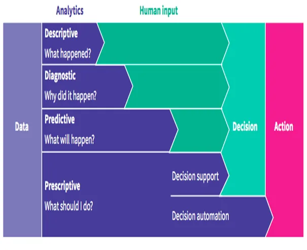

### 1.1. Descriptive Analytics

Descriptive analytics is the first step in data analysis. The goal of
 descriptive analytics is to find out *what happened*?

### 1.2. Diagnostic Analytics

With diagnostic analytics, we can go one step deeper and ask the
 question: *Why did this happen?*

### 1.3. Predictive Analytics

Predictive analytics tries to answer the question:

*What is likely* to happen*?* By using what we learned with descriptive
 and diagnostic analytics

### 1.4.Prescriptive Analytics

Now that you have an idea of what is likely to happen, you might
 want to know what the best course of action is. Prescriptive analytics
 tries to answer the question:

*What should be done?* or *what can we do to make ... happen?*

## 2. Population and Sample
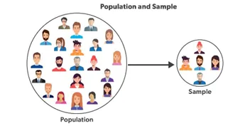

### 2.1. Population

is the complete collection of all individuals (scores, people,

measurements, and so on) to be studied. The collection is complete
 in the sense that it includes all of the individuals to be studied.

### 2.2. Sample

is a subcollection of members selected from a population.

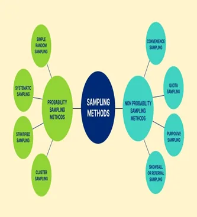

### 2.3. Sampling techniques

#### 2.3.1. Probability Sampling

§ Simple Random Sampling

§ Stratified Sampling

§ Cluster Sampling

§ Systematic Cluster Sampling

#### 2.3.2. Non-Probability Sampling

§ Convenience Sampling

§ Purposive Sampling

§ Quota Sampling

§ Snowball/referral sampling

## 3. Measure of Central Tendency
· **Mean**: The average value of the dataset.

· **Median**: The middle value of an ordered dataset.

· **Mode**: The most frequent value in the dataset. If the data have
 multiple values that occurred the most frequently, we have a
 multimodal distribution.

· **Skewness**: A measure of symmetry.

· **Kurtosis**: A measure of whether the data are heavy-tailed or light-
 tailed relative to a normal distribution

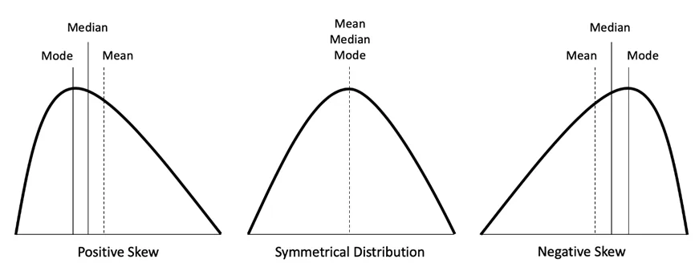

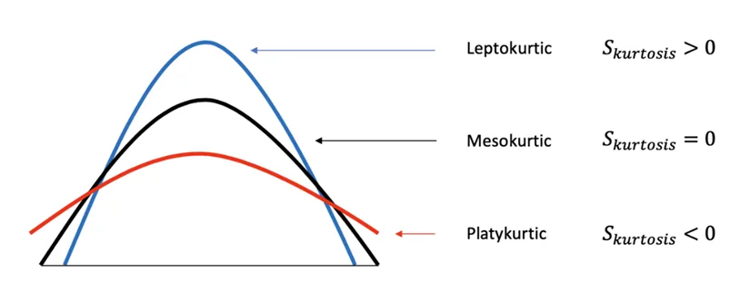

```python
# Filter for Belgium
be_consumption = food_consumption[food_consumption['country'] == 'Belgium']

# Filter for Egypt
Eg_consumption = food_consumption[food_consumption['country'] == 'Egypt']
print(Eg_consumption)

# Filter for USA
usa_consumption = food_consumption[food_consumption['country'] == 'USA']

# Calculate mean and median consumption in Belgium
print("The average consumption for Belgium is : {}".format(np.mean(be_consumption.consumption)))
print("The most common consumption for Belguim is : {}".format(np.median(be_consumption.consumption)))

# Calculate mean and median consumption in USA
print("The average consumption for USA is {}:  ".format(np.mean(usa_consumption.consumption)))
print("The most common consumption for USA is : {}".format(np.median(usa_consumption.consumption)))
```

output

```python
The average consumption for Belgium is : 42.132727272727266 The most common consumption for Belguim is : 12.59 The average consumption for USA is 44.650000000000006:   The most common consumption for USA is : 14.58
```

## 4. Measure of dispersion (Variability)
- **Range**: The difference between the highest and lowest value in the
   dataset.
- **Percentiles, Quartiles and Interquartile Range (IQR)**

Ø **Percentiles** — A measure that indicates the value below which
 a given percentage of observations in a group of observations
 falls.

Ø **Quantiles** — Values that divide the number of data points into

four more or less equal parts, or quarters.

Ø **Interquartile Range(IQR)** — A measure of statistical dispersion
 and variability based on dividing a data set into quartiles.

IQR = Q3−Q1

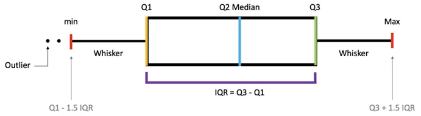

- **Variance**: The average squared difference of the values from the mean to measure how spread out a set of data is relative to the mean.
- **Standard Deviation**: The standard difference between each data point and the mean and the square root of variance.
- **Standard Error(SE**): An estimate of the standard deviation of the sampling distribution.

```python
# Calculate the quartiles of co2_emission
print(np.quantile(food_consumption.co2_emission, [0, 0.25, 0.5, 0.75, 1]))
```

output

```python
[   0.        5.21     16.53     62.5975 1712.    ]
```

```python
# Print variance and sd of co2_emission for each food_category
print(food_consumption.groupby('food_category')['co2_emission'].agg([np.var, np.std]))

# Create histogram of co2_emission for food_category 'beef'
plt.hist(food_consumption[food_consumption['food_category'] == 'beef']['co2_emission'].mean())
plt.show()

# Create histogram of co2_emission for food_category 'eggs'
plt.hist(food_consumption[food_consumption['food_category'] == 'eggs']['co2_emission'].mean())
plt.show()
```

output


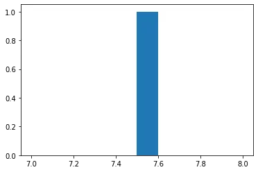

## 5. Relationship Between Variables
- **Causality**: Relationship between two events where one event is affected by the other.
- **Covariance**: A quantitative measure of the joint variability between two or more variables.
- **Correlation**: Measure the relationship between two variables and ranges from *-1 to 1*, the normalized version of covariance.

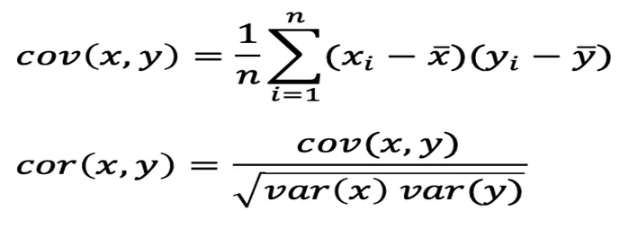

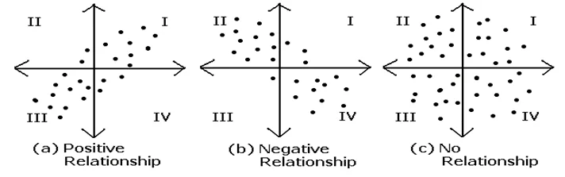

```python
# Scatterplot of food consumption and co2 emission for USA
sns.scatterplot(x='consumption', y='co2_emission', data=usa_consumption)

# Show plot
plt.show()

# Correlation between food consumption and co2 emission for USA
cor = usa_consumption.consumption.corr(usa_consumption.co2_emission)

print(cor)
```

output

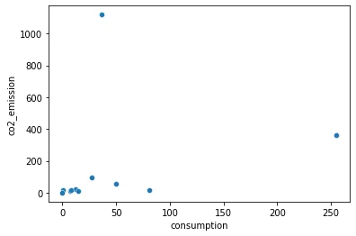

## 6. Probability
**Probability** is the branch of mathematics concerning numerical descriptions of how likely an event is to occur.

- **Complement**: P(A)+P(A’) =1
- **Intersection**: P(A∩B)=P(A)P(B)
- **Union**: P(A∪B)=P(A)+P(B)−P(A∩B)

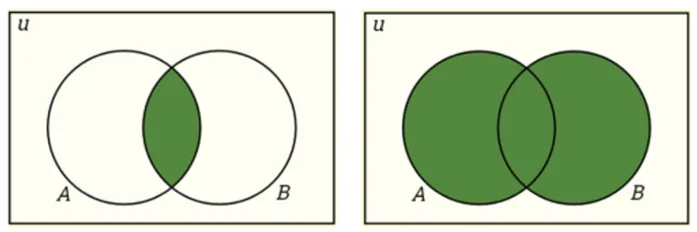

- **Conditional Probability**: P(A|B) is a measure of the probability of one event occurring with some relationship to one or more other events. P(A|B)=P(A∩B)/P(B), when P(B)>0.
- **Independent Events**: Two events are independent if the occurrence of one does not affect the probability of occurrence of the other. P(A∩B)=P(A)P(B) where P(A) != 0 and P(B) != 0 , P(A|B)=P(A), P(B|A)=P(B)
- **Mutually Exclusive Events**: Two events are mutually exclusive if they cannot both occur at the same time. P(A∩B)=0 and P(A∪B)=P(A)+P(B).
- **Bayes’ Theorem** describes the probability of an event based on prior knowledge of conditions that might be related to the event.

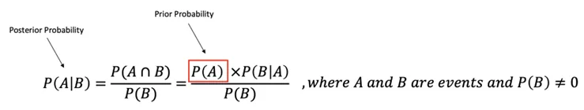

## 7. Probability Distribution
### 7.1. Probability Distribution Functions

- **Probability Mass Function(PMF)**: A function that gives the probability that a *discrete random variable* is exactly equal to some value.
- **Probability Density Function(PDF)**: A function for *continuous data* where the value at any given sample can be interpreted as providing a relative likelihood that the value of the random variable would equal that sample.
- **Cumulative Density Function(CDF)**: A function that gives the probability that a random variable is less than or equal to a certain value.

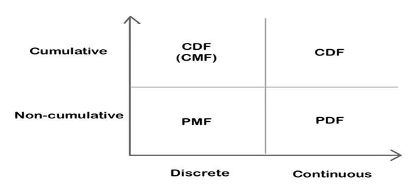

### 7.2. Continuous Probability Distribution

### *Types of continuous distribution*

- **Uniform Distribution**: Also called a rectangular distribution, is a probability distribution where all outcomes are equally likely.
- **Normal/Gaussian Distribution**: The curve of the distribution is bell-shaped and symmetrical and is related to the **Central Limit Theorem** that the sampling distribution of the sample means approaches a normal distribution as the sample size gets larger.

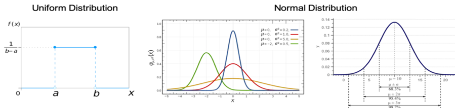

- **Exponential Distribution**: A probability distribution of the time between the events in a *Poisson* point process.
- **Chi-Square Distribution**: The distribution of the sum of squared standard normal deviates.

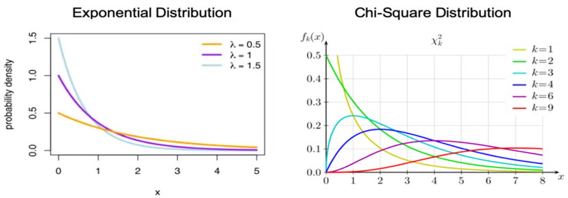

```python
# Subset for food_category equals rice
rice_consumption = food_consumption[food_consumption['food_category'] == 'rice']

# Histogram of co2_emission for rice and show plot
plt.hist(rice_consumption['co2_emission'])
plt.show()
```

output

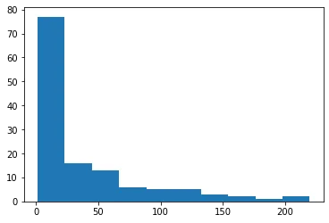

### 7.3. **Discrete** Probability Distribution

### *Types of d****iscrete*** *distribution*

- **Bernoulli Distribution**: The distribution of a random variable that takes a single trial and only 2 possible outcomes, namely 1(success) with probability p, and 0(failure) with probability (1-p).
- **Binomial Distribution**: The distribution of the number of successes in a sequence of *n* independent experiments, each with only 2 possible outcomes, namely 1(success) with probability p, and 0(failure) with probability (1-p).
- **Poisson Distribution**: The distribution that expresses the probability of a given number of events k occurring in a fixed interval of time if these events occur with a known constant average rate λ and independently of the time.

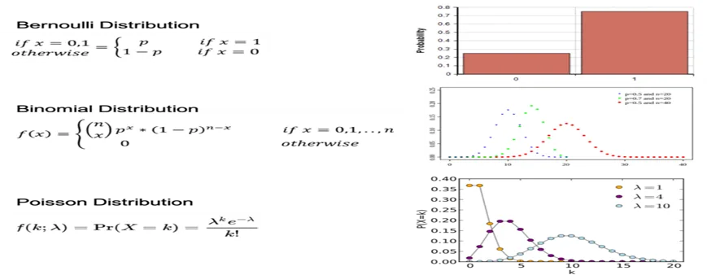

## 8. Data Reshaping & Transformation

**Data Transformation**

is the application of a deterministic mathematical
 function to each point in a data set—that is, each data
 point zi is replaced with the transformed value yi = f(zi),
 where f is a function. Transforms are usually applied so
 that the data appear to more closely meet the
 assumptions of a statistical inference procedure that is to
 be applied or to improve the interpretability or
 the appearance of graphs.

TYPES OF TRANSFORMATION

8.1. Logarithmic Transformation

8.2. Cube Root Transformation

8.3. Square Root Transformation

8.4. Square Transformation

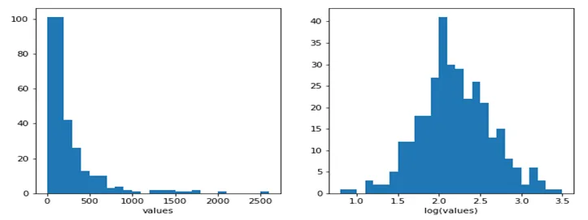

## 9. Hypothesis Testing and Statistical Significance
***Null and Alternative Hypothesis***

**Null Hypothesis**:

A general statement that there is no relationship
 between two measured phenomena or no association among groups.

**Alternative Hypothesis**:

Be contrary to the null hypothesis.

In statistical hypothesis testing, a

- **type I error** is the rejection of a true null hypothesis, while a
- **type II error** is the non-rejection of a false null hypothesis.

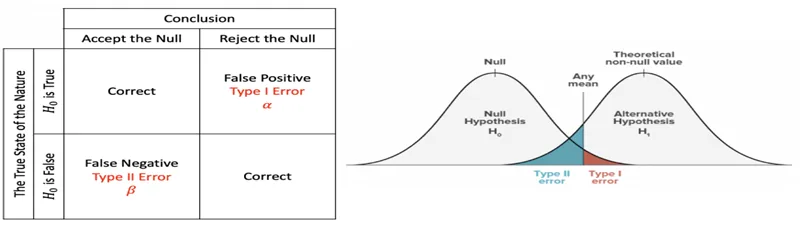

**Interpretation**

**P-value**:

The probability of the test statistic is at least as extreme as the one
 observed given that the null hypothesis is true. When p-value > α, we

fail to reject the null hypothesis, while p-value ≤ α, we reject the null
 hypothesis and we can conclude that we have a significant result.

**Critical Value**:

A point on the scale of the test statistic beyond which we reject the null
 hypothesis, and, is derived from the level of significance α of the test.
 It depends upon a test statistic, which is specific to the type of test,
 and the significance level, α, which defines the sensitivity of the test.

**Significance Level and Rejection Region**: The rejection region is
 actually depended on the significance level. The significance level is
 denoted by *α* and is the probability of rejecting the null hypothesis if it
 is true.

**Z-Test**

A *Z*-test is any statistical test for which the distribution of the test
 statistic under the null hypothesis can be approximated by a normal
 distribution and tests the mean of a distribution in which we already
 know the population variance. Therefore, many statistical tests can be
 conveniently performed as approximate *Z*-tests if the *sample size is*

*large* or the *population variance is known*.

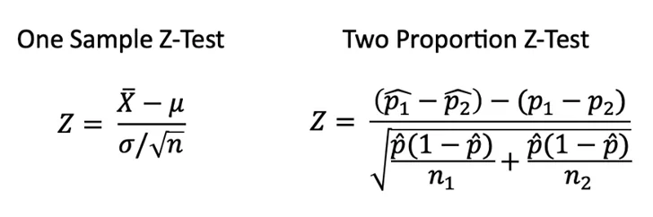

**T-Test**

A T-test is a statistical test if the *population variance is unknown* and
 the *sample size is not large* (n < 30).

**Paired sample** means that we collect data twice from the same group,
 person, item, or thing.

**An Independent sample**

implies that the two samples must have come from two completely
 different populations.

**ANOVA(Analysis of Variance)**

ANOVA is the way to find out if experiment results are significant.

**One-way ANOVA**

compares two means from two independent groups using only one
 independent variable.

**Two-way ANOVA**

is the extension of one-way ANOVA using two independent variables
 to calculate the main effect and interaction effect.

**Chi-Square Test**

- **Chi-Square** Test checks whether or not a model follows approximately normality when we have s discrete set of data points.
- **Goodness of Fit Test** determines if a sample matches the population fit of one categorical variable to a distribution.
- **Chi-Square Test for Independence** compares two sets of data to see if there is a relationship.

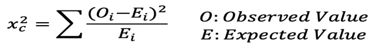

## 10. Regression
**Linear Regression**

is a linear approach to modeling the relationship between a ***dependent variable*** (the variable being measured in a scientific experiment ) and one ***independent variable***(the variable that is controlled in a scientific experiment to test the effects on the dependent variable).

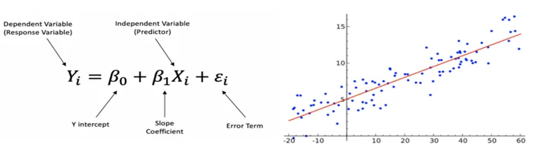

**Multiple Linear Regression**

is a linear approach to modeling the relationship between a dependent variable and two or more independent variables.

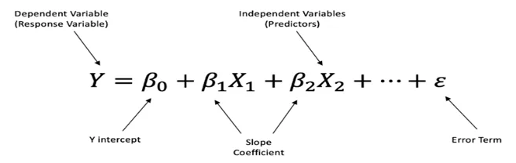

**Steps for Running the Linear Regression**

1. Define the problem

2. Build the dataset

3. Train the model

4. Evaluate the model

5. Use the model
