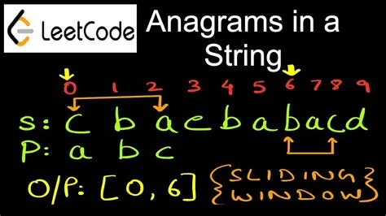

return true if string_1 is an anagram of string_2

An anagram is a situation where among the two given strings or numbers, one of them is a rearranged form of another string or number which is being used, so this means every character in one string or number will be a part of the other string, which in place so in that case, though both the strings mean a different subject they can be rearranged and unified.

**Example:**

HEART

EARTH

In the above example, the word heart can be formed from the word earth, or the word earth can also be formulated as a heart.

Example 2:

Input: s = "anagram", t = "nagaram"

Output: true

Example 3:

Input: s = "rat", t = "car"

Output: false

To solve such problem we should may a step which keed us to the right output finally

First, we define a function to check if the string was given in the input is in English word from the beginning

```python
#this function is checking if the string is in english language
# stack over flow link (https://stackoverflow.com/questions/27084617/detect-strings-with-non-english-characters-in-python)

def isEnglish(s):
    try:
        s.encode(encoding='utf-8').decode('ascii') \
    except UnicodeDecodeError:
        return False
    else:
        return True
```

**Second**, we make a compare function which :

1, check if the length of the string s is more than 1 "not empty".

2, check the compared one t .his length is less than 5\*10\*\*14 which is one of the problem conditions.

3. setting the two strings to lower case form.

4. call isEnglish() function as explained above.

5. in the final return statement we sort every string so we can compare if they are Anagram strings or not.

```python
def compare(s,t):
    assert len(s) >= 1,"S should not be empty"
    assert len(t) <= 5*10**4,
    "T's length should not smaller than 5x10^4"
    assert s.islower() and t.islower(),
    "S and T should be lower case"
    assert isEnglish(s) and isEnglish(t) ,
    "input must be in english"
    #return true if t is an anagram of s
    return sorted(s)== sorted(t)

print(compare(s = "rat", t = "car"))
```
