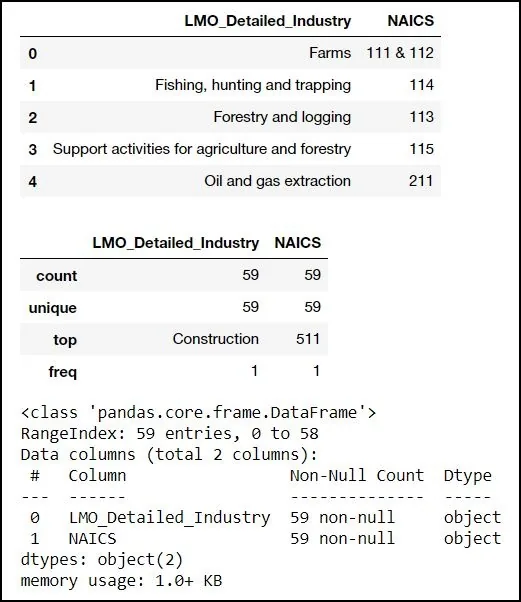
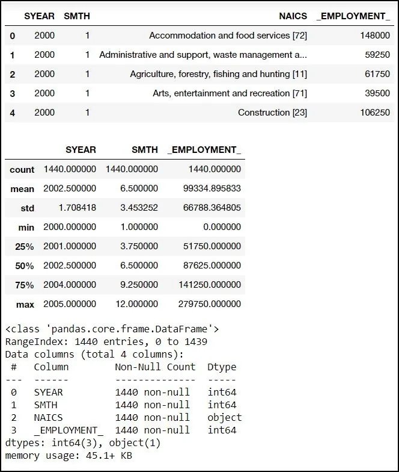
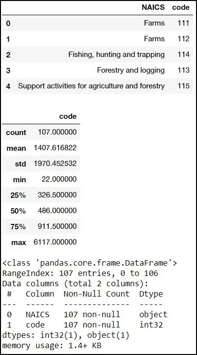
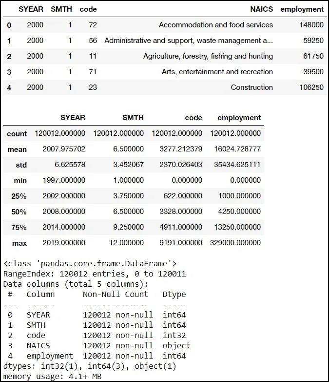
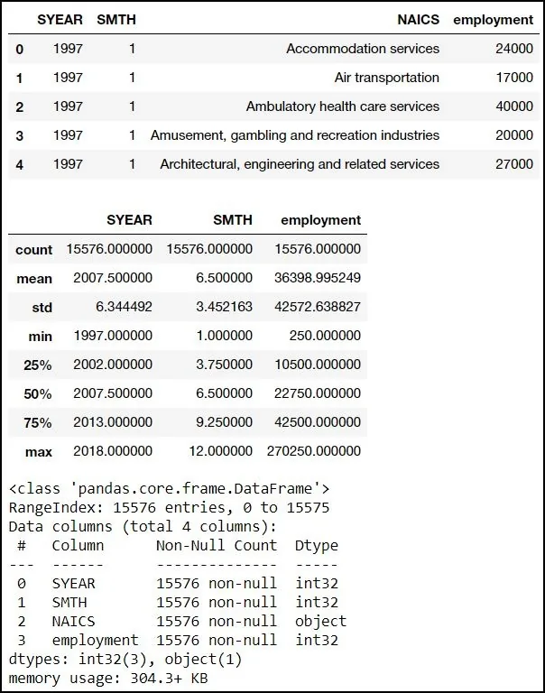
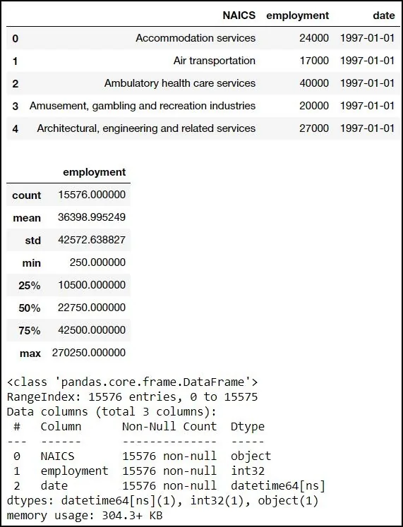
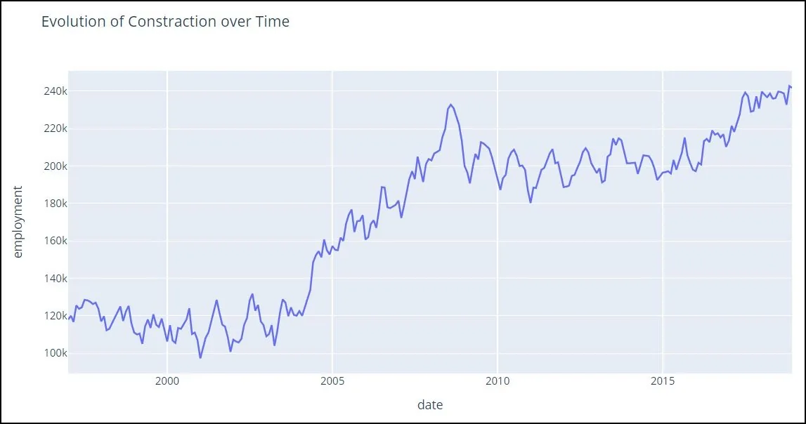
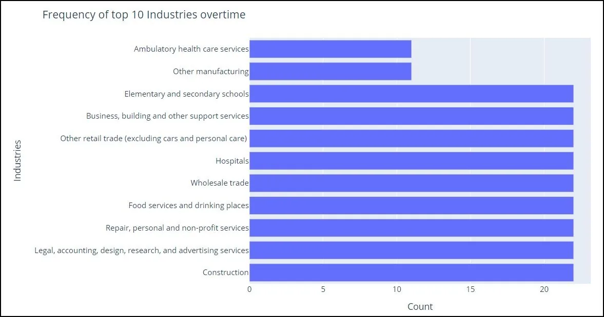

# Introduction to NAICS
### (North American Industry Classification System)

The North American Industry Classification System (NAICS) is an industry classification system developed by the statistical agencies of Canada, Mexico and the United States. Created against the background of the North American Free Trade Agreement, it is designed to provide common definitions of the industrial structure of the three countries and a common statistical framework to facilitate the analysis of the three economies. NAICS is based on supply-side or production-oriented principles, to ensure that industrial data, classified to NAICS, are suitable for the analysis of production-related issues such as industrial performance.


Economic statistics describe the behaviour and activities of economic transactors and of the transactions that take place among them. The economic transactors for which NAICS is designed are businesses and other organizations engaged in the production of goods and services. They include farms, incorporated and unincorporated businesses and government business enterprises. They also include government institutions and agencies engaged in the production of marketed and non-marketed services, as well as organizations such as professional associations and unions and charitable or non-profit organizations and the employees of households. NAICS is a comprehensive system encompassing all economic activities. It has a hierarchical structure. At the highest level, it divides the economy into 20 sectors. At lower levels, it further distinguishes the different economic activities in which businesses are engaged.

### SOURSES:
- [NAICS](https://www.naics.com/)
- [DATAINSIGHT](https://www.datainsightonline.com/)
- [RTRA](https://www.statcan.gc.ca/eng/rtra/rtra)

### Dataset
- RTRA (The Real Time Remote Access (RTRA) system- [Data Repository](https://www.statcan.gc.ca/eng/rtra/rtra) by Statistics Canada
- LMO Detailed Industries [Data Repository](https://www.naics.com/) by NAICS
- Data Output Table by [Datainsight](https://www.datainsightonline.com/)

**Imports and Datasets**

```python
import warnings
warnings.filterwarnings('ignore')
import pandas as pd
import numpy as np
import matplotlib.pyplot as plt
import seaborn as sns
import datetime as dt
import math
from plotly.subplots import make_subplots
import plotly_express as px
import plotly.graph_objects as go
import plotly.figure_factory as ff
from plotly.subplots import make_subplots
import empiricaldist as emp
import re
import os
%matplotlib inline
sns.set_style('darkgrid')
```

## Dataset Used
### North American Industry Classification System (NAICS) (**[**LINK**](https://www.census.gov/eos/www/naics/)**)
Dataset consists of time-series data from JAN 1997 up to JAN 2019 (Updated Annually).

## Importing Datasets from Local files
#### RTRA
- 15 csv files ***RTRA_Employ_*****.csv :\*** RTRA (The Real Time Remote Access (RTRA) system

#### LMO Detailed Industries
- ***LMO_Detailed_Industries_by_NAICS.xlsx :*** LMO Detailed Industries from Datainsight

Data sets consists of 3 main files:-

- An output template which is the target form of the data set.
- A LMO file which is the focus classes desired for analysis.
- RTRA CSV files which are the source of employment data.

## Exploring Imported Datasets
Using .head(),.describe() and .info() methods of pandas





## Cleaning LMO Detailed Industries
```python
# Reading Data
df_LMO = pd.read_excel(r'D:\DATASCIENCE\Project 4\Datasets\\LMO_Detailed_Industries_by_NAICS.xlsx')

# Renaming columns
df_LMO.rename(columns={'NAICS':'code','LMO_Detailed_Industry':'NAICS'},inplace = True)

# Changing data types
df_LMO.code.astype('str')
# Cleaning strings
for i in range(len(df_LMO)):
    if '&' in str(df_LMO.code[i]):
        df_LMO.code[i] = df_LMO.code[i].replace(' & ',',')

# Splitting data
for i in range(len(df_LMO)):
    if ',' in str(df_LMO.code[i]):
        df_LMO.code[i] = str(df_LMO.code[i]).split(',')
# Reshaping Dataframe
df_LMO = df_LMO.explode(column='code').reset_index()[['NAICS','code']]
```

## Cleaning RTRA CSV Files
```python
df_2_3 = pd.DataFrame()
# Importing datafiles
files = os.listdir(r"D:\DATASCIENCE\Project 4\Datasets\CSVs\withname")
for j in files:
    df = pd.read_csv(os.path.join(r'D:\DATASCIENCE\Project 4\Datasets\CSVs\withname\\', j))

#Renaming columns
    df.rename(columns = {'_EMPLOYMENT_':'employment'},inplace=True)

#Extracting codes from NAICS using regex
    df['code'] = 'a'
    for i in range(len(df)):
        if '[' not in df.NAICS[i]:
            df.code[i] = '0000'
        else:
            x = re.search(r'(\[(\d+-?\d+(-?\d+)?)])',df.NAICS[i])
            df.code[i] = x.group(2)
            df.NAICS[i] = (df.NAICS[i].replace(x.group(1),'')).strip()

# Reshaping dataframe
    df = (df.set_index(['SYEAR', 'SMTH','NAICS','employment'])
       .apply(lambda x: x.str.split('-').explode())
       .reset_index())

    df = df[['SYEAR','SMTH','code','NAICS','employment']]
    df_2_3 = df_2_3.append(df)


df_4 = pd.DataFrame()
files = os.listdir(r"D:\DATASCIENCE\Project 4\Datasets\CSVs\withnoname")
for j in files:
    df = pd.read_csv(os.path.join(r'D:\DATASCIENCE\Project 4\Datasets\CSVs\withnoname\\', j))

    df.rename(columns = {'_EMPLOYMENT_':'employment'},inplace=True)
    df['code'] = df.NAICS

    df = df[['SYEAR','SMTH','code','NAICS','employment']]
    df_4 = df_4.append(df)


# Cleaning up and joining Datasets
df_2_3.reset_index(drop=True,inplace=True)
df_4.reset_index(drop=True,inplace=True)
df_full = df_2_3.append(df_4)
df_full.reset_index(drop=True,inplace=True)

df_LMO.code = df_LMO.code.astype('int')
df_full.code = df_full.code.astype('int')
```

### Exploring Cleaned Datasets
Using .head(),.describe() and .info() methods of pandas





## Redefining DataFrame to Achieve Output Template.
Merging dataframes and limiting years to specified range.

```python
LMO_full = pd.merge(df_LMO,df_full[['SYEAR','SMTH','code','employment']],on=['code'],how='left')
LMO_full = LMO_full[(LMO_full.SYEAR > 1996) & (LMO_full.SYEAR < 2019)]
```

**Creating final output template file with filled values for employment.**

```python
output = LMO_full[['SYEAR','SMTH','NAICS','employment']].groupby(['NAICS','SYEAR','SMTH']).sum().reset_index()
output.sort_values(['SYEAR','SMTH','NAICS']).reset_index(drop=True)

output.SYEAR=output.SYEAR.astype('int')
output.SMTH = output.SMTH.astype('int')
output.employment = output.employment.astype('int')
output = output[['SYEAR','SMTH','NAICS','employment']]
output = output.sort_values(['SYEAR','SMTH','NAICS']).reset_index(drop=True)
```

**Exploring output dataframe**



Since Output dataframe matches output excel table row count therefore dataframe is cleaned.

## Analysis Process

## Creating timeseries DataFrame for Furthur Analysis.
```python
timeseries = output
timeseries['date'] = pd.to_datetime(timeseries.SYEAR.astype(str) + '/' + timeseries.SMTH.astype(str) + '/01')
timeseries.drop(['SYEAR','SMTH'],inplace=True,axis=1)
```

**Exploring created Dataframe**



### Inspecting Data and Answering questions that rose up.
1 - Pre-defined Questions:

- How employment in Construction evolved overtime?
- How employment in Construction evolved over time, compared to the total employment across all industries?

2 - Novel Questions:

- Which are the most common top industries over the years?
- How did the top 10 industries evolve overtime?
- How did the bottom 5 industries evolve overtime?

**How employment in Construction evolved overtime?**

```python
fig = px.line(timeseries[timeseries.NAICS == 'Construction'],x = 'date',y='employment',title='Evolution of Constraction over Time')
fig.show()
```



##### *Conclusion:*
- Data shows steady fluctuations through out 1997 till early 2004.
- A huge increase appeared in North America through out 2004 till early 2009.
- A constant fluctuation started from 2009 till early 2017.
- Data suggests future increase in rate of employment in Construction, yet this matter is to be further explored.

**How employment in Construction evolved over time, compared to the total employment across all industries?**

```python
fig = go.Figure()
fig.add_trace(go.Scatter(x=timeseries[timeseries.NAICS == 'Construction'].date, y=timeseries[timeseries.NAICS == 'Construction'].employment,name = 'Construction'))
fig.add_trace(go.Scatter(x=timeseries.groupby('date').sum().reset_index().date, y=timeseries.groupby('date').sum().reset_index().employment,name = 'Total'))
fig.update_layout(title='Employment in Construction over time WRT total employment',
                   xaxis_title='Date',
                   yaxis_title='Employment')
fig.update_layout(yaxis_type="log")
fig.show()
```

##### *Conclusion:*
- The Bump in Construction appears to slightly affect the total employment rate.
- Total employment rate is showing slight and steady increase.

## Most Common Top Industries over the years.

Finding the top ten industries each year and counting the occurrence of each industry in the top ten through the years

```python
dicts = {}
years = list(timeseries.year.unique())
for i in years:
    temp = timeseries.groupby(['year','NAICS']).mean().reset_index()
    dicts[i] = list(temp[temp.year == i].nlargest(10,'employment').NAICS)
df = pd.DataFrame(dicts)
# pd.DataFrame(df.stack().value_counts()).reset_index()
fig = px.bar(pd.DataFrame(df.stack().value_counts()).reset_index(), y="index", x=0, orientation='h')
fig.update_layout(title='Frequency of top 10 Industries overtime',
                   xaxis_title='Count',
                   yaxis_title='Industries')
fig.show()
```



##### *Conclusion:*
- Construction along with 8 other industries appeared in the top ten over the years equal times -22-.
- Ambulatory health care services and other manufacturing appeared equal times at 11 times in the top ten.

**How did the top 10 industries evolve overtime?**

```python
f = [a_tuple[0] for a_tuple in list(df.stack().value_counts().items())]
fig = go.Figure()
for i in f:

    fig.add_trace(go.Scatter(x=timeseries[timeseries.NAICS == i].date, y=timeseries[timeseries.NAICS == i].employment,name = i))


fig.update_layout(title='Top 10 Industries progression overtime',
                   xaxis_title='Date',
                   yaxis_title='Employment')
fig.show()
```

***Conclusion:***

- 'Other Retail Trades' is the top industry over time and Construction is closing in.
- Construction and 'Food Services and drinking places' were close from 1997 till 2004 yet construction employment rate increased ever since.
- 'Repair, personal and non-profit services' was closely tied to Construction and 'Food Services and drinking places' yet continued to stabilize at the same rate.

**How did the bottom 5 industries evolve overtime?**

```python
f = [a_tuple[0] for a_tuple in list(df.stack().value_counts().head().items())]
fig = go.Figure()
for i in f:

    fig.add_trace(go.Scatter(x=timeseries[timeseries.NAICS == i].date, y=timeseries[timeseries.NAICS == i].employment,name = i))


fig.update_layout(title='Bottom 5 Industries progression overtime',
                   xaxis_title='Date',
                   yaxis_title='Employment')
fig.show()
```

##### *Conclusion:*
- 'Fishing, hunting and trapping' is currently the Bottom most industry over time and 'Oil and gas extraction' is oscillating with it.
- 'Primary metal manufacturing' is in steady decline since 1997 with very close ties to 'Heritage institutions'.
- 'Ship and boat building' and 'Heritage institutions' has very similar progression over time.

## Final Thoughts
- Data shows steady fluctuations in 'Construction' through out 1997 till early 2004.
- A huge increase in 'Construction' appeared in North America through out 2004 till early 2009.
- A constant fluctuation in 'Construction' started from 2009 till early 2017.
- Data suggests future increase in rate of employment in 'Construction', yet this matter is to be further explored.
- The Bump in 'Construction' appears to slightly affect the total employment rate.
- Total employment rate is showing slight and steady increase.
- Construction along with 8 other industries appeared in the top ten over the years equal times -22-.
- 'Ambulatory health care services' and 'other manufacturing' appeared equal times at 11 times in the top ten.
- 'Other Retail Trades' is the top industry over time and Construction is closing in.
- 'Construction' and 'Food Services and drinking places' were close from 1997 till 2004 yet construction employment rate increased ever since.
- 'Repair, personal and non-profit services' was closely tied to Construction and 'Food Services and drinking places' yet continued to stabilize at the same rate.
- Top most industry is 'Construction' industry with average employment rate around **172291.6** .
- Bottom most industry is 'Fishing, hunting and trapping' with average employment rate around **2807.7**.

## Future Recommendations.
- Further Study of forecasting of employment rates based on history of data is highly recommended in the future.

## Data Limitations.
- An indepth study of Future predictions and Machine Learning models is limited due to limited features in dataset.
- A deeper aggregation of data is to be expected, a detailed location for each country in the given dataset would have aided in a deeper study.
